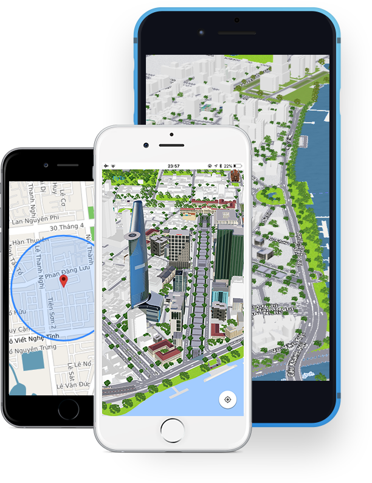

# Map4dMap Android SDK
[](https://map4d.vn/)
[](https://www.android.com/)
[](https://map4d.vn/)

Map4dMap Android SDK cho Cổng 1 cửa ĐTQG

> Map4D Android SDK cho phép bạn tùy chỉnh bản đồ với nội dung để hiển thị trên thiết bị android hỗ trợ opengl 2.0   
Map4D Android SDK không chỉ mang hình ảnh thực tế lên trên bản đồ 3D, ngoài ra còn cho phép tương tác và điều chỉnh các đối tượng 3D của bạn  

[](https://map4d.vn) 

## Installation

Nếu dự án của bạn dùng Gradle thì trước hết cần khai báo url cho maven trong file gradle project.

```xml
allprojects {
    repositories {
        maven {
            url = "https://packages.map4d.vn/repository/maven-public"
        }
    }
}
```

Thêm vào dependencies:

```xml
dependencies {
  implementation 'vn.map4d:Map4dTypes:1.1.0'
  implementation 'vn.map4d:Map4dMapDTQG:0.1.+'
}
```

> **Chú ý:** <span style="color:red">Phiên bản chính xác có thể thay đổi dựa trên phiên bản hiện tại của Maps SDK dành cho Android.</span>

## Requirements

- Ứng dụng xây dựng với Android SDK 21 hoặc cao hơn

## Provide access key

```xml
<?xml version="1.0" encoding="utf-8"?>
<manifest xmlns:android="http://schemas.android.com/apk/res/android"
  package="vn.map4d.simplemap">
  <application
    android:theme="@style/AppTheme">
    <meta-data
      android:name="vn.map4d.map.ACCESS_KEY"
      android:value="TYPE_YOUR_KEY_HERE"/>
  </application>
  <uses-permission android:name="android.permission.INTERNET" />
  <uses-permission android:name="android.permission.ACCESS_NETWORK_STATE" />
  <uses-permission android:name="android.permission.ACCESS_FINE_LOCATION" />
</manifest>
```

## Add a map with MFMapView

1. Create layout sử dụng MFMapView

```xml
<vn.map4d.map.core.MFMapView
  android:id="@+id/mapView"
  android:layout_width="wrap_content"
  android:layout_height="wrap_content"
/>
```

2. Working với MFMapView

> **Chú ý:** <span style="color:red">Khi dùng MFMapView thì chúng ta cần override các phương thức lifecycle sau của Activity hoặc Fragment chứa nó và gọi tới
các hàm tương ứng của đối tượng MFMapView (như code ví dụ ở bên dưới).</span>
 
- **onCreate(Bundle)**
- **onDestroy()**
- **onSaveInstanceState(Bundle)**
- **onStart()**
- **onStop()**

<!-- tabs:start -->
#### ** Java **

```java
public class MainActivity extends AppCompatActivity implements OnMapReadyCallback{ 
    
    private MFMapView mapView;
    private Map4D map4D;
  
    @Override
    protected void onCreate(Bundle savedInstanceState) { 
        super.onCreate(savedInstanceState);
        setContentView(R.layout.simple3d_map_activity);
        mapView = findViewById(R.id.map3D);
        mapView.onCreate(savedInstanceState);
        mapView.getMapAsync(this); 
    }
  
    @Override
    public void onMapReady(Map4D map4D) { 
        // Your code
    }
      
    @Override
    protected void onDestroy() { 
        mapView.onDestroy(); 
        super.onDestroy();
    }
    
    @Override
    protected void onSaveInstanceState(Bundle outState) {
        super.onSaveInstanceState(outState);
        mapView.onSaveInstanceState(outState);
    }
    
    @Override
    protected void onStart() {
        super.onStart();
        mapView.onStart();
    }

    @Override
    protected void onStop() {
        mapView.onStop();
        super.onStop();
    }
}
```

#### ** Kotlin **

```kotlin
class MainActivity : AppCompatActivity(), OnMapReadyCallback {

    private var map4D: Map4D? = null

    override fun onCreate(savedInstanceState: Bundle?) {
        super.onCreate(savedInstanceState)
        setContentView(R.layout.activity_main)
        mapView?.onCreate(savedInstanceState)
        mapView?.getMapAsync(this)
    }

    override fun onMapReady(map4D: Map4D?) {
        // Your code
    }
    
    override fun onDestroy() {
        mapView?.onDestroy()
        super.onDestroy()
    }
    
    override fun onSaveInstanceState(outState: Bundle) {
        super.onSaveInstanceState(outState)
        mapView?.onSaveInstanceState(outState)
    }

    override fun onStart() {
        super.onStart()
        mapView?.onStart()
    }

    override fun onStop() {
        mapView?.onStop()
        super.onStop()
    }
}
```
<!-- tabs:end -->

### Ví dụ hoàn chỉnh sử dụng MFMapView

https://github.com/map4d/android-samples/tree/main/simple-mapview-demo

## Add a MFSupportMapFragment object

Chúng ta có thể thêm đối tượng `MFSupportMapFragment` vào ứng dụng của mình bằng cách tĩnh hoặc động. Cách dơn giản nhất là thêm nó bằng cách tĩnh. Nếu chúng ta
thêm Fragment một cách linh hoạt, chúng ta có thể thực hiện các hành động bổ sung trên Fragment đó, chẳng hạn như xóa và thay thế Fragment đó khi chạy.

### Thêm fragment tĩnh

Trong file layout của activity chúng ta sẽ:

1. Thêm một `fragment` element.

2. Thêm khai báo `xmlns:map="http://schemas.android.com/apk/res-auto`. Việc này cho phép sử dụng các thuộc tính XML tùy chỉnh của Map

3. Trong `fragment` element, set thuộc tính `android:name` thành `vn.map4d.map.core.MFSupportMapFragment`

4. Thêm thuộc tính `android:id` cho element `fragment`

Ví dụ sau đây là file layout hoàn chỉnh bao gồm `fragment` element:

```xml
<?xml version="1.0" encoding="utf-8"?>
<fragment xmlns:android="http://schemas.android.com/apk/res/android"
  xmlns:tools="http://schemas.android.com/tools"
  xmlns:map="http://schemas.android.com/apk/res-auto"
  android:id="@+id/map"
  android:name="vn.map4d.map.core.MFSupportMapFragment"
  android:layout_width="match_parent"
  android:layout_height="match_parent"
  tools:context=".MainActivity" />
```

### Thêm fragment động

Trong activity:

1. Tạo một instance `MFSupportMapFragment`

2. Commit một transaction để thêm fragment vào activity. Chi tiết xem [Fragment Transactions](https://developer.android.com/guide/fragments/transactions).

Ví dụ:

<!-- tabs:start -->
#### ** Java **

```java
MFSupportMapFragment mapFragment = MFSupportMapFragment.newInstance();
getSupportFragmentManager()
  .beginTransaction()
  .add(R.id.my_container, mapFragment)
  .commit();
```

#### ** Kotlin **

```kotlin
val mapFragment = MFSupportMapFragment.newInstance()
supportFragmentManager
  .beginTransaction()
  .add(R.id.my_container, mapFragment)
  .commit()
```
<!-- tabs:end -->

### Ví dụ hoàn chỉnh sử dụng MFSupportMapFragment

https://github.com/map4d/android-samples/tree/main/support-map-fragment-demo
