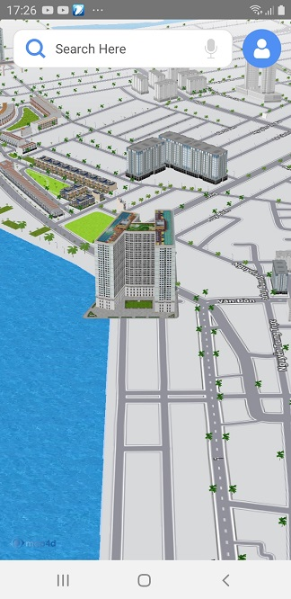
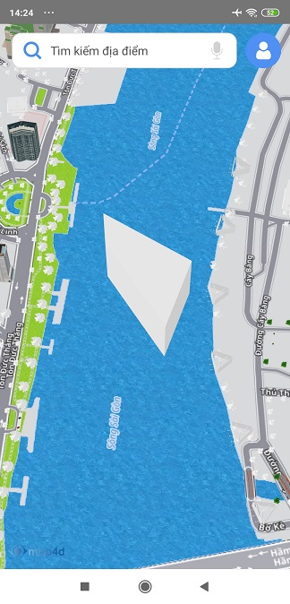

# Building

Điểm khác biệt giữa nền tảng bản đồ **map4d** với các nền tảng bản đồ khác đó là chế độ bản đồ 3D. Chế độ này sẽ có các đối
tượng 3D mô phỏng lại các tòa nhà, cây cối, các cây cầu cũng như các công trình kiến trúc khác, ... Ngoài những đối tượng building
3D có sẵn của bản đồ, bạn còn có thể tự tạo và thêm đối tượng 3D của bạn lên bản đồ thông qua đối tượng **map4d.Building**

**Chú ý: Những đối tượng Building này chỉ được vẽ trong chế độ 3D của bản đồ, nó không được vẽ trong chế độ 2D.**

### 1. Tạo Building


  
<!-- tabs:start -->
#### ** Kotlin **
```kotlin
    map4D?.setBuildingsEnabled(true)
    val buildingOptions = MFBuildingOptions()
    buildingOptions.location(MFLocationCoordinate(16.088987, 108.227940))
      .name("Test Building")
      .model("https://hcm03.vstorage.vngcloud.vn/v1/AUTH_b32b6bc102c44269ab7b55e7820e7116/sdk/models/5db6b4798b4711141457d8a9.obj")
      .texture("https://hcm03.vstorage.vngcloud.vn/v1/AUTH_b32b6bc102c44269ab7b55e7820e7116/sdk/textures/5db6b4798b4711141457d8ab.jpg")
    map4D?.addBuilding(buildingOptions)
```
#### ** Java **
```java
    map4D?.setBuildingsEnabled(true);
    MFBuildingOptions buildingOptions = new MFBuildingOptions();
    buildingOptions.location(new MFLocationCoordinate(16.088987, 108.227940))
     .name("Test Building")
     .model("https://hcm03.vstorage.vngcloud.vn/v1/AUTH_b32b6bc102c44269ab7b55e7820e7116/sdk/models/5db6b4798b4711141457d8a9.obj")
     .texture("https://hcm03.vstorage.vngcloud.vn/v1/AUTH_b32b6bc102c44269ab7b55e7820e7116/sdk/textures/5db6b4798b4711141457d8ab.jpg");
    map4D.addBuilding(buildingOptions);
```
<!-- tabs:end -->

### 2. Tạo Extrude Building


  
<!-- tabs:start -->
#### ** Kotlin **
```kotlin
    val extrudeBuildingOptions = MFBuildingOptions()
      .location(MFLocationCoordinate(10.774544, 106.707764))
      .name("Extrude Building")
      .model(
        listOf(MFLocationCoordinate(10.774544, 106.707764), MFLocationCoordinate(10.773766, 106.709001),
        MFLocationCoordinate(10.772759, 106.708627), MFLocationCoordinate( 10.774045, 106.707806)))
      .height(100.0)
    map4D?.addBuilding(extrudeBuildingOptions)
    map4D?.moveCamera(MFCameraUpdateFactory.newCoordinate(MFLocationCoordinate(10.774544, 106.707764)))
```
#### ** Java **
```java
    map4D.setBuildingsEnabled(true);
    MFBuildingOptions extrudeBuildingOptions = new MFBuildingOptions();
    extrudeBuildingOptions.location(new MFLocationCoordinate(10.774544, 106.707764))
      .name("Extrude Building")
      .model(
        new ArrayList<MFLocationCoordinate>(Arrays.asList(new MFLocationCoordinate(10.774544, 106.707764), new MFLocationCoordinate(10.773766, 106.709001),
          new MFLocationCoordinate(10.772759, 106.708627), new MFLocationCoordinate( 10.774045, 106.707806))))
      .height(100.0);
    map4D.addBuilding(extrudeBuildingOptions);
    map4D.moveCamera(MFCameraUpdateFactory.newCoordinate(new MFLocationCoordinate(10.774544, 106.707764)));
```
<!-- tabs:end -->

### 3. Xóa Building khỏi bản đồ

Để xóa một building ra khỏi bản đồ, hãy gọi phương thức **remove()**

<!-- tabs:start -->
#### ** Kotlin **
```kotlin
    building.remove()
```
#### ** Java **
```java
    building.remove();
```
<!-- tabs:end -->

### 4. Hiện, ẩn những Building có sẵn của bản đồ

Bạn có thể cho phép hiện hoặc ẩn những building có sẵn của bản đồ. Mặc định thì bản đồ sẽ hiển thị tất cả các building có
sẵn của nó ở chế độ 3D. Nếu bạn muốn ẩn tất cả các building đó đi thì sử dụng phương thức **setBuildingsEnabled()** của
lớp **Map4D** và truyền vào tham số **false**. Ngược lại nếu bạn muốn hiện chúng lên thì bạn truyền vào tham số là **true**.

Ví dụ để ẩn các building có sẵn của bản đồ:

<!-- tabs:start -->
#### ** Kotlin **
```kotlin
    map4D?.isBuildingsEnabled = false
or
    map4D?.setBuildingsEnabled(false)
```

#### ** Java **
```java
    map4D?.setBuildingsEnabled(false)
```
<!-- tabs:end -->

Ngoài ra để kiểm tra các building có sẵn có được hiện trên bản đồ hay không bạn cũng có thể sử dụng phương thức **isBuildingsEnabled()**
của lớp **map4d.Map**. Phương thức này sẽ trả về một giá trị **boolean** tương ứng với các building có được hiện hay không.

<!-- tabs:start -->
#### ** Kotlin **
```kotlin 
val isBuildingsEnabled = map4D?.isBuildingsEnabled ?: false
```
#### ** Java **
```java 
boolean isBuildingsEnabled = map4.isBuildingsEnabled();
```
<!-- tabs:end -->

### 5. Sự kiện click Building

- Phát sinh khi người dùng click vào Building có sẵn của Map:

<!-- tabs:start -->
#### ** Kotlin **
```kotlin
map4D?.setOnBuildingClickListener { buildingId, name, location ->
  map4D?.setSelectedBuildings(listOf(buildingId))
}
```

#### ** Java **
```java
map4D.setOnBuildingClickListener(new Map4D.OnBuildingClickListener() {
    @Override
    public void onBuildingClick(String buildingId, String name, MFLocationCoordinate location) {
        MarkerActivity.this.map4D.setSelectedBuildings(Arrays.asList(buildingId));
    }
});
```
<!-- tabs:end -->

- Phát sinh khi người dùng click vào Building được người dùng thêm vào:

<!-- tabs:start -->
#### ** Kotlin **
```kotlin
map4D?.setOnUserBuildingClickListener { building ->
  building.isSelected = true
}
```

#### ** Java **
```java
map4D.setOnUserBuildingClickListener(new Map4D.OnUserBuildingClickListener() {
    @Override
    public void onUserBuildingClick(MFBuilding mfBuilding) {
        mfBuilding.setSelected(true);
    }
});
```
<!-- tabs:end -->

## Reference

### Building Class

`MFBuilding` class

Tạo Building với các options được chỉ định

<!-- tabs:start -->
##### ** Kotlin **
```kotlin
    map4D?.setBuildingsEnabled(true)
    val buildingOptions = MFBuildingOptions()
    buildingOptions.location(MFLocationCoordinate(16.088987, 108.227940))
      .name("Test Building")
      .model("https://hcm03.vstorage.vngcloud.vn/v1/AUTH_b32b6bc102c44269ab7b55e7820e7116/sdk/models/5db6b4798b4711141457d8a9.obj")
      .texture("https://hcm03.vstorage.vngcloud.vn/v1/AUTH_b32b6bc102c44269ab7b55e7820e7116/sdk/textures/5db6b4798b4711141457d8ab.jpg")
    map4D?.addBuilding(buildingOptions)
```
##### ** Java **
```java
    map4D?.setBuildingsEnabled(true);
    MFBuildingOptions buildingOptions = new MFBuildingOptions();
    buildingOptions.location(new MFLocationCoordinate(16.088987, 108.227940))
     .name("Test Building")
     .model("https://hcm03.vstorage.vngcloud.vn/v1/AUTH_b32b6bc102c44269ab7b55e7820e7116/sdk/models/5db6b4798b4711141457d8a9.obj")
     .texture("https://hcm03.vstorage.vngcloud.vn/v1/AUTH_b32b6bc102c44269ab7b55e7820e7116/sdk/textures/5db6b4798b4711141457d8ab.jpg");
    map4D.addBuilding(buildingOptions);
```
<!-- tabs:end -->

**Methods**

| Name                         | Parameters                              | Return Value | Description                                                                            |
|------------------------------|:---------------------------------------:|:------------:|----------------------------------------------------------------------------------------|
| **setLocation**              |[MFLocationCoordinate](/reference/coordinates?id=MFLocationCoordinate)| `none`| Set vị trí tọa độ trên bản đồ cho building                       |
| **getLocation**              | `none` | [MFLocationCoordinate](/reference/coordinates?id=MFLocationCoordinate)| Get vị trí tọa độ của building                                 |
| **setName**                  | string                                  | `none`       | Set tên cho building                                                                   |
| **getName**                  | `none`                                  | string       | Get tên của building                                                                   |
| **setBearing**               | double                                  | `none`       | Set góc quay khi đặt trên bản đồ cho building theo đơn vị Độ                           |
| **getBearing**               | `none`                                  | double       | Get góc quay trên bản đồ của building theo đơn vị Độ                                   |
| **setScale**                 | double                                  | `none`       | Set tỉ lệ vẽ building trên bản đồ so với kích thước thật của nó                        |
| **getScale**                 | `none`                                  | double       | Get tỉ lệ vẽ building trên bản đồ so với kích thước thật của nó                        |
| **setHeight**                | double                                  | `none`       | Set giá trị độ cao cho building khi model của nó được tạo từ thuộc tính coordinates    |
| **getHeight**                | `none`                                  | double       | Get giá trị độ cao của building khi model của nó được tạo từ thuộc tính coordinates    |
| **setElevation**             | float                                   | `none`       | Set giá trị độ cao building so với mực nước biển theo đơn vị mét                       |
| **setSelected**              | boolean                                 | `none`       | Set giá trị để xác định building có được hightlight hay không                          |
| **isSelected**               | `none`                                  | boolean      | Kiểm tra building có được hightlight hay không                                         |
| **setModel**                 | string                                  | `none`       | Set đường dẫn URL để lấy dữ liệu model cho Building                                    |
| **getModel**                 | string                                  | `none`       | Get đường dẫn URL để lấy dữ liệu model cho Building                                    |
| **setTexture**               | string                                  | `none`       | Set đường dẫn URL để lấy dữ liệu texture cho Building                                  |
| **getTexture**               | string                                  | `none`       | Set đường dẫn URL để lấy dữ liệu texture cho Building                                  |
| **setModel**                 | List<[MFLocationCoordinate](/reference/coordinates?id=MFLocationCoordinate)> | `none`| Set mảng vị trí mặt đáy **MFLocationCoordinate** đã truyền vào để tạo Building extrude|
| **getModelCoordinates**      | List<[MFLocationCoordinate](/reference/coordinates?id=MFLocationCoordinate)> | `none`| Get mảng vị trí **MFLocationCoordinate** để tạo một Building hình khối với mặt đáy của hình khối là mảng vị trí này|
| **setVisible**               | boolean                                 | `none`       | Ẩn/hiện building trên map hay không                                                    |
| **isVisible**                | `none`                                  | boolean      | Get trạng thái ẩn/hiện của building                                                    |
| **setTouchable**             | boolean                                 | `none`       | Cho phép có thể tương tác với building trên bản đồ hay không                           |
| **isTouchable**              | `none`                                  | boolean      | Kiểm tra xem có thể tương tác với building trên bản đồ hay không                       |

### Building Options

`MFBuildingOptions` class

Đối tượng BuildingOptions dùng để xác định các thuộc tính dùng cho Building.

**Properties**

| Name                         | Type                | Description                                                                                                                                                           |
|------------------------------|:-------------------:|-----------------------------------------------------------------------------------------------------------------------------------------------------------------------|
| **location**                 |[MFLocationCoordinate](/reference/coordinates?id=MFLocationCoordinate)| chỉ định một **MFLocationCoordinate** để xác định vị trí ban đầu của building.                                       |
| **name**                     | string              | chỉ định tên của Building mà bạn tạo                                                                                             |
| **scale**                    | double              | chỉ định tỉ lệ của Building được vẽ ra ở trên bản đồ so với tỉ lệ thật của nó. Ví dụ khi giá trị **scale** là 0.5 thì Building sẽ nhỏ hơn một nửa so với kích thước thật của nó. Giá trị mặc định là **1**.|
| **bearing**                  | double              | chỉ định góc quay của Building khi được vẽ ra trên bản đồ theo đơn vị là Độ. Bình thường giá trị mặc định của nó là **0**. Khi bạn muốn quay Building theo một hướng nào đó thì bạn chỉ cần set lại giá  trị **bearing** trong khoảng từ 0 đến 360 độ.|
| **elevation**                | double              | chỉ định độ cao của building so với mực nước biển, đơn vị là mét. Giá trị mặc định là **0**                                                                           |
| **height**                   | double              | chỉ định chiều cao của Building theo đơn vị là mét. Thuộc tính này chỉ có tác dụng khi Building của bạn được tạo từ một mảng MFLocationCoordinate thông qua thuộc tính **coordinates** (hay còn gọi là Extrude Building). Nó không có tác dụng với Building được vẽ bằng Model và Texture. Giá trị mặc định là **1**.|
| **model**                    | string              | chỉ định một đường dẫn URL để lấy dữ liệu model cho Building.                                                                                                         |
| **texture**                  | string              | chỉ định một đường dẫn URL để lấy dữ liệu texture cho Building. Thuộc tính này chỉ được dùng khi thuộc tính **model** được set giá trị. Nó sẽ map texture này vào **model** mà bạn đã set cho Building. Nếu bạn không set giá trị **texture** khi đã set giá trị **model** thì bản đồ sẽ vẽ một building màu trắng.|
| **coordinates**              |List<[MFLocationCoordinate](/reference/coordinates?id=MFLocationCoordinate)>| chỉ định một mảng vị trí **MFLocationCoordinate** để tạo một Building hình khối với mặt đáy của hình khối là mảng vị trí này. Nó kết hợp với thuộc tính **height** để tạo chiều cao cho hình khối đó (building này được gọi là Extrude Building). Trường hợp dùng **coordinates** thì sẽ không dùng đến thuộc tính **texture**. Nếu set giá trị cho **coordinates** và cả **model** đồng thời thì sẽ ưu tiên lấy giá trị của **model**để tạo Building.|
| **visible**                  | boolean             | xác định building có thể ẩn hay hiện trên bản đồ. Giá trị mặc định là **true**.                                                                                       |
| **touchable**                | boolean             | cho phép người dùng có thể tương tác với building trên bản đồ hay không. Giá trị mặc định là **true**.                                                                |