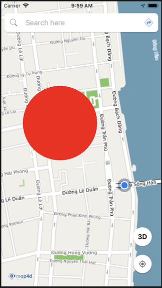
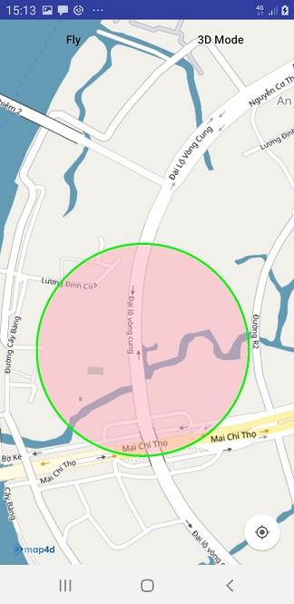

# Circle

Lớp Circle cho phép người dùng vẽ một Circle lên map..

### 1. Tạo circle



- Tạo circle from MFCircleOptions 

<!-- tabs:start -->
#### ** Kotlin **
```kotlin
 val circle = map4D.addCircle(MFCircleOptions()
                        .center(MFLocationCoordinate(16.066517, 108.210354))
                        .radius(500)
                        .fillColor(ContextCompat.getColor(this, R.color.redWithAlphaThirtyPercent)))
```
#### ** Java **
```java
 MFCircle circle = map4D.addCircle(new MFCircleOptions()
                        .center(new MFLocationCoordinate(16.066517, 108.210354))
                        .radius(500)
                        .fillColor(ContextCompat.getColor(this, R.color.redWithAlphaThirtyPercent)));
```
<!-- tabs:end -->

Như ví dụ trên thì chúng ta tạo một Circle với các tùy chỉnh như sau:
* Tâm của Circle ở tọa độ `MFLocationCoordinate (LatLng)`: 16.066517, 108.210354
* Bán kính của Circle là: 500 mét
* Màu của Circle là: #4D00ff00, 4D là giá trị alpha

- Tạo circle với strokeColor and strokeWidth.



<!-- tabs:start -->
#### ** Kotlin **
```kotlin
 val circle = map4D.addCircle(MFCircleOptions()
                        .center(MFLocationCoordinate(16.066517, 108.210354))
                        .radius(300.0)
                        .fillColor(ContextCompat.getColor(context ?: return, R.color.green))
                        .strokeWidth(5.0f)
                        .strokeColor(ContextCompat.getColor(this ?: return, R.color.red)))
```

#### ** Java **
```java
 java circle = map4D.addCircle(new MFCircleOptions()
                        .center(new MFLocationCoordinate(16.066517, 108.210354))
                        .radius(300)
                        .fillColor(ContextCompat.getColor(this, R.color.green))
                        .strokeWidth(5.f)
                        .strokeColor(ContextCompat.getColor(this, R.color.red)));
```

<!-- tabs:end -->
**Lưu ý:**

   - Stroke width đơn vị là point tương đương dp trong android
   - Stroke width mặc định là 0.f (không vẽ)
   
### 2. Xóa Circle

> Để xóa Circle ra khỏi bản đồ ta sử dụng hàm `remove()`

<!-- tabs:start -->
#### ** Kotlin **
```kotlin
 circle.remove()
```

#### ** Java **
```java
circle.remove();
```
<!-- tabs:end -->

### 3. Sự kiện click circle

Phát sinh khi người dùng click vào circle, mặc circle có thể click được (touchable).

<!-- tabs:start -->
#### ** Kotlin **
```kotlin
map4D?.setOnCircleClickListener { mfCircle ->
      Toast.makeText(context, "Circle clicked:  ${mfCircle.id}", Toast.LENGTH_SHORT).show()
    }
```
#### ** Java **
```java
map4D.setOnCircleClickListener(new Map4D.OnCircleClickListener() {
    @Override
    public void onCircleClick(MFCircle mfCircle) {
        Toast.makeText(getApplicationContext(), "Circle clicked:  " + mfCircle.getId(), Toast.LENGTH_SHORT).show();
    }
});
```
<!-- tabs:end -->

> Tham số mfCircle sẽ trả về đối tượng Circle mà người dùng click vào

## 4. Thứ tự vẽ các layer

- Giá trị default zIndex của Circle nếu người dùng không truyền vào là -1.f
- zIndex: Circle nào có zIndex lớn hơn sẽ ưu tiên hiển thị trước, zIndex càng lớn càng sẽ được vẽ sau.

<!-- tabs:start -->
#### ** Kotlin **
```kotlin
  val circleA = map4D.addCircle(MFCircleOptions()
                          .center(MFLocationCoordinate(16.066517, 108.210354))
                          .radius(500.0)
                          .fillColor(ContextCompat.getColor(context ?: return, R.color.green))
                          .zIndex(10.0f))
  val circleB = map4D.addCircle(MFCircleOptions()
                          .center(MFLocationCoordinate(16.066517, 108.210354))
                          .radius(500.0)
                          .fillColor(ContextCompat.getColor(context ?: return, R.color.red))
                          .zIndex(2.0f))
```

#### ** Java **
```java
  MFCircle circleA = map4D.addCircle(new MFCircleOptions()
                          .center(new MFLocationCoordinate(16.066517, 108.210354))
                          .radius(500)
                          .fillColor(ContextCompat.getColor(this, R.color.green))
                          .zIndex(10.f));
  MFCircle circleB = map4D.addCircle(new MFCircleOptions()
                          .center(new MFLocationCoordinate(16.066517, 108.210354))
                          .radius(500)
                          .fillColor(ContextCompat.getColor(this, R.color.red))
                          .zIndex(2.f));
```

<!-- tabs:end -->
- CircleA sẽ được vẽ đè lên vì zIndex của nó lớn hơn zIndex của circleB.

<!-- tabs:start -->

#### ** Kotlin **
```java
  MFCircle circleA = map4D.addCircle(new MFCircleOptions()
                            .center(new MFLocationCoordinate(16.066517, 108.210354))
                            .radius(500)
                            .fillColor(ContextCompat.getColor(this, R.color.red)));
  MFCircle circleB = map4D.addCircle(new MFCircleOptions()
                            .center(new MFLocationCoordinate(16.066517, 108.210354))
                            .radius(500)
                            .fillColor(ContextCompat.getColor(this, R.color.green)));
```
#### ** Java **
```java
  MFCircle circleA = map4D.addCircle(new MFCircleOptions()
                            .center(new MFLocationCoordinate(16.066517, 108.210354))
                            .radius(500)
                            .fillColor(ContextCompat.getColor(this, R.color.red)));
  MFCircle circleB = map4D.addCircle(new MFCircleOptions()
                            .center(new MFLocationCoordinate(16.066517, 108.210354))
                            .radius(500)
                            .fillColor(ContextCompat.getColor(this, R.color.green)));
```

<!-- tabs:end -->
- CircleB sẽ vẽ đè lên CircleA vì nó có zIndex bằng nhau. Cùng zIndex thì layer nào thêm vào sau sẽ vẽ đè lên layer trước.

## Reference

### Circle Class

`MFCircle` class


Tạo Circle từ  MFCircleOptions:

<!-- tabs:start -->
##### ** Kotlin **
```kotlin
 val circle = map4D.addCircle(MFCircleOptions()
                        .center(MFLocationCoordinate(16.066517, 108.210354))
                        .radius(500)
                        .fillColor(ContextCompat.getColor(this, R.color.redWithAlphaThirtyPercent)))
```
##### ** Java **
```java
 MFCircle circle = map4D.addCircle(new MFCircleOptions()
                        .center(new MFLocationCoordinate(16.066517, 108.210354))
                        .radius(500)
                        .fillColor(ContextCompat.getColor(this, R.color.redWithAlphaThirtyPercent)));
```
<!-- tabs:end -->

**Methods**

| Name                         | Parameters                              | Return Value | Description                                                                            |
|------------------------------|:---------------------------------------:|:------------:|----------------------------------------------------------------------------------------|
| **setCenter**                | [MFLocationCoordinate](/reference/coordinates?id=MFLocationCoordinate)| `none`   | Set tạo độ tâm cho circle                                    |
| **getCenter**                | `none` |  [MFLocationCoordinate](/reference/coordinates?id=MFLocationCoordinate) | Get tọa độ tâm của circle                                    |
| **setFillColor**             | @ColorInt int                           | `none`       | Set màu cho circle kiểu ColorInt.                                                      |
| **getFillColor**             | `none`                                  | @ColorRes int| Get màu của circle                                                                     |
| **setRadius**                | double                                  | `none`       | Set bán kính cho circle theo đơn vị là mét                                             |
| **getRadius**                | `none`                                  | double       | Get bán kính của circle theo đơn vị là mét                                             |
| **setStrokeColor**           | @ColorInt int                           | `none`       | Set màu cho circle theo kiểu ColorInt                                                  |
| **getStrokeColor**           | `none`                                  | @ColorInt int| Get màu của circle                                                                     |
| **setStrokeWidth**           | float                                   | `none`       | Set độ rộng cho đường viền của circle                                                  |
| **getStrokeWidth**           | `none`                                  | float        | Get độ rộng cho đường viền của circle                                                  |
| **setVisible**               | boolean                                 | `none`       | Ẩn/hiện circle trên map                                                                |
| **isVisible**                | `none`                                  | boolean      | Get trạng thái ẩn/hiện của circle                                                      |
| **setZIndex**                | float                                   | `none`       | Set giá trị zIndex cho circle                                                          |
| **getZIndex**                | `none`                                  | float        | Get giá trị zIndex hiện tại của circle                                                 |
| **setTouchable**             | boolean                                 | `none`       | Cho phép có thể tương tác với circle trên bản đồ hay không                             |
| **isTouchable**              | `none`                                  | boolean      | Kiểm tra xem có thể tương tác được với circle trên bản đồ hay không                    |


### Circle Options

`MFCircleOptions` class

Đối tượng MFCircleOptions dùng để xác định các thuộc tính dùng cho Circle.

**Properties**

| Name                       | Type                | Description                                                                                                                                                           |
|----------------------------|:-------------------:|-----------------------------------------------------------------------------------------------------------------------------------------------------------------------|
| **center**                 |[MFLocationCoordinate](/reference/coordinates?id=MFLocationCoordinate)| một điểm tọa độ **MFLocationCoordinate** để xác định tâm của Circle.                                                              |
| **radius**                 | double              | chỉ định bán kính của Circle theo đơn vị **mét**.                                                                                                                     |
| **fillColor**              | string              | chỉ định màu sắc của Circle theo kiểu @ColorInt int. Giá trịn mặc định là Color.RED.                                                                                       |
| **visible**                | boolean             | xác định Circle có thể ẩn hay hiện trên bản đồ. Giá trị mặc định là **true**.                                                                                         |
| **strokeColor**            | string              | chỉ định màu sắc của **đường viền Circle** theo kiểu @ColorInt int. Giá trịn mặc định là Color.BLACK.                                                                      |
| **strokeWidth**            | number              | chỉ định độ lớn của **đường viền Circle** theo đơn vị **point**.                                                                                                      |
| **touchable**              | boolean             | cho phép người dùng có thể tương tác với Circle trên bản đồ hay không. Giá trị mặc định là **true**.                                                                 |
| **zIndex**                 | number              | chỉ định thứ tự  hiển thị giữa các Circle với nhau hoặc giữa Circle với các đối tượng khác trên bản đồ. Giá trị mặc định là **-1.0f**.                                    |
| **userData**               | Object              | Kiểu User Data mà người dùng muốn lưu                                                                                                                                 |
