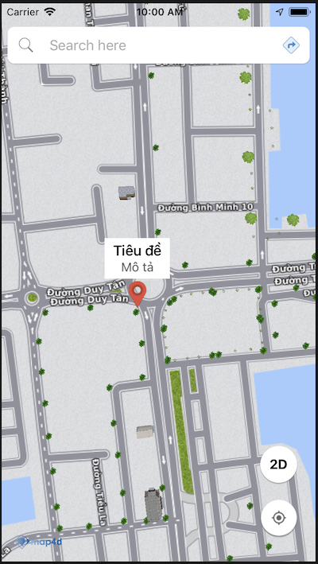

# Marker

Marker dùng để xác định một vị trí trên bản đồ. Cho phép người dùng thêm một điểm ghim trên bản đồ ở một vị trí xác định.

### 1. Thêm một marker
Hàm khởi tạo của lớp **MFMarker** cần truyền vào một đối tượng [MFMarkerOptions](/reference/marker?id=marker-options) để định nghĩa các thuộc tính ban đầu của
Marker. 

Ví dụ sau đây thêm một Marker đơn giản vào bản đồ tại Bình Thạnh, Thành phố Hồ Chí Minh:

<!-- tabs:start -->
#### ** Kotlin **

```kotlin
override fun onMapReady(map4D: Map4D) {  
    val markerOptions = MFMarkerOptions() 
    markerOptions.position(MFLocationCoordinate(10.793113, 106.720739))  
    markerOptions.snippet("Trung Tâm Hành Chính").title("Quận Bình Thạnh")  
    map4D.addMarker(markerOptions)  
}
```
#### ** Java **

```java
@Override  
public void onMapReady(final Map4D map4D) {  
    MFMarkerOptions marker = new MFMarkerOptions();  
    marker.position(new MFLocationCoordinate(10.793113, 106.720739));  
    marker.snippet("Trung Tâm Hành Chính").title("Quận Bình Thạnh");  
    map4D.addMarker(marker);  
}
```
<!-- tabs:end -->

### 2. Xóa Marker khỏi bản đồ

Để xóa một Marker ra khỏi bản đồ, hãy gọi phương thức **remove()**

<!-- tabs:start -->
#### ** Kotlin **

```kotlin
    marker.remove()
```

#### ** Java **

```java
    marker.remove();
```
<!-- tabs:end -->

> Nếu bạn muốn quản lý một danh sách các Marker, bạn nên tạo một mảng để chứa các Marker đó. Sử dụng mảng này bạn  
có thể gọi phương thức **remove()** lần lượt từng Marker trong mảng khi bạn cần xóa các Marker.

### 3. Tùy chỉnh hình ảnh cho Marker

Bạn có thể chỉ định một icon hoặc một hình ảnh khác để thay thế cho hình ảnh mặc định của Marker.

#### Thay đổi icon mặc đinh với thuộc tính icon

> Nếu bạn muốn thay đổi icon mặc định với icon khác từ image bạn có thể dùng thuộc tính **icon** cho marker.
> Hiện tại icon tạo từ resource chỉ hỗ trợ BitmapDrawable or VectorDrawable

> Chúng ta có thể tạo icon *MFBitmapDescriptor* thông qua *MFBitmapDescriptorFactory* class.

```java
public final class MFBitmapDescriptorFactory {
    public static MFBitmapDescriptor fromBitmap(Bitmap bitmap) {...}
    public static MFBitmapDescriptor fromView(View view) {...}
    public static MFBitmapDescriptor fromResource(@DrawableRes int resourceId) {...}
    public static MFBitmapDescriptor defaultMarker() {...}
}
```

<!-- tabs:start -->
#### ** Kotlin **

```kotlin
     val marker = map4D.addMarker(MFMarkerOptions()
                    .position(MFLocationCoordinate(10.771666, 106.704405))
                    .icon(MFBitmapDescriptorFactory.fromResource(R.drawable.ic_add_location_white_48d)))
```

#### ** Java **

```java
     MFMarker marker = map4D.addMarker(new MFMarkerOptions()
                    .position(new MFLocationCoordinate(10.771666, 106.704405))
                    .icon(MFBitmapDescriptorFactory.fromResource(R.drawable.ic_add_location_white_48dp)));
```
<!-- tabs:end -->

#### Hiển thị thông tin của Marker bằng infoWindow

- Khi marker có tiêu đề hoặc mô tả (title & snippet), nếu người dùng click vào marker, thông tin marker sẽ được hiển thị dựa vào điểm neo *windowAnchorU* và *windowAnchorV*.

<!-- tabs:start -->
#### ** Kotlin **

```kotlin
map4D.addMarker(MFMarkerOptions()
    .position(MFLocationCoordinate(10.771666, 106.704405))
    .icon(MFBitmapDescriptorFactory.fromResource(R.drawable.markerIcon))
    .title("Title")
    .snippet("Snippet"))
```

### ** Java **

```java
map4D.addMarker(new MFMarkerOptions()
    .position(new MFLocationCoordinate(10.771666, 106.704405))
    .icon(MFBitmapDescriptorFactory.fromResource(R.drawable.markerIcon))
    .title("Title")
    .snippet("Snippet"));
```
<!-- tabs:end -->

   > Chúng ta có thể tùy biến bảng hiển thị thông tin bao gồm cả layout lẫn nội dung
   
```java
public interface InfoWindowAdapter {
    android.view.View getInfoWindow(MFMarker marker);
    android.view.View getInfoContents(MFMarker marker);
}
```

- Hàm *getInfoWindow*: View của người dùng custom layout và nội dung, đc dùng khi View trả về != null
- Hàm *getInfoContents*: Custom nội dung, layout mặc định và được dùng khi getInfoWindow = null và View trả về != null

- Ví dụ

<!-- tabs:start -->

### ** Kotlin **

```kotlin
 inner class CustomInfoWindowAdapter: Map4D.InfoWindowAdapter {
    private val mWindow: View

    init {
      mWindow = layoutInflater.inflate(R.layout.custom_info_window, null)
    }

    override fun getInfoWindow(marker: MFMarker): View? {
      if (defaultInfoWindow) {
        return null
      }
      render(marker, mWindow)
      return mWindow
    }

    override fun getInfoContents(marker: MFMarker): View? {
      return null;
    }

    private fun render(marker: MFMarker, view: View) {
      val title = marker.title
      val titleUi = view.findViewById(R.id.title) as? TextView
      if (title != null) {
        // Spannable string allows us to edit the formatting of the text.
        val titleText = SpannableString(title)
        titleText.setSpan(ForegroundColorSpan(Color.RED), 0, titleText.length, 0)
        titleUi?.text = titleText
      } else {
        titleUi?.text = "Title"
      }

      val snippet = marker.snippet
      val snippetUi = view.findViewById(R.id.snippet) as? TextView
      if (snippet != null && snippet.length > 12) {
        val snippetText = SpannableString(snippet)
        snippetText.setSpan(ForegroundColorSpan(Color.MAGENTA), 0, 10, 0)
        snippetText.setSpan(ForegroundColorSpan(Color.BLUE), 12, snippet.length, 0)
        snippetUi?.text = snippetText
      } else {
        snippetUi?.text = snippet
      }
    }
 }
  
 override fun onMapReady(map4D: Map4D) {
    this.map4D = map4D
    map4D.setInfoWindowAdapter(CustomInfoWindowAdapter())
 }
```

### ** Java **

```java
class CustomInfoWindowAdapter implements Map4D.InfoWindowAdapter {
    private final View mWindow;

    CustomInfoWindowAdapter() {
        mWindow = getLayoutInflater().inflate(R.layout.custom_info_window, null); 
    }

    @Override
    public View getInfoWindow(MFMarker marker) {
        if (defaultInfoWindow) {
            return null; 
        }
        render(marker, mWindow);
        return mWindow; 
    }

    @Override
    public View getInfoContents(MFMarker marker) {
        return null; 
    }

    private void render(MFMarker marker, View view) {
        String title = marker.getTitle();
        TextView titleUi = ((TextView) view.findViewById(R.id.title));
        if (title != null) {
            // Spannable string allows us to edit the formatting of the text.
            SpannableString titleText = new SpannableString(title);
            titleText.setSpan(new ForegroundColorSpan(Color.RED), 0, titleText.length(), 0);
            titleUi.setText(titleText); 
        } else {
            titleUi.setText(title); 
        }

        String snippet = marker.getSnippet();
        TextView snippetUi = ((TextView) view.findViewById(R.id.snippet));
        if (snippet != null && snippet.length() > 12) {
            SpannableString snippetText = new SpannableString(snippet);
            snippetText.setSpan(new ForegroundColorSpan(Color.MAGENTA), 0, 10, 0);
            snippetText.setSpan(new ForegroundColorSpan(Color.BLUE), 12, snippet.length(), 0);
            snippetUi.setText(snippetText); 
        } else {
            snippetUi.setText(snippet); 
        } 
    }
    
}
@Override

public void onMapReady(Map4D map4D) {
    this.map4D = map4D;
    map4D.setInfoWindowAdapter(new CustomInfoWindowAdapter());
}
```
<!-- tabs:end -->



### 4. Tạo một Marker có thể kéo được trên bản đồ

> Để cho phép người dùng có thể kéo một Marker tới một vị trí khác trên bản đồ, chỉ định thuộc tính **draggable** thành **true** ở trong
**MFMarkerOptions**

> Ngoài ra bạn có thể gọi phương thức **setDraggable()** của đối tượng **Marker** và truyền vào tham số **true** để bật
  tính năng draggable của marker hoặc truyền vào tham số **false** để tắt tính năng draggable.
  
Để có thể drag marker thì chúng ta phải long press lên nó, sau đó mới có thể drag nó trên Map được. 
  
<!-- tabs:start -->

#### ** Kotlin  **
```kotlin
var marker = map4D.addMarker(MFMarkerOptions()
    .position(MFLocationCoordinate(10.771666, 106.704405))
    .draggable(true))  
// or

marker.isDraggable = true
```

#### ** Java **
```java
MFMarker marker = map4D.addMarker(new MFMarkerOptions()
                    .position(new MFLocationCoordinate(10.771666, 106.704405))
                    .draggable(true));  
// or

marker.setDraggable(true);
```

<!-- tabs:end -->

### 5. Sự kiện click marker

Phát sinh khi người dùng click vào marker

<!-- tabs:start -->
#### ** Kotlin **
```kotlin
map4D?.setOnMarkerClickListener { marker ->
    Toast.makeText(context, "${marker.title}", Toast.LENGTH_SHORT).show()
    return@setOnMarkerClickListener false
}
```

#### ** Java **
```java
map4D.setOnMarkerClickListener(new Map4D.OnMarkerClickListener() {
    @Override
    public boolean onMarkerClick(MFMarker marker) {
        Toast.makeText(context, "Marker title: " + marker.getTitle(), Toast.LENGTH_SHORT).show();
        return false;
    }
});
```
<!-- tabs:end -->

- Tham số *marker* sẽ trả về đối tượng marker mà người dùng click vào.
- Nếu trả về *true* thì sự kiện mặc định khi nhấn vào marker sẽ không được thực thi.
- Nếu trả về *false* thì sự kiện mặc định khi nhấn vào marker sẽ vẫn được thực thi.
- Sự kiện mặc định khi nhấn vào marker sẽ là hiển thị InfoWindow của marker.

### 6. Sự kiện drag marker

Nếu marker được tạo có thể kéo trên bản đồ thì sự kiện drag marker sẽ phát sinh khi người dùng kéo marker trên Map.
Khi marker được kéo thì `onMarkerDragStart(MFMarker)` sẽ được gọi đầu tiên. Trong khi marker đang được kéo trên bản đồ thì
`onMarkerDrag(MFMarker)` sẽ được gọi liên tục. Khi chúng ta kết thúc drag thì `onMarkerDragEnd(MFMarker)` sẽ được gọi.

<!-- tabs:start -->
#### ** Kotlin **
```kotlin
map4D?.setOnMarkerDragListener(object : Map4D.OnMarkerDragListener {
    override fun onMarkerDrag(marker: MFMarker?) {
    }

    override fun onMarkerDragEnd(marker: MFMarker?) {
    }

    override fun onMarkerDragStart(marker: MFMarker?) {
    }
})
```

#### ** Java **
```java
map4D.setOnMarkerDragListener((new Map4D.OnMarkerDragListener() {
    @Override
    public void onMarkerDrag(MFMarker marker) {
    }

    @Override
    public void onMarkerDragEnd(MFMarker marker) {
    }

    @Override
    public void onMarkerDragStart(MFMarker marker) {
    }
}));
```
<!-- tabs:end -->

- Tham số *marker* sẽ trả về đối tượng marker mà người dùng drag.

### 7. Một vài lưu ý khi vẽ Marker
> Giá trị default zIndex của marker nếu người dùng không truyền vào là 1.f

> zIndex: Marker nào có zIndex lớn hơn sẽ được vẽ sau, zIndex càng lớn càng sẽ được vẽ sau.

Ví dụ: 

<!-- tabs:start -->

#### ** Kotlin **
```kotlin
    val markerA = map4D.addMarker(MFMarkerOptions()
                      .position(MFLocationCoordinate(10.771666, 106.704405))
                      .icon(MFBitmapDescriptorFactory.fromResource(R.drawable.ic_default_marker))
                      .zIndex(5.f))

    val markerB = map4D.addMarker(MFMarkerOptions()
                        .position(MFLocationCoordinate(10.771666, 106.704405))
                        .icon(MFBitmapDescriptorFactory.fromResource(R.drawable.ic_my_position))
                        .zIndex(2.f))
```

#### ** Java **
```java
    MFMarker markerA = map4D.addMarker(new MFMarkerOptions()
                      .position(new MFLocationCoordinate(10.771666, 106.704405))
                      .icon(MFBitmapDescriptorFactory.fromResource(R.drawable.ic_default_marker))
                      .zIndex(5.f));

    MFMarker markerB = map4D.addMarker(new MFMarkerOptions()
                        .position(new MFLocationCoordinate(10.771666, 106.704405))
                        .icon(MFBitmapDescriptorFactory.fromResource(R.drawable.ic_my_position))
                        .zIndex(2.f));
```
<!-- tabs:end -->

- Như ví dụ trên thì markerA sẽ hiển thị phía trước marker vì nó có zIndex lớn hơn markerB.

- zIndex bằng nhau thì thêm vào sau sẽ vẽ sau.

Ví dụ:
<!-- tabs:start -->
#### ** Kotlin **
```kotlin

    val markerA = map4D.addMarker(MFMarkerOptions()
                          .position(MFLocationCoordinate(10.771666, 106.704405))
                          .icon(MFBitmapDescriptorFactory.fromResource(R.drawable.ic_default_marker)))

    val markerB = map4D.addMarker(MFMarkerOptions()
                          .position(MFLocationCoordinate(10.771666, 106.704405))
                          .icon(MFBitmapDescriptorFactory.fromResource(R.drawable.ic_my_position)))

```

#### ** Java **
```java

    MFMarker markerA = map4D.addMarker(new MFMarkerOptions()
                          .position(new MFLocationCoordinate(10.771666, 106.704405))
                          .icon(MFBitmapDescriptorFactory.fromResource(R.drawable.ic_default_marker)));

    MFMarker markerB = map4D.addMarker(new MFMarkerOptions()
                          .position(new MFLocationCoordinate(10.771666, 106.704405))
                          .icon(MFBitmapDescriptorFactory.fromResource(R.drawable.ic_my_position)));

```
<!-- tabs:end -->
- Như ví dụ trên thì markerB sẽ hiển thị phía trước markerA vì cả 2 marker có cùng zIndex nhưng markerB lại thêm vào sau markerA.

## Reference

### MFMarker Class

Tạo Marker với các **MFMarkerOptions** được chỉ định

<!-- tabs:start -->
#### ** Kotlin **

```kotlin
override fun onMapReady(map4D: Map4D) {  
    val markerOptions = MFMarkerOptions() 
        .position(MFLocationCoordinate(10.793113, 106.720739))  
        .snippet("Trung Tâm Hành Chính").title("Quận Bình Thạnh")  
    val marker = map4D?.addMarker(markerOptions)  
}
```
#### ** Java **

```java
@Override  
public void onMapReady(final Map4D map4D) {  
    MFMarkerOptions marker = new MFMarkerOptions();  
    marker.position(new MFLocationCoordinate(10.793113, 106.720739));  
    marker.snippet("Trung Tâm Hành Chính").title("Quận Bình Thạnh");  
    map4D.addMarker(marker);  
}
```
<!-- tabs:end -->

**Methods**

| Name                         | Parameters                              | Return Value | Description                                                                            |
|------------------------------|:---------------------------------------:|:------------:|----------------------------------------------------------------------------------------|
| **getAnchorU**               | `none`                                  | double       | Get điểm neo của Marker theo chiều x                                                     |
| **getAnchorV**               | `none`                                  | double       | Get điểm neo của Marker theo chiều y                                                     |
| **getElevation**             | `none`                                  | double       | Get độ cao của marker                                                                  |
| **getIcon**                  | `none`                                  |[MFBitmapDescriptor](/reference/marker?id=MFBitmapDescriptor)| Get hình ảnh đơn giản đã set cho marker trước đó|                                                                 ||
| **getIconView**              | `none`                                  | View         | Get hình ảnh custom đã set cho marker trước đó                                         |
| **getPosition**              | `none`                                  | [MFLocationCoordinate](/reference/coordinates?id=MFLocationCoordinate)| Get vị trí của marker         |
| **getRotation**              | `none`                                  | double       | Get góc quay của marker trên bản đồ                                                    |
| **getSnippet**               | `none`                                  | string       | Get mô tả của marker                                                                   |
| **getTitle**                 | `none`                                  | string       | Get tiêu đề của maker                                                                  |
| **getWindowAnchorU**         | `none`                                  | float        | Get điểm neo cho bảng thông tin marker theo chiều x                                    |
| **getWindowAnchorV**         | `none`                                  | float        | Get điểm neo cho bảng thông tin marker theo chiều y                                    |
| **hideInfoWindow**           | `none`                                  | void         | Ẩn bảng thông tin của marker                                                           |
| **isDraggable**              | `none`                                  | boolean      | Kiểm tra xem marker có thể kéo trên bản đồ hay không                                   |
| **isInfoWindowShown**        | `none`                                  | boolean      | Kiểm tra xem bảng thông tin của marker có hiển thị hay không                           |
| **isTouchable**              | `none`                                  | boolean      | Kiểm tra xem hiện tại có thể tương tác với marker không                                |
| **setVisible**               | boolean                                 | `none`       | Set ẩn hiện cho Marker                                                                 |
| **isVisible**                | `none`                                  | boolean      | Kiểm tra xem hiện tại marker có hiển thị hay không                                     |
| **setDraggable**             | boolean                                 | void         | Cho phép marker có được kéo trên bản đồ hay không                                      |
| **setIcon**                  | [MFBitmapDescriptor](/reference/marker?id=MFBitmapDescriptor)|void| Set một hình ảnh đơn giản cho marker để thay cho hình ảnh mặc định          |
| **setIconView**              | View                                    | void         | Set một hình ảnh custom cho marker để thay cho icon và hình ảnh mặc định               |
| **setPosition**              | [MFLocationCoordinate](/reference/coordinates?id=MFLocationCoordinate)|void| Set vị trí cho marker                                              |
| **setRotation**              | double                                  | void         | Set góc quay của marker trên bản đồ theo đơn vị độ                                     |
| **setSnippet**               | string                                  | void         | Set mô tả của marker                                                                   |
| **setTitle**                 | string                                  | void         | Set tiêu đề bảng thông tin của marker                                                  |
| **setElevation**             | double                                  | void         | Set độ cao cho marker so với mực nước biển, đơn vị là mét                              |
| **setTouchable**             | boolean                                 | void         | Set có thể tương tác với marker không                                                  |
| **setAnchor**                | float, float                            | void         | Set điểm neo cho marker                                                                |
| **setWindowAnchor**          | float, float                            | void         | Set điểm neo cho bảng thông tin marker                                                 |
| **showInfoWindow**           | `none`                                  | void         | Hiện bảng thông tin của marker                                                         |
| **setZIndex**                | float                                   | `none`       | Set giá trị zIndex cho Marker                                                          |
| **getZIndex**                | `none`                                  | float        | Get giá trị zIndex hiện tại của Marker                                                 |
| **setFlat**                  | boolean                                 | `none`       | Set Marker có thể nghiêng và xoay theo Map không                                       |
| **isFlat**                   | `none`                                  | boolean      | Kiểm tra xem hiện tại marker có thể nghiêng và xoay theo Map không                     |

### Marker Options

`MFMarkerOptions` class

Đối tượng MFMarkerOptions dùng để xác định các thuộc tính dùng cho Marker.

**Properties**

| Name                       | Type                | Description                                                                                                                                                           |
|----------------------------|:-------------------:|-----------------------------------------------------------------------------------------------------------------------------------------------------------------------|
| **position**               |[MFLocationCoordinate](/reference/coordinates?id=MFLocationCoordinate)| chỉ định một **MFLocationCoordinate** để xác định vị trí ban đầu của Marker.                                         |
| **icon**                   |[MFBitmapDescriptor](/reference/marker?id=MFBitmapDescriptor)| Set một hình ảnh đơn giản cho marker.                                                                                         |
| **iconView**               | View                | Set hình ảnh custom cho marker                                                                                                                                        |
| **anchor**                 | float, float        | Xác định điểm neo cho Marker                                                                                                                                          |
| **visible**                | boolean             | xác định Marker có thể ẩn hay hiện trên bản đồ. Giá trị mặc định là **true**.                                                                                         |
| **touchable**              | boolean             | cho phép người dùng có thể tương tác với Marker trên bản đồ hay không. Giá trị mặc định là **true**                                                                   |
| **elevation**              | double              | chỉ định độ cao của Marker so với mực nước biển, đơn vị là mét. Giá trị mặc định là **0**                                                                             |
| **zIndex**                 | float               | chỉ định thứ tự chồng nhau giữa các Marker với nhau hoặc giữa Marker với các đối tượng khác trên bản đồ. Giá trị mặc định là **1.0f**                                 |
| **windowAnchorU**          | float               | xác định điểm neo bảng thông tin của Marker theo chiều x. Bảng thông tin này sẽ hiện lên khi click vào Marker.                                                        |
| **windowAnchorV**          | float               | xác định điểm neo bảng thông tin của Marker theo chiều y. Bảng thông tin này sẽ hiện lên khi click vào Marker.                                                        |
| **title**                  | string              | chỉ định tiêu đề của Marker. Tiêu đề sẽ được hiển thị ở dòng đầu tiên của bảng thông tin Marker.                                                                      |
| **snippet**                | string              | mô tả thông tin ngắn gọn cho Marker. Snippet sẽ được hiển thị ở bẳng thông tin của Marker và phía dưới dòng tiêu đề.                                                  |
| **rotation**               | number              | chỉ định góc quay của Marker theo đơn vị là Độ. Giá trị mặc định là **0**                                                                                             |
| **draggable**              | boolean             | cho phép người dùng có thể kéo Marker trên bản đồ hay không. Giá trị mặc định là **false**                                                                            |
| **flat**                   | boolean             | chỉ định Marker có thể nghiêng và xoay theo bản đồ hay không. Giá trị mặc định là **false**                                                                           |
| **userData**               | Object              | truyền vào userData mà người dùng định nghĩa                                                                                                                          |

### MFBitmapDescriptor

Là một đối tượng lưu trữ hình ảnh.

`MFBitmapDescriptor` class

- Tạo MFBitmapDescriptor từ **MFBitmapDescriptorFactory**

<!-- tabs:start -->
#### ** Kotlin **
```kotlin
MFBitmapDescriptorFactory.fromResource(R.drawbable.example)
```
#### ** Java **
```java
MFBitmapDescriptorFactory.fromResource(R.drawbable.example);
```
<!-- tabs:end -->

