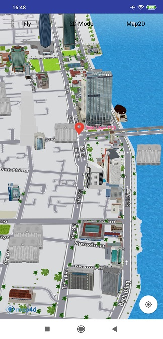

# POI

Hiện tại trên bản đồ đã có những điểm đánh dấu địa điểm có sẵn (như địa danh công cộng, quán cà phê, nhà hàng, bến xe, ...)
và chúng chỉ hiển thị khi bản đồ ở chế độ 2D. Khi bạn cần một đối tượng để đánh dấu một địa điểm trên bản đồ tương tự như
những điểm có sẵn đó thì bạn có thể dùng lớp **MFPOI**. Các đối tượng **MFPOI** bạn thêm vào bản đồ có thể hiển thị
ở **cả 2 chế độ 2D và 3D**. 

### 1. Tạo POI

 
  
<!-- tabs:start -->
#### ** Kotlin **
```kotlin
val userPOIOptions = MFPOIOptions()
    userPOIOptions.position(MFLocationCoordinate(16.066517, 108.210354)).title("Test User POI")
      .titleColor(Color.GREEN)
      .subtitle("Da Nang")
    val poi = map4D.addPOI(userPOIOptions)
```

#### ** Java **
```java
  MFPOIOptions userPOIOptions = new MFPOIOptions();
  userPOIOptions.position(new MFLocationCoordinate(16.071876, 108.223994)).title("Test User POI")
    titleColor(Color.GREEN).subtitle("Da Nang");
  MFPOI poi = map4D.addPOI(userPOIOptions);
```
<!-- tabs:end -->
 - **Chú ý**:
 - Người dùng có thể set icon cho POI bằng các cách sau (theo thứ tự ưu tiên):
   - ***Tuỳ biến lại marker bằng cách dùng hàm setIconView***
   - ***Sử dụng 1 hình ảnh làm icon dùng hàm setIcon***
   - ***Set type cho POI***
   
### 2. Xóa POI khỏi bản đồ

Để xóa một POI ra khỏi bản đồ, hãy gọi phương thức **remove()**

<!-- tabs:start -->
#### ** Kotlin **
```kotlin
    poi.remove()
```
#### ** Java **
```java
poi.remove();
```
<!-- tabs:end -->

### 3. Bật, tắt tính năng POI có sẵn của bản đồ

Bạn có thể bật hoặc tắt tính năng POI có sẵn của bản đồ. Mặc định thì bản đồ sẽ hiển thị các POI có sẵn của nó. Nếu bạn
muốn tắt nó đi thì sử dụng phương thức **setPOIsEnabled()** của lớp **Map4D** và truyền vào tham số **false**. Ngược
lại nếu bạn muốn bật nó lên thì bạn truyền vào tham số là **true**.

Ví dụ để tắt tính năng POI có sẵn của bản đồ:

<!-- tabs:start -->

#### ** Kotlin **
```kotlin
map4D?.setPOIsEnabled(false)
map4D?.isPOIsEnabled = false
```
#### ** Java **
```javascript
map4D.setPOIsEnabled(false);
```
<!-- tabs:end -->
Ngoài ra để kiểm tra tính năng POI có sẵn có được bật hay không bạn cũng có thể sử dụng phương thức **isPOIsEnabled()**
của lớp **Map4D**. Phương thức này sẽ trả về một giá trị **boolean** tương ứng với tính năng có được bật hay không.

<!-- tabs:start -->
#### ** Kotlin **
```kotlin
if (!map4D?.isPOIsEnabled) {
  Toast.makeText( context,
    "Poi is turn off",
    Toast.LENGTH_SHORT
  ).show()
}
```
#### ** Java **
```java
boolean isPOIsEnabled = map4D.isPOIsEnabled();
if (!isPOIsEnabled) {
  Toast.makeText( context,
    "Poi is turn off",
    Toast.LENGTH_SHORT
  ).show();
}
```
<!-- tabs:end -->

## 3. Sự kiện click POI

> Poi có 2 loại là của người dùng thêm vào và có sẵn trên bản đồ.

- Phát sinh khi người dùng click vào POI mà user thêm vào

<!-- tabs:start -->
#### ** Kotlin **
```kotlin
map4D?.setOnUserPOIClickListener {poi ->
    Toast.makeText(context, "User Poi Clicked: ${poi.title}", Toast.LENGTH_SHORT).show()
}
```

#### ** Java **
```java
map4D.setOnUserPOIClickListener(new Map4D.OnUserPOIClickListener() {
    @Override
    public void onUserPOIClick(MFPOI mfpoi) {
        Toast.makeText(context , "User Poi Clicked: " + mfpoi.getTitle(), Toast.LENGTH_SHORT).show();
    }
});
```
<!-- tabs:end -->

- Phát sinh khi người dùng click vào POI mà user thêm vào

<!-- tabs:start -->
#### ** Kotlin **
```kotlin
map4D?.setOnPOIClickListener { placeId, title, mfLocationCoordinate ->
    Toast.makeText(context, "Poi Clicked: $title", Toast.LENGTH_SHORT).show()
}
```

#### ** Java **
```java
map4D.setOnPOIClickListener(new Map4D.OnPOIClickListener() {
    @Override
    public void onPOIClick(String placeId, String title, MFLocationCoordinate location) {
        Toast.makeText(context , "Poi Clicked: " + title, Toast.LENGTH_SHORT).show();
    }
});
```
<!-- tabs:end -->

## Reference

### POI Class

`MFPOI` class

**Constructor** 

Tạo POI với các options được chỉ định

<!-- tabs:start -->
#### ** Kotlin **
```kotlin
val userPOIOptions = MFPOIOptions()
    userPOIOptions.position(MFLocationCoordinate(16.066517, 108.210354)).title("Test User POI")
      .titleColor(Color.GREEN)
      .subtitle("Da Nang")
    val poi = map4D.addPOI(userPOIOptions)
```

#### ** Java **
```java
  MFPOIOptions userPOIOptions = new MFPOIOptions();
  userPOIOptions.position(new MFLocationCoordinate(16.071876, 108.223994)).title("Test User POI")
    titleColor(Color.GREEN).subtitle("Da Nang");
  MFPOI poi = map4D.addPOI(userPOIOptions);
```
<!-- tabs:end -->

**Methods**

| Name                         | Parameters                              | Return Value | Description                                                                            |
|------------------------------|:---------------------------------------:|:------------:|----------------------------------------------------------------------------------------|
| **setTitle**                 | string                                  | `none`       | Set tiêu đề cho POI                                                                    |
| **getTitle**                 | `none`                                  | string       | Get tiêu đề của POI                                                                    |
| **setPosition**              |[MFLocationCoordinate](/reference/coordinates?id=MFLocationCoordinate)| `none`    | Set vị trí tọa độ trên bản đồ cho POI                        |
| **getPosition**              | `none` | [MFLocationCoordinate](/reference/coordinates?id=MFLocationCoordinate)  | Get vị trí tọa độ của POI                                    |
| ~**setTitleColor**~          | @ColorInt int                           | `none`       | Set màu cho tiêu đề của POI theo kiểu @ColorInt int                                    |
| ~**getTitleColor**~          | `none`                                  | @ColorInt int| Get màu tiêu đề của POI                                                                |
| **setColor**                 | @ColorInt int                           | `none`       | Set màu cho icon (nếu sử dụng `type`) và tiêu đề của POI theo kiểu @ColorInt int       |
| **getColor**                 | `none`                                  | @ColorInt int| Get màu icon và tiêu đề của POI                                                        |
| **setSubtitle**              | string                                  | `none`       | Set thông tin mô tả cho POI                                                            |
| **getSubtitle**              | `none`                                  | string       | Get thông tin mô tả của POI                                                            |
| **setType**                  | string                                  | `none`       | Set kiểu cho POI                                                                       |
| **getType**                  | `none`                                  | string       | Get kiểu của POI                                                                       |
| **setAnchor**                | float, float                            | void         | Set điểm neo cho icon của POI                                                          |
| **getAnchorU**               | `none`                                  | double       | Get điểm neo của icon POI theo chiều x                                                 |
| **getAnchorV**               | `none`                                  | double       | Get điểm neo của icon POI theo chiều y                                                 |
| **setIcon**                  |[MFBitmapDescriptor](/reference/marker?id=MFBitmapDescriptor)| `none`| Set hình ảnh đơn giản thay thế ảnh mặc định của POI                       |
| **getIcon**                  | `none`                                  |[MFBitmapDescriptor](/reference/marker?id=MFBitmapDescriptor)| Get hình ảnh đơn giản của POI           |
| **setIconView**              | View                                    | `none`      | Set hình ảnh custom thay thế ảnh mặc định của POI                                       |
| **getIconView**              | `none`                                  | View         | Get hình ảnh custom View của POI                                                       |
| **setVisible**               | boolean                                 | `none`       | Ẩn/hiện POI trên map hay không                                                         |
| **isVisible**                | `none`                                  | boolean      | Get trạng thái ẩn/hiện của POI                                                         |
| **setTouchable**             | boolean                                 | `none`       | Cho phép có được tương tác với POI trên bản đồ hay không                               |
| **isTouchable**              | `none`                                  | boolean      | Kiểm tra xem có thể tương tác với POI trên bản đồ hay không                            |
| **setZIndex**                | float                                   | `none`       | Set giá trị zIndex cho POI                                                             |
| **getZIndex**                | `none`                                  | float        | Get giá trị zIndex hiện tại của POI                                                    |

### POI Options

`MFPOIOptions` class

Đối tượng POIOptions dùng để xác định các thuộc tính dùng cho POI.

**Properties**

| Name                         | Type                | Description                                                                                                                                                           |
|------------------------------|:-------------------:|-----------------------------------------------------------------------------------------------------------------------------------------------------------------------|
| **position**                 |[MFLocationCoordinate](/reference/coordinates?id=MFLocationCoordinate)| chỉ định một **MFLocationCoordinate** để xác định vị trí ban đầu của POI.                                            |
| **title**                    | string              | chỉ định tiêu đề của POI. Tiêu đề sẽ hiển thị thông tin của POI mà bạn muốn hiển thị cho người dùng.                                                                  |
| **subtitle**                 | string              | chỉ định thông tin mô tả của POI.                                                                                                                                     |
| ~**titleColor**~             | @ColorInt int       | chỉ định màu tiêu đề của POI theo kiểu @ColorInt int. Giá trị mặc định là **"Color.BLUE"**                                                                            |
| **color**                    | @ColorInt int       | chỉ định màu cho icon (nếu chỉ định `type`) và tiêu đề của POI theo kiểu @ColorInt int. Giá trị mặc định là **"Color.BLUE"**                                            |
| **type**                     | string              | chỉ định kiểu của POI, tùy thuộc vào kiểu mà icon của POI sẽ có hình ảnh tương ứng. Hiện tại **map4d** hỗ trợ cái kiểu sau: **point, cafe, bus_station, electronics, shop, bakery, fuel, restaurant, police, payment_centre, museum, university, school, airport, bank, clothes, motel, insurance, furniture, atm, hospital, bar, books, theatre, car, goverment, townhall, apartment, park, stadium, nightclub**. Kiểu mặc định sẽ là **point**.|
| **anchor**                   | float, float        | Xác định điểm neo cho icon của POI                                                                                                                                    |
| **icon**                     |[MFBitmapDescriptor](/reference/marker?id=MFBitmapDescriptor)| chỉ định một hình ảnh đơn giản cho POI. Nếu option này được set giá trị thì hình ảnh của POI sẽ lấy mà không cần quan tâm tới option **type**. Giá trị mặc định là **null**.|
| **iconView**                 | View                | chỉ định một custom View cho POI. Nếu option này được set giá trị thì hình ảnh của POI sẽ lấy hình ảnh này mà không cần quan tâm tới option **type**. Giá trị mặc định là **null**.|
| **zIndex**                   | float               | chỉ định thứ tự chồng nhau giữa các POI với nhau, nó không dùng để xác định thứ tự chồng nhau so với các đối tượng khác. Giá trị mặc định là **1.0f**.                   |
| **visible**                  | boolean             | xác định POI có thể ẩn hay hiện trên bản đồ. Giá trị mặc định là **true**.                                                                                            |
| **touchable**                | boolean             | cho phép người dùng có thể tương tác với POI trên bản đồ hay không. Giá trị mặc định là **true**.                                                                     |
| **userData**                 | Object              | Kiểu User Data mà người dùng muốn lưu                                                                                                                                 |
