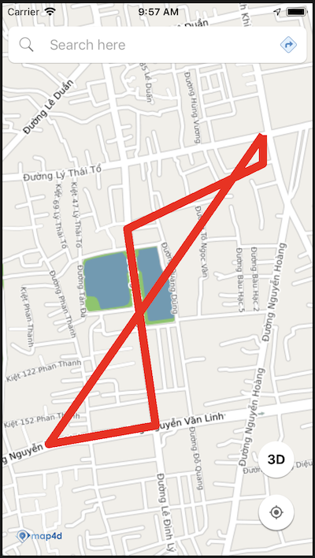
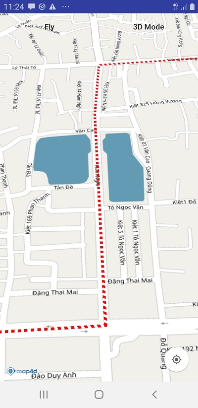

# Polyline

Để vẽ đường thẳng trên bản đồ thì ta sử dụng đối tượng Polyline. Một đối tượng Polyline bao gồm một mảng các điểm tọa độ
và tạo ra các đoạn thẳng nối các vị trí đó theo một trình tự có thứ tự.

### 1. Tạo polyline



> Tạo đối tượng polyline từ **MFPolylineOptions**


<!-- tabs:start -->
#### ** Kotlin **
```kotlin

  val latLngList = mutableListOf<MFLocationCoordinate>()
  latLngList.add(MFLocationCoordinate(16.067218, 108.213916))
  latLngList.add(MFLocationCoordinate(16.066496, 108.210311))
  latLngList.add(MFLocationCoordinate(16.064877, 108.210397))
  latLngList.add(MFLocationCoordinate(16.059980, 108.211137))
  latLngList.add(MFLocationCoordinate(16.059516, 108.208358))
  latLngList.add(MFLocationCoordinate(16.067218, 108.213916))
  val polyline = map4D?.addPolyline(
    MFPolylineOptions().add(*latLngList.toTypedArray())
    .color(ContextCompat.getColor(context ?: return, R.color.red))
    .width(8.0f))
```

#### ** Java **
```java
  private final List<MFLocationCoordinate> latLngList = new ArrayList<>();

  latLngList.add(new MFLocationCoordinate(16.067218, 108.213916));
  latLngList.add(new MFLocationCoordinate(16.066496, 108.210311));
  latLngList.add(new MFLocationCoordinate(16.064877, 108.210397));
  latLngList.add(new MFLocationCoordinate(16.059980, 108.211137));
  latLngList.add(new MFLocationCoordinate(16.059516, 108.208358));
  latLngList.add(new MFLocationCoordinate(16.067218, 108.213916));

  polyline = map4D.addPolyline(new MFPolylineOptions().add(latLngList.toArray(new MFLocationCoordinate[latLngList.size()]))
                .color(ContextCompat.getColor(this, R.color.red))
                .width(8);
```
<!-- tabs:end -->

Ví dụ trên thì chúng ta tạo một polyline từ danh sách các tọa độ `latLngList` với các tùy chỉnh:
* Màu sắc: là màu đỏ
* Độ rộng của polyline: 8 point

> Tạo Polyline với pattern. Pattern mặc định của Polyline là `MFSolidPattern`

Ví dụ bên dưới chúng ta sẽ sử dụng pattern `MFDashPattern` cho Polyline. Đó là các nét đứt nối tiếp nhau.

<!-- tabs:start -->
#### ** Kotlin **
```kotlin
  val latLngList: MutableList<MFLocationCoordinate> = mutableListOf()
  
  latLngList.add(MFLocationCoordinate(16.067218, 108.213916))
  latLngList.add(MFLocationCoordinate(16.066496, 108.210311))
  latLngList.add(MFLocationCoordinate(16.064877, 108.210397))
  latLngList.add(MFLocationCoordinate(16.059980, 108.211137))
  latLngList.add(MFLocationCoordinate(16.059516, 108.208358))

  val polyline = map4D!!.addPolyline(
    MFPolylineOptions().add(*latLngList.toTypedArray())
      .color(Color.RED)
      .width(8f)
      .pattern(MFDashPattern(8, 8))
```
#### ** Java **
```java
  final List<MFLocationCoordinate> latLngList = new ArrayList<>();

  latLngList.add(new MFLocationCoordinate(16.067218, 108.213916));
  latLngList.add(new MFLocationCoordinate(16.066496, 108.210311));
  latLngList.add(new MFLocationCoordinate(16.064877, 108.210397));
  latLngList.add(new MFLocationCoordinate(16.059980, 108.211137));
  latLngList.add(new MFLocationCoordinate(16.059516, 108.208358));

  polyline = map4D.addPolyline(new MFPolylineOptions().add(latLngList.toArray(new MFLocationCoordinate[latLngList.size()]))
                .color(Color.RED)
                .width(8)
                .pattern(new MFDashPattern(8, 8)));
```
<!-- tabs:end -->

- **Result**: 



Ngoài ra chúng ta còn có thêm pattern `MFDotPattern` và `MFIconPattern`

- Với `MFDotPattern` chúng ta sử dụng như sau:

<!-- tabs:start -->
#### ** Kotlin **
```kotlin
  val latLngList: MutableList<MFLocationCoordinate> = mutableListOf()
  
  latLngList.add(MFLocationCoordinate(16.067218, 108.213916))
  latLngList.add(MFLocationCoordinate(16.066496, 108.210311))
  latLngList.add(MFLocationCoordinate(16.064877, 108.210397))
  latLngList.add(MFLocationCoordinate(16.059980, 108.211137))
  latLngList.add(MFLocationCoordinate(16.059516, 108.208358))

  val polyline = map4D!!.addPolyline(
    MFPolylineOptions().add(*latLngList.toTypedArray())
      .color(Color.RED)
      .width(8f)
      .pattern(MFDotPattern(1))
```
#### ** Java **
```java
  final List<MFLocationCoordinate> latLngList = new ArrayList<>();

  latLngList.add(new MFLocationCoordinate(16.067218, 108.213916));
  latLngList.add(new MFLocationCoordinate(16.066496, 108.210311));
  latLngList.add(new MFLocationCoordinate(16.064877, 108.210397));
  latLngList.add(new MFLocationCoordinate(16.059980, 108.211137));
  latLngList.add(new MFLocationCoordinate(16.059516, 108.208358));

  polyline = map4D.addPolyline(new MFPolylineOptions().add(latLngList.toArray(new MFLocationCoordinate[latLngList.size()]))
                .color(Color.RED)
                .width(8)
                .pattern(new MFDotPattern(1)));
```
<!-- tabs:end -->

- **Result**


- Với `MFIconPattern` chúng ta sử dụng như sau:

<!-- tabs:start -->
#### ** Kotlin **
```kotlin
  val latLngList: MutableList<MFLocationCoordinate> = mutableListOf()
  
  latLngList.add(MFLocationCoordinate(16.067218, 108.213916))
  latLngList.add(MFLocationCoordinate(16.066496, 108.210311))
  latLngList.add(MFLocationCoordinate(16.064877, 108.210397))
  latLngList.add(MFLocationCoordinate(16.059980, 108.211137))
  latLngList.add(MFLocationCoordinate(16.059516, 108.208358))
  
  // icon có hỗ trợ alpha để tạo các khoảng hở cho hình ảnh
  val icon = MFBitmapDescriptorFactory.fromResource(R.drawable.your_icon)

  val polyline = map4D!!.addPolyline(
    MFPolylineOptions().add(*latLngList.toTypedArray())
      .color(Color.RED)
      .width(8f)
      .pattern(MFIconPattern(icon))
```
#### ** Java **
```java
  final List<MFLocationCoordinate> latLngList = new ArrayList<>();

  latLngList.add(new MFLocationCoordinate(16.067218, 108.213916));
  latLngList.add(new MFLocationCoordinate(16.066496, 108.210311));
  latLngList.add(new MFLocationCoordinate(16.064877, 108.210397));
  latLngList.add(new MFLocationCoordinate(16.059980, 108.211137));
  latLngList.add(new MFLocationCoordinate(16.059516, 108.208358));
  
  // icon có hỗ trợ alpha để tạo các khoảng hở cho hình ảnh
  MFBitmapDescriptor icon = MFBitmapDescriptorFactory.fromResource(R.drawable.your_icon);

  polyline = map4D.addPolyline(new MFPolylineOptions().add(latLngList.toArray(new MFLocationCoordinate[latLngList.size()]))
                .color(Color.RED)
                .width(8)
                .pattern(new MFIconPattern(icon)));
```
<!-- tabs:end -->

- **Result**


### 2. Xóa Polyline

> Để xóa polyline ra khỏi bản đồ ta sử dụng hàm `remove()`

<!-- tabs:start -->
#### ** Kotlin **
```kotlin
  polyline.remove()
```
#### ** Java **
```java
  polyline.remove();
```
<!-- tabs:end -->

### 3. Sự kiện click polyline

- Phát sinh khi người dùng click vào polyline

<!-- tabs:start -->

#### ** Kotlin **
```kotlin
    map4D?.setOnPolylineClickListener{ polyline ->
        Toast.makeText( context ?: return@setOnPolylineClickListener,
          "clicked Polyline: id " + polyline.id,
          Toast.LENGTH_SHORT
        ).show()
    }
```
#### ** Java **
```java
  map4D.setOnPolylineClickListener(new Map4D.OnPolylineClickListener() {
    @Override
    public void onPolylineClick(MFPolyline polyline) {
        Toast.makeText(getApplicationContext(), "clicked Polyline: id " + polyline.getId(), Toast.LENGTH_SHORT).show();
    }
  });
```
<!-- tabs:end -->
* Tham số polyline sẽ trả về đối tượng polyline mà người dùng click vào

## 4. Thứ tự vẽ các layer

- Giá trị default zIndex của Polyline nếu người dùng không truyền vào là -1.f
- zIndex: Polyline nào có zIndex lớn hơn sẽ ưu tiên hiển thị trước, zIndex càng lớn càng sẽ được vẽ sau.

<!-- tabs:start -->
#### ** Kotlin **
```kotlin
	val latLngList: MutableList<MFLocationCoordinate> = ArrayList()
    latLngList.add(MFLocationCoordinate(16.067218, 108.213916))
    latLngList.add(MFLocationCoordinate(16.066496, 108.210311))
    latLngList.add(MFLocationCoordinate(16.064877, 108.210397))
    latLngList.add(MFLocationCoordinate(16.059980, 108.211137))
    latLngList.add(MFLocationCoordinate(16.059516, 108.208358))

    val polylineA = map4D!!.addPolyline(
      MFPolylineOptions().add(*latLngList.toTypedArray())
        .color(Color.BLUE)
        .width(20f)
        .zIndex(5f)
    )

    val polylineB = map4D!!.addPolyline(
      MFPolylineOptions().add(*latLngList.toTypedArray())
        .color(Color.RED)
        .width(8f)
        .zIndex(10f)
    )
```
#### ** Java **
```java
	final List<MFLocationCoordinate> latLngList = new ArrayList<>();
    latLngList.add(new MFLocationCoordinate(16.067218, 108.213916));
    latLngList.add(new MFLocationCoordinate(16.066496, 108.210311));
    latLngList.add(new MFLocationCoordinate(16.064877, 108.210397));
    latLngList.add(new MFLocationCoordinate(16.059980, 108.211137));
    latLngList.add(new MFLocationCoordinate(16.059516, 108.208358));
    
    MFPolylineA polylineA = map4D.addPolyline(new MFPolylineOptions().add(latLngList.toArray(new MFLocationCoordinate[latLngList.size()]))
                    .color(ContextCompat.getColor(this, R.color.blue))
                    .width(20.f)
                    .zIndex(5.f));
                    
    MFPolyline polylineB = map4D.addPolyline(new MFPolylineOptions().add(latLngList.toArray(new MFLocationCoordinate[latLngList.size()]))
                    .color(ContextCompat.getColor(this, R.color.blue))
                    .width(8.f)
                    .zindex(10.f));
```
<!-- tabs:end -->
Như ví dụ ở trên thì polylineB sẽ đè lên polylineA vì nó có zIndex lớn hơn zIndex của polylineA.

- zIndex bằng nhau thì add vào sau sẽ vẽ sau.

**Ví dụ:**

<!-- tabs:start -->
#### ** Kotlin **
```kotlin
val latLngList: MutableList<MFLocationCoordinate> = ArrayList()
    latLngList.add(MFLocationCoordinate(16.067218, 108.213916))
    latLngList.add(MFLocationCoordinate(16.066496, 108.210311))
    latLngList.add(MFLocationCoordinate(16.064877, 108.210397))
    latLngList.add(MFLocationCoordinate(16.059980, 108.211137))
    latLngList.add(MFLocationCoordinate(16.059516, 108.208358))

    val polylineA = map4D!!.addPolyline(
      MFPolylineOptions().add(*latLngList.toTypedArray())
        .color(Color.BLUE)
        .width(8f)
        .zIndex(5f)
    )

    val polylineB = map4D!!.addPolyline(
      MFPolylineOptions().add(*latLngList.toTypedArray())
        .color(Color.RED)
        .width(20f)
        .zIndex(5f)
    )
```

#### ** Java **
```java
	final List<MFLocationCoordinate> latLngList = new ArrayList<>();
    latLngList.add(new MFLocationCoordinate(16.067218, 108.213916));
    latLngList.add(new MFLocationCoordinate(16.066496, 108.210311));
    latLngList.add(new MFLocationCoordinate(16.064877, 108.210397));
    latLngList.add(new MFLocationCoordinate(16.059980, 108.211137));
    latLngList.add(new MFLocationCoordinate(16.059516, 108.208358));
    
    MFPolylineA polylineA = map4D.addPolyline(new MFPolylineOptions().add(latLngList.toArray(new MFLocationCoordinate[latLngList.size()]))
                    .color(ContextCompat.getColor(this, R.color.blueWithAlpha))
                    .width(8.f)
                    .zIndex(5.f));
                    
    MFPolyline polylineB = map4D.addPolyline(new MFPolylineOptions().add(latLngList.toArray(new MFLocationCoordinate[latLngList.size()]))
                    .color(ContextCompat.getColor(this, R.color.blueWithAlpha))
                    .width(20.f)
                    .zindex(5.f));
```
<!-- tabs:end -->

Như ví dụ ở trên thì polylineB sẽ đè lên polylineA vì nó có zIndex bằng nhau nên được add vào sau sẽ được vẽ sau.

## Reference

### Polyline Class

`MFPolyline` class

- Tạo Polyline với các options được chỉ định

<!-- tabs:start -->
#### ** Kotlin **
```kotlin

  val latLngList = mutableListOf<MFLocationCoordinate>()
  latLngList.add(MFLocationCoordinate(16.067218, 108.213916))
  latLngList.add(MFLocationCoordinate(16.066496, 108.210311))
  latLngList.add(MFLocationCoordinate(16.064877, 108.210397))
  latLngList.add(MFLocationCoordinate(16.059980, 108.211137))
  latLngList.add(MFLocationCoordinate(16.059516, 108.208358))
  latLngList.add(MFLocationCoordinate(16.067218, 108.213916))
  val polyline = map4D?.addPolyline(
    MFPolylineOptions().add(*latLngList.toTypedArray())
    .color(ContextCompat.getColor(context ?: return, R.color.red))
    .width(8.0f))
```

#### ** Java **
```java
  private final List<MFLocationCoordinate> latLngList = new ArrayList<>();

  latLngList.add(new MFLocationCoordinate(16.067218, 108.213916));
  latLngList.add(new MFLocationCoordinate(16.066496, 108.210311));
  latLngList.add(new MFLocationCoordinate(16.064877, 108.210397));
  latLngList.add(new MFLocationCoordinate(16.059980, 108.211137));
  latLngList.add(new MFLocationCoordinate(16.059516, 108.208358));
  latLngList.add(new MFLocationCoordinate(16.067218, 108.213916));

  polyline = map4D.addPolyline(new MFPolylineOptions().add(latLngList.toArray(new MFLocationCoordinate[latLngList.size()]))
                .color(ContextCompat.getColor(this, R.color.red))
                .width(8);
```
<!-- tabs:end -->

**Methods**

| Name                         | Parameters                              | Return Value | Description                                                                            |
|------------------------------|:---------------------------------------:|:------------:|----------------------------------------------------------------------------------------|
| **setPath**                  | List<[MFLocationCoordinate](/reference/coordinates?id=MFLocationCoordinate)>|`none`| Set mảng các điểm tọa độ của polyline                      |
| **getPoints**                | None |List<[MFLocationCoordinate](/reference/coordinates?id=MFLocationCoordinate)>| Get list các điểm tọa độ của polyline                       |
| **setWidth**                 | float                                   | `none`       | Set độ rộng cho polyline                                                               |
| **getWidth**                 | `none`                                  | float        | Get độ rộng của polyline                                                               |
| **setColor**                 | @ColorInt int                           | `none`       | Set màu cho polyline theo kiểu @ColorInt int                                           |
| **getColor**                 | `none`                                  | @ColorInt int          | Get màu của polyline                                                         |
| **setVisible**               | boolean                                 | `none`       | Ẩn/hiện polyline trên map hay không                                                    |
| **isVisible**                | `none`                                  | boolean      | Get trạng thái ẩn/hiện của polyline                                                    |
| ~**setStyle**~               | MFPolylineStyle                         | `none`       | Set kiểu vẽ cho polyline (có 2 kiểu là: **MFPolyline.Solid** và **MFPolylineStyle.Dotted**)|
| ~**getStyle**~               | `none`                                  | MFPolylineStyle| Get kiểu vẽ hiện tại của polyline                                                    |
| **setPattern**     | [PatternItem](/reference/polyline?id=patternitem-class) | `none` | Set pattern cho polyline là kiểu Solid, Dash, Dot hoặc Icon                            |
| **getPattern**     | `none` | [PatternItem](/reference/polyline?id=patternitem-class) | Get pattern hiện tại của polyline                                                      |
| **setZIndex**                | float                                   | `none`       | Set giá trị zIndex cho polyline                                                        |
| **getZIndex**                | `none`                                  | float        | Get giá trị zIndex hiện tại của polyline                                               |
| **setTouchable**             | boolean                                 | `none`       | Cho phép có được tương tác với polyline trên bản đồ hay không                          |
| **isTouchable**              | `none`                                  | boolean      | Kiểm tra xem có thể tương tác với polyline trên bản đồ hay không                       |


### Polyline Options

`MFPolylineOptions` class

Đối tượng PolylineOptions dùng để xác định các thuộc tính dùng cho Polyline.

**Properties**

| Name                         | Type                | Description                                                                                                                                                           |
|------------------------------|:-------------------:|-----------------------------------------------------------------------------------------------------------------------------------------------------------------------|
| **path**                     |List<[MFLocationCoordinate](/reference/coordinates?id=MFLocationCoordinate)>| truyền vào một mảng các tọa độ **MFLocationCoordinate** để tạo Polyline.                                       |
| **width**                    | float               | chỉ định độ rộng của Polyline theo đơn vị point.                                                                                                                      |
| **color**                    | @ColorInt int       | chỉ định màu sắc của Polyline theo kiểu @ColorInt int. Giá trị mặc định là **"Color.BLACK"**.|
| **visible**                  | boolean             | xác định Polyline có thể ẩn hay hiện trên bản đồ. Giá trị mặc định là **true**.                                                                                       |
| **touchable**                | boolean             | cho phép người dùng có thể tương tác với Polyline trên bản đồ hay không. Giá trị mặc định là **true**.                                                                |
| **zIndex**                   | float               | chỉ định thứ tự hiển thị giữa các Polyline với nhau hoặc giữa Polyline với các đối tượng khác trên bản đồ. Giá trị mặc định là **-1.0f**.                             |
| ~**style**~                  | MFPolylineStyle     | chỉ định Polyline là loại nét liền (**"MFPolylineStyle.Solid"**) hay nét đứt (**"MFPolylineStyle.Dotted"**). Giá trị mặc định là **"MFPolylineStyle.Solid"**          |
| **pattern**                  | [PatternItem](/reference/polyline?id=patternitem-class)| chỉ định pattern cho Polyline là kiểu Solid, Dash, Dot hoặc Icon. Giá trị mặc định là Solid                                    |
| **userData**                 | Object              | Kiểu User Data mà người dùng muốn lưu                                                                                                                                 |

### PatternItem class

`PatternItem` abstract class

**Methods**

| Name                         | Parameters                              | Return Value | Description                                                                            |
|------------------------------|:---------------------------------------:|:------------:|----------------------------------------------------------------------------------------|
| **getType**                  |`none`| [MFPatternType](/reference/polyline?id=mfpatterntype) | Get kiểu của pattern                                                             |
| **getTypeValue**             |`none`                                   | int          | Get giá trị kiểu pattern theo số nguyên                                                |

### MFSolidPattern class

class `MFSolidPattern` extends `PatternItem`

> Dùng để định nghĩa pattern màu đồng nhất cho line.

**Constructor**

<!-- tabs:start -->
#### ** Kotlin **
```kotlin
val pattern = MFSolidPattern()
```

#### ** Java **
```java
PatternItem pattern = new MFSolidPattern();
```
<!-- tabs:end -->

### MFDashPattern class

class `MFDashPattern` extends `PatternItem`

> Dùng để định nghĩa pattern là nét đứt nối tiếp cho line. 

**Constructor**

```java
MFDashPattern(int length, int gap)
```

- Parameters:
  - length: độ dài của nét đứt
  - gap: khoảng hở giữa các nét đứt

<!-- tabs:start -->
#### ** Kotlin **
```kotlin
val pattern = MFDashPattern(8, 8)
```

#### ** Java **
```java
PatternItem pattern = new MFDashPattern(8, 8);
```
<!-- tabs:end -->

### MFDotPattern class

class `MFDotPattern` extends `PatternItem`

> Dùng để định nghĩa pattern là các chấm tròn nối tiếp cho line. 

**Constructor**

```java
MFDotPattern(int repeat)
```

- Parameters:
  - repeat: khoảng hở giữa các chấm tròn tính theo số lần bán kính của chấm tròn đó.

<!-- tabs:start -->
#### ** Kotlin **
```kotlin
val pattern = MFDotPattern(0)
```

#### ** Java **
```java
PatternItem pattern = new MFDotPattern(0);
```
<!-- tabs:end -->

### MFIconPattern class

class `MFIconPattern` extends `PatternItem`

> Dùng để định nghĩa pattern là hình ảnh do chúng ta chỉ định và nó được lặp đi lặp lại trên line. 

**Constructor**

```java
MFIconPattern(MFBitmapDescriptor icon)
```

- Parameters:
  - icon: hình ảnh mà chúng ta muốn hiển thị trên line (**có hỗ trợ alpha để tạo khoảng hở cho hình ảnh trên line**).

<!-- tabs:start -->
#### ** Kotlin **
```kotlin
val icon = MFBitmapDescriptorFactory.fromResource(R.drawable.your_icon)
val pattern = new MFIconPattern(icon)
```

#### ** Java **
```java
MFBitmapDescriptor icon = MFBitmapDescriptorFactory.fromResource(R.drawable.your_icon);
PatternItem pattern = new MFIconPattern(icon);
```
<!-- tabs:end -->

### MFPatternType

`MFPatternType` enum

Có 4 loại MFPatternType như bên dưới:

| No. | Name    | Description                                                                                                            |
|:---:|---------|------------------------------------------------------------------------------------------------------------------------|
|  1  | Solid   | Giá trị: `MFPatternType.Solid`<br>Pattern này sẽ vẽ line là một màu đồng nhất                                          |
|  2  | Dash    | Giá trị: `MFPatternType.Dash`<br>Pattern này sẽ vẽ line là các nét đứt nối tiếp nhau                                   |
|  3  | Dot     | Giá trị: `MFPatternType.Dot`<br>Pattern này sẽ vẽ line là các chấm tròn nối tiếp nhau                                  |
|  4  | Icon    | Giá trị: `MFPatternType.Icon`<br>Pattern này sẽ vẽ line là một hình ảnh do chúng ta chỉ định và nó được lặp đi lặp lại |
