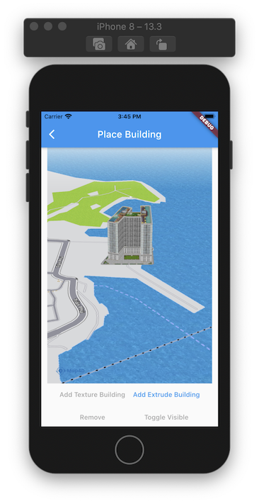
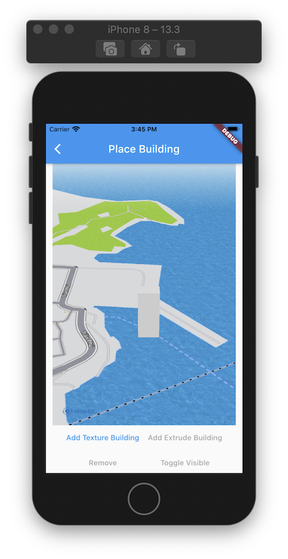

# Building

> Điểm khác biệt giữa nền tảng bản đồ **Map4D** với các nền tảng bản đồ khác đó là chế độ bản đồ 3D. Chế độ này sẽ có các đối
tượng 3D mô phỏng lại các tòa nhà, cây cối, các cây cầu cũng như các công trình kiến trúc khác, ... Ngoài những đối tượng **Building 3D** 
có sẵn của bản đồ, bạn còn có thể tự tạo và thêm đối tượng 3D của bạn lên bản đồ thông qua đối tượng **MFBuilding**

**Chú ý**: Những đối tượng **Building** này chỉ được vẽ trong chế độ 3D của bản đồ, nó không được vẽ trong chế độ 2D.

### Các thuộc tính của **Building**:

| Name                       |Description                                                                                                              |
|----------------------------|-------------------------------------------------------------------------------------------------------------------------|
| **buildingId**             | [Id](//pub.dev/documentation/map4d_map/latest/map4d_map/MFBuildingId-class.html) của **Building**.                      |
| **consumeTapEvents**       | Cho phép người dùng có thể tương tác được với **Building** hay không. Giá trị mặc định là **true**. Khi không cho phép người dùng tương tác với **Building** thì tất cả các sự kiện liên quan tới **Building** từ phía người dùng sẽ không có tác dụng. |
| **name**                   | Chỉ định tên của  **Building**.                                                                                         |
| **position**               | Chỉ định một [MFLatLng](//pub.dev/documentation/map4d_map/latest/map4d_map/MFLatLng-class.html) để xác định vị trí ban đầu của **Building**.                                         |
| **model**                  | Chỉ định một đường dẫn **URL** để lấy dữ liệu **model** cho **Building**.                                               |
| **texture**                | Chỉ định một đường dẫn **URL** để lấy dữ liệu **texture** cho **Building**. Thuộc tính này chỉ được dùng khi thuộc tính **model** được **set** giá trị. Nó sẽ **map** **texture** này vào **model** mà bạn đã **set** cho **Building**. Nếu bạn không **set** giá trị **texture** khi đã **set** giá trị **model** thì bản đồ sẽ vẽ một **building** màu trắng.  |
| **coordinates**            | Chỉ định một mảng vị trí [MFLatLng](//pub.dev/documentation/map4d_map/latest/map4d_map/MFLatLng-class.html) để tạo một **Building** hình khối với mặt đáy của hình khối là mảng vị trí này. Nó kết hợp với thuộc tính **height** để tạo chiều cao cho hình khối đó (**building** này được gọi là **Extrude Building**). Trường hợp dùng **coordinates** thì sẽ không dùng đến thuộc tính **texture**. Nếu **set** giá trị cho **coordinates** và cả **model** đồng thời thì sẽ ưu tiên lấy giá trị của **model** để tạo **Building**. |
| **height**                 | Chỉ định chiều cao của **Building** theo đơn vị là mét. Thuộc tính này chỉ có tác dụng khi **Building** của bạn được tạo từ một mảng [MFLatLng](//pub.dev/documentation/map4d_map/latest/map4d_map/MFLatLng-class.html) thông qua thuộc tính **coordinates** (hay còn gọi là **Extrude Building**). Nó không có tác dụng với **Building** được vẽ bằng **Model** và **Texture**. Giá trị mặc định là 1.  |
| **scale**                  | Chỉ định tỉ lệ của **Building** được vẽ ra ở trên bản đồ so với tỉ lệ thật của nó. Ví dụ khi giá trị scale là 0.5 thì **Building** sẽ nhỏ hơn một nửa so với kích thước thật của nó. Giá trị mặc định là 1. |
| **bearing**                | Chỉ định góc quay của **Building** khi được vẽ ra trên bản đồ theo đơn vị là Độ. Bình thường giá trị mặc định của nó là 0. Khi bạn muốn quay **Building** theo một hướng nào đó thì bạn chỉ cần set lại giá trị **bearing** trong khoảng từ 0 đến 360 độ. |
| **elevation**              | Chỉ định độ cao của **Building** so với mực nước biển, đơn vị là mét. Giá trị mặc định là 0                              |
| **selected**               | Chỉ định Building có được **hightlight** hay không. Khi nó được set là true thì **Building** sẽ được vẽ một đường viền màu đỏ xung quanh để giúp người dùng dễ nhận biết. Còn khi nó được **set** giá trị là **false** thì nó sẽ được vẽ như một **Building** bình thường. Giá trị mặc định là **false**. |
| **visible**               | Xác định **Building** có thể ẩn hay hiện trên bản đồ. Giá trị mặc định là **true**.                                      |

### 1. Thêm một Building

- Ta nên tạo một mảng **buildings** để quản lý các **building** biển diển trên **map**.

```dart
Map<MFBuildingId, MFBuilding> buildings = <MFBuildingId, MFBuilding>{};
MFBuildingId? _extrudeBuildingId;
MFBuildingId? _textureBuildingId;
```

- Texture building

 

```dart
void _addTextureBuilding() {
  final String buildingIdVal = 'building_id_texture_0';
  _buildingIdCounter++;
  final MFBuildingId buildingId = MFBuildingId(buildingIdVal);

  final MFBuilding building = MFBuilding(
    buildingId: buildingId,
    consumeTapEvents: true,
    position: _kInitTextureBuildingPosition,
    name: 'Texture Building',
    modelUrl: 'https://sw-hcm-1.vinadata.vn/v1/AUTH_d0ecabcbdcd74f6aa6ac9a5da528eb78/sdk/models/5b21d9a5cd18d02d045a5e99',
    textureUrl: 'https://sw-hcm-1.vinadata.vn/v1/AUTH_d0ecabcbdcd74f6aa6ac9a5da528eb78/sdk/textures/0cb35e1610c34e55946a7839356d8f66.jpg',
    onTap: () {
      _onBuildingTapped(buildingId);
    },
  );

  _textureBuildingId = buildingId;
  setState(() {
    buildings[buildingId] = building;
  });
}
```

- Extrude building

 

```dart
  void _addExtrudeBuilding() {
    final String buildingIdVal = 'building_id_extrude_0';
    final List<MFLatLng> coordinates = <MFLatLng>[
      MFLatLng(12.204259280159668, 109.21635255217552),
      MFLatLng(12.204259280159668,109.2167267203331),
      MFLatLng(12.20450177726977, 109.2167267203331),
      MFLatLng(12.20450177726977, 109.21635255217552),
      MFLatLng(12.204259280159668,109.21635255217552)
    ];
    final MFBuildingId buildingId = MFBuildingId(buildingIdVal);
    final MFBuilding building = MFBuilding(
      buildingId: buildingId,
      consumeTapEvents: true,
      position: _kInitExtrudeBuildingPosition,
      name: 'Extrude Building',
      coordinates: coordinates,
      height: 100,
      onTap: () {
        _onBuildingTapped(buildingId);
      },
    );

    _extrudeBuildingId = buildingId;
    setState(() {
      buildings[buildingId] = building;
    });
  }
```

Bạn có thể tùy chỉnh thuộc tính của **Building** trước khi thêm nó vào bản đồ hoặc sau khi nó đã được thêm vào bản đồ.

### 2. Xóa Building khỏi bản đồ

```dart
void _remove(MFBuildingId id) {
  setState(() {
    if (buildings.containsKey(id)) {
      buildings.remove(id);
    }
    if (id == _extrudeBuildingId) {
      _extrudeBuildingId = null;
    }
    else if (id == _textureBuildingId) {
      _textureBuildingId = null;
    }
  });
}
```

### 3. Tùy chỉnh cho Building

#### 3.1 Ẩn hiện Building

```dart
void _toggleVisible(MFBuildingId buildingId) {
  final MFBuilding building = buildings[buildingId]!;
  setState(() {
    buildings[buildingId] = building.copyWith(
      visibleParam: !building.visible,
    );
  });
}
```

### 4. Sự kiện tap của Building
```dart
void _onBuildingTapped(MFBuildingId buildingId) {
  print('Selected building: $id');
  setState(() {
    selectedBuilding = id;
  });
}
```