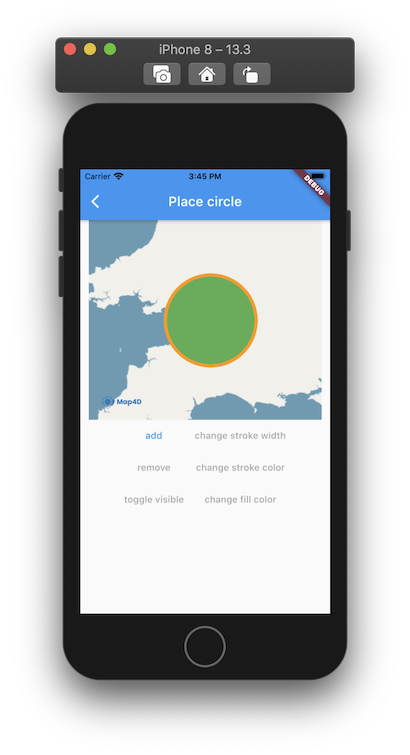

# Circle

Nếu bạn muốn vẽ một hình tròn lên bản đồ, thì Map4D SDK cung cấp cho bạn lớp **MFCircle** để thực hiện điều đó. 
Bạn có thể dễ dàng vẽ các vòng tròn trên bề mặt bản đồ.

Để tạo một Circle, bạn phải tạo **circleId** và chỉ định hai thuộc tính **center** và **radius**:

### Các thuộc tính của **Circle**:

| Name                       |Description                                                                                                              |
|----------------------------|-------------------------------------------------------------------------------------------------------------------------|
| **circleId**               | [Id](//pub.dev/documentation/map4d_map/latest/map4d_map/MFCircleId-class.html) của **Circle**.                                                                                                  |
| **consumeTapEvents**       | Cho phép người dùng có thể tương tác được với **Circle** hay không. Giá trị mặc định là **true**. Khi không cho phép người dùng tương tác với **Circle** thì tất cả các sự kiện liên quan tới **Circle** từ phía người dùng sẽ không có tác dụng. |
| **fillColor**              | Chỉ định màu sắc của **Circle**.                                                                                        |
| **center**                 | Chỉ định một[MFLatLng](//pub.dev/documentation/map4d_map/latest/map4d_map/MFLatLng-class.html) để xác định vị trí ban đầu của **Circle**                                             |
| **radius**                 | Bán kính đường của tròn tính từ tâm.                                                                                    |
| **strokeColor**            | Chỉ định màu sắc **đường viền Circle** point.                                                                           |
| **strokeWidth**            | Chỉ định độ lớn của đường viền **Circle** theo đơn vị.                                                                  |
| **zIndex**                 | Chỉ định thứ tự hiển thị giữa các Circle với nhau hoặc giữa **Circle** với các đối tượng khác trên bản đồ. Giá trị mặc định là **0**.  |
| **visible**                | Xác định **Circle** có thể ẩn hay hiện trên bản đồ. Giá trị mặc định là **true**.                                       |
| **onTap**                  | Callbacks để nhận sự kiện tap circle trên map.                                                                          |

### 1. Thêm một Circle

- Ta nên tạo một mảng **circles** để quản lý các **circle** biển diển trên **map**.

 

```dart
Map<MFCircleId, MFCircle> circles = <MFCircleId, MFCircle>{};
```

Đoạn mã sau sẽ vẽ một vòng tròn lên bản đồ:

```dart
void _add() {
  final MFCircleId circleId = MFCircleId('circle_id_0');
  final MFCircle circle = MFCircle(
    circleId: circleId,
    consumeTapEvents: true,
    strokeColor: Colors.orange,
    fillColor: Colors.green,
    strokeWidth: 5,
    center: MFLatLng(16.024816, 108.231791),
    radius: 50000,
    onTap: () {
      _onCircleTapped(circleId);
    }
  );

  setState(() {
    circles[circleId] = circle;
  });
}
```

Bạn có thể tùy chỉnh thuộc tính của **Circle** trước khi thêm nó vào bản đồ hoặc sau khi nó đã được thêm vào bản đồ.

### 2. Xóa Circle khỏi bản đồ

```dart
void _remove(MFCircleId circleId) {
  setState(() {
    if (circles.containsKey(circleId)) {
      circles.remove(circleId);
    }
  });
}
```

### 3. Tùy chỉnh cho Circle

#### 3.1 Ẩn hiện Circle

```dart
void _changeVisible(MFCircleId circleId) {
  final MFCircle circle = circles[circleId]!;
  setState(() {
    circles[circleId] = circle.copyWith(
      visibleParam: !circle.visible,
    );
  });
}
```

#### 3.2 Điểu chỉnh màu của Circle

```dart
void _changeFillColor(MFCircleId circleId) {
  final MFCircle circle = circles[circleId]!;
  setState(() {
    circles[circleId] = circle.copyWith(
      fillColorParam: Colors.blue,
    );
  });
}
```

#### 3.2 Điểu chỉnh màu viền Circle

```dart
void _changeStrokeColor(MFCircleId circleId) {
  final MFCircle circle = circles[circleId]!;
  setState(() {
    circles[circleId] = circle.copyWith(
      strokeColorParam: Colors.pink,
    );
  });
}
```

#### 3.2 Điểu chỉnh kích thước viền Circle

```dart
void _changeStrokeWidth(MFCircleId circleId) {
  final MFCircle circle = circles[circleId]!;
  setState(() {
    circles[circleId] = circle.copyWith(
      strokeWidthParam: 50,
    );
  });
}
```


### 4. Sự kiện tap của Circle
```dart
void _onCircleTapped(MFCircleId circleId) {
  setState(() {
    final MFCircle circle = circles[circleId]!;
    print("Selected circle: " + circleId.toString());
  });
}
```