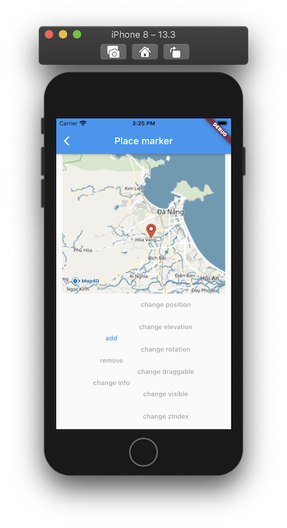

# Marker

> **Marker** dùng để xác định một vị trí đơn lẻ trên bản đồ. 

> Cho phép người dùng đánh dấu lên các vị trí trên bản đồ bằng các biểu tượng chung được cung cấp bởi **Map4dMap plugin** 
hoặc bạn có thể tuỳ chỉnh bằng một hình ảnh khác hoặc tuỳ chỉnh các thuộc tính của **Marker**

### Các thuộc tính của **Marker**:

| Name                       |Description                                                                                                              |
|----------------------------|-------------------------------------------------------------------------------------------------------------------------|
| **markerId**               | [Id](//pub.dev/documentation/map4d_map/latest/map4d_map/MFMarkerId-class.html) của **Marker**.                                                                                                  |
| **consumeTapEvents**       | Cho phép người dùng có thể tương tác được với **Marker** hay không. Giá trị mặc định là **true**. Khi không cho phép người dùng tương tác với **Marker** thì tất cả các sự kiện liên quan tới **Marker** từ phía người dùng sẽ không có tác dụng. |
| **position**               | Chỉ định một [MFLatLng](//pub.dev/documentation/map4d_map/latest/map4d_map/MFLatLng-class.html) để xác định vị trí ban đầu của **Marker**.                                           |
| **anchor**                 | Chỉ định một **Offset** để xác định điểm neo cho **Marker**. Giá trị mặc định là **const Offset(0.5, 0.5)**             |
| **elevation**              | Chỉ định độ cao của **Marker** so với mực nước biển, đơn vị là mét. Giá trị mặc định là **0**                           |
| **rotation**               | Chỉ định góc quay của **Marker** theo đơn vị là Độ. Giá trị mặc định là **0**                                           |
| **draggable**              | Cho phép người dùng có thể kéo **Marker** trên bản đồ hay không. Giá trị mặc định là **false**                          |
| **icon**                   | Tùy chỉnh **icon** cho **Marker**. Có thể truyền vào là một **MFBitmap**                                                |
| **visible**                | Xác định **Marker** có thể ẩn hay hiện trên bản đồ. Giá trị mặc định là **true**.                                       |
| **zIndex**                 | Chỉ định thứ tự hiển thị giữa **Marker** với các đối tượng khác trên bản đồ. Giá trị mặc định là **0**                  |
| **infoWindow**             | Tạo bản tin của **Marker**. Có thể truyền vào là **MFInfoWindow**                                                       |

### Các thuộc tính của **MFInfoWindow**

| Name                       |Description                                                                                                              |
|----------------------------|-------------------------------------------------------------------------------------------------------------------------|
| **anchor**                 | Chỉ định một **Offset** để xác định điểm neo bảng thông tin của **Marker**. Bảng thông tin này sẽ hiện lên khi **touch** vào **Marker**. Giá trị mặc định là **const Offset(0.5, 0.0)** |
| **title**                  | Chỉ định tiêu đề của **Marker**. Tiêu đề sẽ được hiển thị ở dòng đầu tiên của bảng thông tin **Marker**.                |
| **snippet**                | Mô tả thông tin ngắn gọn cho **Marker**. Snippet sẽ được hiển thị ở bẳng thông tin của **Marker** và phía dưới dòng tiêu đề. |

### 1. Thêm một Marker

 

- Ta nên tạo một mảng **markers** để quản lý các **marker** biển diển trên **map**.

```dart
Map<MFMarkerId, MFMarker> markers = <MFMarkerId, MFMarker>{};
```

Đoạn mã sau sẽ vẽ một vòng tròn lên bản đồ:

```dart
void _add() {
  final MFMarkerId markerId = MFMarkerId('marker_id_0');
  final MFMarker marker = MFMarker(
    consumeTapEvents: true,
    markerId: markerId,
    position: MFLatLng(16.0324816, 108.132791),
    anchor: Offset(0.5, 1.0),
    infoWindow: MFInfoWindow(
        snippet: "Snippet",
        title: "Map4D",
        anchor: const Offset(0.5, 0.0),
        onTap: () {
          _onInfoWindowTapped(markerId);
        }),
    zIndex: 1.0,
    onTap: () {
      _onMarkerTapped(markerId);
    },
    onDragEnd: (MFLatLng position) {
      _onMarkerDragEnd(markerId, position);
    }
  );
  setState(() {
    markers[markerId] = marker;
  });
}
```

Bạn có thể tùy chỉnh thuộc tính của **Marker** trước khi thêm nó vào bản đồ hoặc sau khi nó đã được thêm vào bản đồ.

### 2. Xóa Marker khỏi bản đồ

```dart
void _remove(MFMarkerId markerId) {
  setState(() {
    if (markers.containsKey(markerId)) {
      markers.remove(markerId);
    }
  });
}
```

### 3. Tùy chỉnh cho Marker

#### 3.1 Ẩn hiện Marker

```dart
void _changeVisible(MFMarkerId markerId) {
  final MFMarker marker = markers[markerId]!;
  setState(() {
    markers[markerId] = marker.copyWith(
      visibleParam: !marker.visible,
    );
  });
}
```

#### 3.2 Điểu chỉnh vị trí của Marker

```dart
void _changePosition(MFMarkerId markerId) {
  final MFMarker marker = markers[markerId]!;
  setState(() {
    markers[markerId] = marker.copyWith(
        positionParam: MFLatLng(16.0354816, 108.134791),
      );
  });
}
```

#### 3.3 Xoay Marker

```dart
void _changeRotation(MFMarkerId markerId) {
  final MFMarker marker = markers[markerId]!;
  setState(() {
    markers[markerId] = marker.copyWith(
      rotationParam: 50,
    );
  });
}
```

#### 3.4 Thay đổi độ cao Marker.

- Chỉ áp dụng ở chế độ 3D.

```dart
void _changeElevation(MFMarkerId markerId) {
  final MFMarker marker = markers[markerId]!;
  setState(() {
    markers[markerId] = marker.copyWith(
      elevationParam: 100,
    );
  });
}
```

#### 3.5 Thay đổi zIndex của Marker.

```dart
void _changeZindex(MFMarkerId markerId) {
  final MFMarker marker = markers[markerId]!;
  setState(() {
    markers[markerId] = marker.copyWith(
      zIndexParam: 99,
    );
  });
}
```

#### 3.6 Thay đổi draggable của Marker.

```dart
void _changeDraggable(MFMarkerId markerId) {
  final MFMarker marker = markers[markerId]!;
  setState(() {
    markers[markerId] = marker.copyWith(
      draggableParam: !marker.draggable,
    );
  });
}
```

#### 3.7 Điểu chỉnh InfoWindow của Marker 

```dart
Future<void> _changeInfo(MFMarkerId markerId) async {
  final MFMarker marker = markers[markerId]!;
  final String newTitle = 'New title';
  final String newSnippet = 'New snippet';
  setState(() {
    markers[markerId] = marker.copyWith(
      infoWindowParam: marker.infoWindow.copyWith(
        snippetParam: newSnippet,
        titleParam: newTitle,
      ),
    );
  });
}
```

### 4. Các sự kiện của Marker

#### 4.1 Sự kiện Tap vào Marker 
```dart
void _onMarkerTapped(MFMarkerId markerId) {
  setState(() {
    final MFMarker marker = markers[markerId]!;
    print("Selected marker: " + markerId.toString());
  });
}
```

#### 4.1 Sự kiện Tap vào InfoWindow của Marker 
```dart
  void _onInfoWindowTapped(MFMarkerId markerId) {
    setState(() {
      print("Did tap info window of " + markerId.value);
    });
  }
```

#### 4.1 Sự kiện DragEnd của Marker 
```dart
void _onMarkerDragEnd(MFMarkerId markerId, MFLatLng newPosition) async {
  final MFMarker? tappedMarker = markers[markerId];
  if (tappedMarker != null) {
    await showDialog<void>(
        context: context,
        builder: (BuildContext context) {
          return AlertDialog(
              actions: <Widget>[
                TextButton(
                  child: const Text('OK'),
                  onPressed: () => Navigator.of(context).pop(),
                )
              ],
              content: Padding(
                  padding: const EdgeInsets.symmetric(vertical: 66),
                  child: Column(
                    mainAxisSize: MainAxisSize.min,
                    children: <Widget>[
                      Text('Old position: ${tappedMarker.position}'),
                      Text('New position: $newPosition'),
                    ],
                  )));
        });
  }
  final MFMarker marker = markers[markerId]!;
  setState(() {
    markers[markerId] = marker.copyWith(
      positionParam: newPosition
    );
  });
}
```