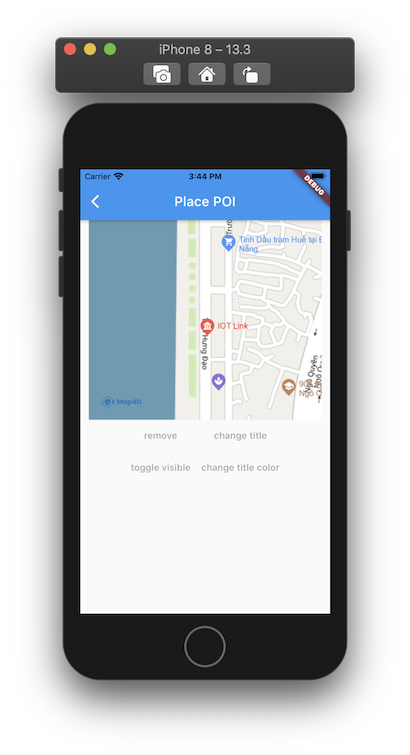

# POI

> Hiện tại trên bản đồ đã có những điểm đánh dấu địa điểm có sẵn (như địa danh công cộng, quán cà phê, nhà hàng, bến xe, ...)
và chúng chỉ hiển thị khi bản đồ ở chế độ 2D. Khi bạn cần một đối tượng để đánh dấu một địa điểm trên bản đồ tương tự như
những điểm có sẵn đó thì bạn có thể dùng lớp **MFPOI**. Các đối tượng **POI** bạn thêm vào bản đồ có thể hiện thị
ở **cả 2 chế độ 2D và 3D**.

### Các thuộc tính của **POI**:

| Name                       |Description                                                                                                              |
|----------------------------|-------------------------------------------------------------------------------------------------------------------------|
| **position**               | Chỉ định một [MFLatLng](//pub.dev/documentation/map4d_map/latest/map4d_map/MFLatLng-class.html) để xác định vị trí ban đầu của **POI**.|
| **title**                  | Chỉ định tiêu đề của **POI**. Tiêu đề sẽ hiển thị thông tin của **POI** mà bạn muốn hiển thị cho người dùng.            |
| **titleColor**             | Chỉ định màu tiêu đề của **POI**.                                                                                       |
| **subtitle**               | Chỉ định thông tin mô tả của **POI**.                                                                                   |
| **type**                   | Chỉ định kiểu của **POI**, tùy thuộc vào kiểu mà icon của **POI** sẽ có hình ảnh tương ứng.                             |
| **icon**                   | Tùy chỉnh **icon** cho **POI**. Có thể truyền vào là một **UIImage**                                                    |
| **consumeTapEvents**       | Cho phép người dùng có thể tương tác được với **POI** hay không. Giá trị mặc định là **true**. Khi không cho phép người dùng tương tác với **POI** thì tất cả các sự kiện liên quan tới **POI** từ phía người dùng sẽ không có tác dụng. | 
| **visible**                | Xác định **POI** có thể ẩn hay hiện trên bản đồ. Giá trị mặc định là **true**.                                          |
| **zIndex**                 | Chỉ định thứ tự hiển thị giữa **POI** với các đối tượng khác trên bản đồ. Giá trị mặc định là **0**                     |

**Ghi chú:** Hiện tại Map4D hỗ trợ cái kiểu sau: **point**, **cafe**, **bus_station**, **electronics**, **shop**, **bakery**, **fuel**, **restaurant**, **police**, **payment_centre**, **museum**, **university**, **school**, **airport**, **bank**, **clothes**, **motel**, **insurance**, **furniture**, **atm**, **hospital**, **bar**, **books**, **theatre**, **car**, **goverment**, **townhall**, **apartment**, **park**, **stadium**, **nightclub**. Kiểu mặc định sẽ là **point**.

### 1. Thêm một POI

- Ta nên tạo một mảng **pois** để quản lý các **poi** biển diển trên **map**.

 

```dart
Map<MFPOIId, MFPOI> pois = <MFPOIId, MFPOI>{};
```

```dart
void _add() {
  final String poiIdVal = 'poi_id_0';
  final MFPOIId poiId = MFPOIId(poiIdVal);
  final MFPOI poi = MFPOI(
    poiId: poiId,
    consumeTapEvents: true,
    position: MFLatLng(16.0324816, 108.132791),
    title: "IOT Link",
    titleColor: Colors.red,
    type: "hospital",
    onTap: () {
      _onPOITapped(poiId);
    },
  );

  setState(() {
    pois[poiId] = poi;
  });
}
```

Bạn có thể tùy chỉnh thuộc tính của **POI** trước khi thêm nó vào bản đồ hoặc sau khi nó đã được thêm vào bản đồ.

### 2. Xóa POI khỏi bản đồ

```dart
void _remove(MFPOIId poiId) {
  setState(() {
    if (pois.containsKey(poiId)) {
      pois.remove(poiId);
    }
  });
}
```

### 3. Tùy chỉnh cho POI

#### 3.1 Ẩn hiện POI

```dart
void _toggleVisible(MFPOIId poiId) {
  final MFPOI poi = pois[poiId]!;
  setState(() {
    pois[poiId] = poi.copyWith(
      visibleParam: !poi.visible,
    );
  });
}
```

#### 3.2 Thay đổi tiêu đề của POI

```dart
void _changeTitle(MFPOIId poiId) {
  final MFPOI poi = pois[poiId]!;
  setState(() {
    pois[poiId] = poi.copyWith(
      titleParam: "IOT Link",
    );
  });
}
```

#### 3.3 Thay đổi màu tiêu đề của POI

```dart
void _changeTitleColor(MFPOIId poiId) {
  final MFPOI poi = pois[poiId]!;
  setState(() {
    pois[poiId] = poi.copyWith(titleColorParam: Colors.blue);
  });
}
```

### 4. Sự kiện tap của POI
```dart
void _onPOITapped(MFPOIId poiId) {
  setState(() {
    final MFPOI poi = pois[poiId]!;
    print("Selected poi: " + poiId.toString());
  });
}
```