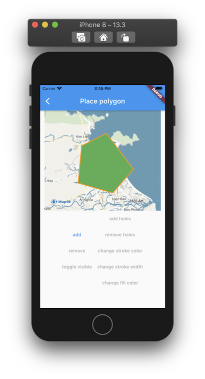
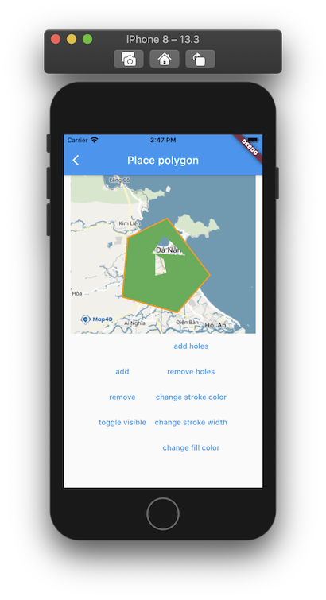

# Polygon

> Để vẽ các đa giác trên bản đồ thì ta sử dụng đối tượng **MFPolygon**. Một đối tượng **MFPolygon** bao gồm một mảng các điểm tọa độ
và tạo ra các đoạn thẳng nối các vị trí đó theo một trình tự có thứ tự.

### Các thuộc tính của **Polygon**:

| Name                       |Description                                                                                                              |
|----------------------------|-------------------------------------------------------------------------------------------------------------------------|
| **polygonId**              | [Id](//pub.dev/documentation/map4d_map/latest/map4d_map/MFPolygonId-class.html) của **Polygon**.                                                                                                 |
| **points**                 | Truyền vào một mảng các tọa độ [MFLatLng](//pub.dev/documentation/map4d_map/latest/map4d_map/MFLatLng-class.html) để tạo **Polygon**.                                                 |
| **holes**                  | Truyền vào một mảng hoặc nhiều mảng các tọa độ [MFLatLng](//pub.dev/documentation/map4d_map/latest/map4d_map/MFLatLng-class.html) để tạo **Holes** cho **Polygon**.                  |
| **fillColor**              | Chỉ định màu tô phía trong của **Polygon**.                                                                             |
| **strokeColor**            | Chỉ định màu sắc đường viền ngoài cùng của **Polygon**.                                                                 |
| **strokeWidth**            | Chỉ định độ rộng đường viền của Polygon theo đơn vị point.                                                              |
| **consumeTapEvents**       | Cho phép người dùng có thể tương tác được với **Polygon** hay không. Giá trị mặc định là **true**. Khi không cho phép người dùng tương tác với **Polygon** thì tất cả các sự kiện liên quan tới **Polygon** từ phía người dùng sẽ không có tác dụng.  |
| **visible**                | Xác định **Polygon** có thể ẩn hay hiện trên bản đồ. Giá trị mặc định là **true**.                                      |
| **zIndex**                 | Chỉ định thứ tự hiển thị giữa các **Polygon** với nhau hoặc giữa **Polygon** với các đối tượng khác trên bản đồ. Giá trị mặc định là **0**  | 

### 1. Tạo một Polygon

#### 1.1 Toạ polygon
- Ta nên tạo một mảng **polygons** để quản lý các **polygon** biển diển trên **map**.

```dart
Map<MFPolygonId, MFPolygon> polygons = <MFPolygonId, MFPolygon>{};
```

 

Đoạn mã sau sẽ vẽ một Polygon lên bản đồ:

```dart
List<MFLatLng> _createPoints() {
  final List<MFLatLng> points = <MFLatLng>[];
  points.add(_createLatLng(16.09628897915164, 108.09963226318358));
  points.add(_createLatLng(15.948785390273288, 108.08521270751953));
  points.add(_createLatLng(15.909828927635155, 108.22803497314453));
  points.add(_createLatLng(16.003245716502565, 108.31283569335938));
  points.add(_createLatLng(16.14510277154745, 108.20228576660156));
  points.add(_createLatLng(16.09628897915164, 108.09963226318358));
  return points;
}

void _add() {
  final MFPolygonId polygonId = MFPolygonId('Polygon_id_0');
  final MFPolygon polygon = MFPolygon(
      polygonId: polygonId,
      consumeTapEvents: true,
      color: Colors.orange,
      width: 5,
      points: _createPoints(),
      onTap: () {
        _onPolygonTapped(polygonId);
      },
    );

  setState(() {
    polygons[polygonId] = polygon;
  });
}
```

#### 1.2 Thêm holes cho polygon 

 

```dart
List<List<MFLatLng>> _createHoles(MFPolygonId polygonId) {
  final List<List<MFLatLng>> holes = <List<MFLatLng>>[];
  final double offset = (polygonOffsets[polygonId]! - 1) / 4;

  final List<MFLatLng> hole1 = <MFLatLng>[];
  hole1.add(_createLatLng(16.102556286933407, 108.19370269775389));
  hole1.add(_createLatLng(16.058021127461473, 108.16280364990233));
  hole1.add(_createLatLng(16.05274222526572, 108.24897766113281));
  hole1.add(_createLatLng(16.102556286933407, 108.19370269775389));
  holes.add(hole1);

  final List<MFLatLng> hole2 = <MFLatLng>[];
  hole2.add(_createLatLng(16.055483506239545, 108.17070007324219));
  hole2.add(_createLatLng(16.00220588906289, 108.1710433959961));
  hole2.add(_createLatLng(16.008525929134183, 108.20022583007812));
  hole2.add(_createLatLng(16.043173858350652, 108.19267272949219));
  hole2.add(_createLatLng(16.055483506239545, 108.17070007324219));
  holes.add(hole2);

  return holes;
}

void _addHoles(MFPolygonId polygonId) {
  final MFPolygon polygon = polygons[polygonId]!;
  setState(() {
    var holes = _createHoles(polygonId);
    polygons[polygonId] =
        polygon.copyWith(holesParam: holes);
  });
}
```

Bạn có thể tùy chỉnh thuộc tính của **Polygon** trước khi thêm nó vào bản đồ hoặc sau khi nó đã được thêm vào bản đồ.

### 2. Xóa Polygon khỏi bản đồ

#### 2.1 Xóa Polygon 
```dart
void _remove(MFPolygonId polygonId) {
  setState(() {
    if (polygons.containsKey(polygonId)) {
      polygons.remove(polygonId);
    }
  });
}
```

### 2.2 Xoá Holes
```dart
void _removeHoles(MFPolygonId polygonId) {
  final MFPolygon polygon = polygons[polygonId]!;
  setState(() {
    polygons[polygonId] = polygon.copyWith(
      holesParam: <List<MFLatLng>>[],
    );
  });
}
```

### 3. Tùy chỉnh cho Polygon

#### 3.1 Ẩn hiện Polygon

```dart
void _changeVisible(MFPolygonId polygonId) {
  final MFPolygon polygon = Polygons[polygonId]!;
  setState(() {
    polygons[polygonId] = polygon.copyWith(
      visibleParam: !polygon.visible,
    );
  });
}
```

#### 3.2 Điểu chỉnh màu của Polygon

```dart
void _changeFillColor(MFPolygonId polygonId) {
  final MFPolygon polygon = polygons[polygonId]!;
  setState(() {
    polygons[polygonId] = polygon.copyWith(
      fillColorParam: Colors.red,
    );
  });
}
```

#### 3.3 Điểu chỉnh màu viền của Polygon

```dart
void _changeStrokeColor(MFPolygonId polygonId) {
  final MFPolygon polygon = polygons[polygonId]!;
  setState(() {
    polygons[polygonId] = polygon.copyWith(
      strokeColorParam: Colors.pink,
    );
  });
}
```

#### 3.4 Điểu chỉnh kích thước viền của Polygon

```dart
void _changeStrokeWidth(MFPolygonId polygonId) {
  final MFPolygon polygon = polygons[polygonId]!;
  setState(() {
    polygons[polygonId] = polygon.copyWith(
      strokeWidthParam: 50,
    );
  });
}
```


### 4. Sự kiện tap của Polygon
```dart
void _onPolygonTapped(MFPolygonId polygonId) {
  setState(() {
    final MFPolygon polygon = Polygons[polygonId]!;
    print("Selected polygon: " + polygonId.toString());
  });
}
```
