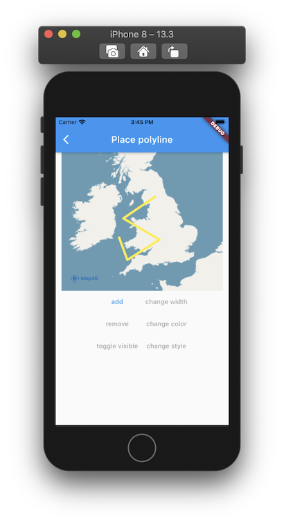

# Polyline

> Để vẽ các đường thẳng trên bản đồ thì ta sử dụng đối tượng **MFPolyline**. Một đối tượng **MFPolyline** bao gồm một mảng các điểm tọa độ
và tạo ra các đoạn thẳng nối các vị trí đó theo một trình tự có thứ tự.

### Các thuộc tính của **Polyline**:

| Name                       |Description                                                                                                              |
|----------------------------|-------------------------------------------------------------------------------------------------------------------------|
| **polylineId**             | [Id](//pub.dev/documentation/map4d_map/latest/map4d_map/MFPolylineId-class.html) của **Polyline**.                                                                                                |
| **points**                 | Truyền vào một mảng các tọa độ [MFLatLng](//pub.dev/documentation/map4d_map/latest/map4d_map/MFLatLng-class.html) để tạo Polyline.**Polyline**.                                       |
| **width**                  | Chỉ định độ rộng của **Polyline** theo đơn vị point.                                                                    |
| **style**                  | Chỉ định **Polyline** là loại nét liền **solid** hay nét đứt **dotted**. Giá trị mặc định là **solid** **Polyline**.    |
| **color**                  | Chỉ định màu sắc của **Polyline**.                                                                                      |
| **consumeTapEvents**       | Cho phép người dùng có thể tương tác được với **Polyline** hay không. Giá trị mặc định là **true**. Khi không cho phép người dùng tương tác với **Polyline** thì tất cả các sự kiện liên quan tới **Polyline** từ phía người dùng sẽ không có tác dụng.  |
| **visible**                | Xác định **Polyline** có thể ẩn hay hiện trên bản đồ. Giá trị mặc định là **true**.                                     |
| **zIndex**                 | Chỉ định thứ tự hiển thị giữa các **Polyline** với các đối tượng khác trên bản đồ. Giá trị mặc định là **0**            |

### 1. Thêm một Polyline

- Ta nên tạo một mảng **polylines** để quản lý các **polyline** biển diển trên **map**.

```dart
Map<MFPolylineId, MFPolyline> polylines = <MFPolylineId, MFPolyline>{};
```

 

Đoạn mã sau sẽ vẽ một Polyline lên bản đồ:

```dart
List<MFLatLng> _createPoints() {
  final List<MFLatLng> points = <MFLatLng>[];
  points.add(_createLatLng(51.4816, -3.1791));
  points.add(_createLatLng(53.0430, -2.9925));
  points.add(_createLatLng(53.1396, -4.2739));
  points.add(_createLatLng(52.4153, -4.0829));
  return points;
}

MFLatLng _createLatLng(double lat, double lng) {
  return MFLatLng(lat, lng);
}

void _add() {
  final MFPolylineId polylineId = MFPolylineId('Polyline_id_0');
  final MFPolyline polyline = MFPolyline(
    polylineId: polylineId,
    consumeTapEvents: true,
    color: Colors.orange,
    width: 5,
    points: _createPoints(),
    onTap: () {
      _onPolylineTapped(polylineId);
    },
  );
  setState(() {
    polylines[polylineId] = polyline;
  });
}
```

Bạn có thể tùy chỉnh thuộc tính của **Polyline** trước khi thêm nó vào bản đồ hoặc sau khi nó đã được thêm vào bản đồ.

### 2. Xóa Polyline khỏi bản đồ
```dart
void _remove(MFPolylineId polylineId) {
  setState(() {
    if (polylines.containsKey(polylineId)) {
      polylines.remove(polylineId);
    }
  });
}
```

### 3. Tùy chỉnh cho Polyline

#### 3.1 Ẩn hiện Polyline

```dart
void _changeVisible(MFPolylineId polylineId) {
  final MFPolyline polyline = Polylines[polylineId]!;
  setState(() {
    polylines[polylineId] = polyline.copyWith(
      visibleParam: !polyline.visible,
    );
  });
}
```

#### 3.2 Điểu chỉnh màu của Polyline

```dart
void _changeColor(MFPolylineId polylineId) {
  final MFPolyline polyline = polylines[polylineId]!;
  setState(() {
    polylines[polylineId] = polyline.copyWith(
      colorParam: Colors.blue,
    );
  });
}
```

#### 3.3 Điểu chỉnh màu kích thước của Polyline

```dart
void _changeWidth(MFPolylineId polylineId) {
  final MFPolyline polyline = polylines[polylineId]!;
  setState(() {
    polylines[polylineId] = polyline.copyWith(
      widthParam: 50,
    );
  });
}
```

#### 3.4 Điểu chỉnh style của Polyline

**Polyline** có 2 style là loại. Giá trị mặc định là **solid** **Polyline**.

- Nét liền **solid** 
- Nét đứt **dotted**

```dart

void _changeStyle(MFPolylineId polylineId) {
  final MFPolyline polyline = polylines[polylineId]!;
  setState(() {
    polylines[polylineId] = polyline.copyWith(
      styleParam: MFPolylineStyle.dotted,
    );
  });
}
```

### 4. Sự kiện tap của Polyline
```dart
void _onPolylineTapped(MFPolylineId polylineId) {
  setState(() {
    final MFPolyline polyline = Polylines[polylineId]!;
  });
}
```