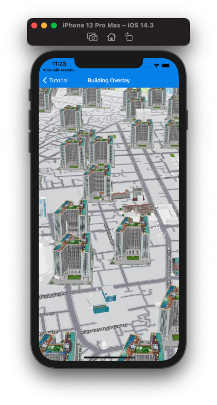

# Building Overlay

Building overlay là một loại overlay cho phép người dùng hiển thị các building từ nhiều nguồn khác nhau lên bản đồ, kết hợp với building sẵn có của Map4D.  
Building overlay chỉ hiển thị ở chế độ 3D.



## Add Building overlay

Để thêm 1 building overlay vào map cần tạo mới 1 đối tượng của lớp [MFURLBuildingLayer](/reference/building-overlay?id=mfurlbuildinglayer-class) sau đó set `map` cho building overlay đó.  
Hàm khởi tạo của lớp [MFURLBuildingLayer](/reference/building-overlay?id=mfurlbuildinglayer-class) yêu cầu đối tượng implement protocol [MFBuildingURLConstructor](/reference/building-overlay?id=mfbuildingurlconstructor-protocol)  

Implement **MFBuildingURLConstructor** protocol yêu cầu 2 phương thức `getBuildingUrlWith` và `parserBuildingData`.  
Trong đó:  
- getBuildingUrlWith: Nhận vào các giá trị là toạ độ x, y và mức zoom của tile, kết quả là một kiểu [URL](https://developer.apple.com/documentation/foundation/url) chỉ đến rest api cung cấp dữ liệu building theo tile.
- parserBuildingData: Nhận vào là dữ liệu được về từ api cung cấp bởi *getBuildingUrlWith*, ta sẽ phải parser dữ liệu đó thành mảng các đối tượng [MFBuildingData](/reference/building-overlay?id=mfbuildingdata-class)

### Tạo mới Building overlay

Đoạn code bên dưới hướng dẫn cách implement [MFBuildingURLConstructor](/reference/building-overlay?id=mfbuildingurlconstructor-protocol) và tạo đối tượng [MFURLBuildingLayer](/reference/building-overlay?id=mfurlbuildinglayer-class)

<!-- tabs:start -->
#### ** Swift **
Implement **MFBuildingURLConstructor**
```swift
class BuildingURLConstructor : NSObject, MFBuildingURLConstructor {
  func getBuildingUrlWith(x: UInt, y: UInt, zoom: UInt) -> URL? {
    let url = "https://poi-random.herokuapp.com/poi/\(zoom)/\(x)/\(y)"
    return URL(string: url)
  }
  
  func parserBuildingData(_ data: String) -> [MFBuildingData]? {
    do {
      var buildingDatas:[MFBuildingData] = []
      let decoder = JSONDecoder()
      let poisJson = try decoder.decode(POIsJson.self, from: data.data(using: .utf8)!)
      
      guard let places = poisJson.pois else { return nil }
      for place in places {
        guard let placeId = place.id else { continue }
        let position = CLLocationCoordinate2DMake(place.position?.lat ?? 0, place.position?.lng ?? 0)
        let model = "https://hcm03.vstorage.vngcloud.vn/v1/AUTH_b32b6bc102c44269ab7b55e7820e7116/sdk/models/5db6b4798b4711141457d8a9.obj"
        let texture = "https://hcm03.vstorage.vngcloud.vn/v1/AUTH_b32b6bc102c44269ab7b55e7820e7116/sdk/textures/5db6b4798b4711141457d8ab.jpg"
        let building = MFBuildingData(id: placeId, position: position, model: model, texture: texture)
        buildingDatas.append(building)
        break;
      }
      
      return buildingDatas;
    } catch let err {
      print(err.localizedDescription)
      return nil
    }
  }
}
```

Tạo đối tượng **MFURLBuildingLayer**
```swift
let urlConstructor = BuildingURLConstructor()
let buildingOverlay = MFURLBuildingLayer(urlConstructor: urlConstructor, prefixId: "building-layer-")
```
#### ** Objective-C **
Implement **MFBuildingURLConstructor**
```objc
#import <Map4dMap/Map4dMap.h>
@interface BuildingURLConstructor : NSObject <MFBuildingURLConstructor>
@end

@implementation BuildingURLConstructor

- (NSURL * _Nullable)getBuildingUrlWithX:(NSUInteger)x y:(NSUInteger)y zoom:(NSUInteger)zoom {
  NSString *url = [NSString stringWithFormat:@"https://poi-random.herokuapp.com/poi/%lu/%lu/%lu", zoom, x, y];
  return [NSURL URLWithString:url];
}

- (NSArray<MFBuildingData *> * _Nullable)parserBuildingData:(NSString * _Nonnull)data {
  @try {
    NSData* jsonData = [data dataUsingEncoding:NSUTF8StringEncoding];
    NSError *jsonError;
    NSDictionary *jsonObject = [NSJSONSerialization JSONObjectWithData:jsonData options:kNilOptions error:&jsonError];
    
    if (jsonObject != nil) {
      NSArray *places = [jsonObject valueForKey:@"pois"];

      if (places != nil && places.count > 0) {
        NSMutableArray *buildingDatas = [[NSMutableArray alloc] init];
        
        for (int i = 0; i < places.count; i++) {
          NSDictionary *place = [places objectAtIndex:i];
          if (place == nil) {
            continue;
          }
          
          NSString *placeId = [place valueForKey:@"id"];
          NSString *title = [place valueForKey:@"title"];
          NSDictionary *positionObject = [place valueForKey:@"position"];
          if (placeId == nil || title == nil || positionObject == nil) {
            continue;
          }
          
          NSNumber *latObject = [positionObject valueForKey:@"lat"];
          NSNumber *lngObject = [positionObject valueForKey:@"lng"];
          if (latObject == nil || lngObject == nil) {
            continue;
          }
          
          MFBuildingData *buildingData = [[MFBuildingData alloc] init];
          buildingData.id = placeId;
          buildingData.name = title;
          buildingData.position = CLLocationCoordinate2DMake(latObject.doubleValue, lngObject.doubleValue);
          buildingData.model = @"https://hcm03.vstorage.vngcloud.vn/v1/AUTH_b32b6bc102c44269ab7b55e7820e7116/sdk/models/5db6b4798b4711141457d8a9.obj";
          buildingData.texture = @"https://hcm03.vstorage.vngcloud.vn/v1/AUTH_b32b6bc102c44269ab7b55e7820e7116/sdk/textures/5db6b4798b4711141457d8ab.jpg";
          [buildingDatas addObject:buildingData];
          break;
        }
        
        return buildingDatas;
      }
    }

    return nil;
  }
  @catch (NSException *exception) {
    return nil;
  }
}

@end
```

Tạo đối tượng **MFURLBuildingLayer**
```objc
BuildingURLConstructor *urlConstructor = [[BuildingURLConstructor alloc] init];
MFURLBuildingLayer *buildingOverlay = [MFURLBuildingLayer buildingLayerWithURLConstructor:urlConstructor prefixId:@"building-"];
```
<!-- tabs:end -->

### Add Building overlay lên Map

Để vẽ building overlay lên map, ta set map view cho property `map` của đối tượng **MFURLBuildingLayer**

<!-- tabs:start -->
#### ** Swift **
```swift
buildingOverlay.map = mapView
```
#### ** Objective-C **
```objc
buildingOverlay.map = self.mapView;
```
<!-- tabs:end -->

### Remove Building overlay

Để xóa building overlay khỏi map, ta set property `map` của đối tượng **MFURLBuildingLayer** thành `nil`

<!-- tabs:start -->
#### ** Swift **
```swift
buildingOverlay.map = nil
```
#### ** Objective-C **
```objc
buildingOverlay.map = nil;
```
<!-- tabs:end -->

### Ẩn/Hiện Building Overlay

Set giá trị cho property `isHidden` để ẩn/hiện building overlay.  
**Chú ý**: Mặc dù building overlay không hiển thị nhưng quá trình tải các building vẫn diễn ra

<!-- tabs:start -->
#### ** Swift **
```swift
buildingOverlay.isHidden = true
```
#### ** Objective-C **
```objc
buildingOverlay.isHidden = YES;
```
<!-- tabs:end -->

## Sự kiện đối với building thuộc building overlay

Các sự kiện đối với building thuộc building overlay phát sinh tương tự với building của Map4D, việc xử lý được diễn ra ngay tại hàm xử lý sự kiện của Map4D.

<!-- tabs:start -->
#### ** Swift **
```swift
func mapView(_ mapView: MFMapView!, didTapBuildingWithBuildingID buildingID: String!, name: String!, location: CLLocationCoordinate2D)
```
#### ** Objective-C **
```objc
- (void)mapView: (MFMapView*)  mapView didTapBuildingWithBuildingID: (NSString*) buildingID name: (NSString*) name location: (CLLocationCoordinate2D) location;
```
<!-- tabs:end -->

# Reference

### MFURLBuildingLayer class
`MFURLBuildingLayer` class

**Constructor** 

Lớp `MFURLBuildingLayer` cung cấp một số phương thức static để tạo đối tượng *MFURLBuildingLayer* một cách tiện lợi
```objc
+ (instancetype _Nonnull) buildingLayerWithURLConstructor:(id<MFBuildingURLConstructor> _Nonnull)constructor;
+ (instancetype _Nonnull) buildingLayerWithURLConstructor:(id<MFBuildingURLConstructor> _Nonnull)constructor prefixId:(NSString* _Nullable)prefixId;
```

- Parameters:
  - urlConstructor: [MFBuildingURLConstructor](#mfbuildingurlconstructor-protocol) *required*
  - prefixId: [NSString](https://developer.apple.com/documentation/foundation/nsstring)

Sử dụng
<!-- tabs:start -->
##### ** Swift **
```swift
let buildingOverlay = MFURLBuildingLayer(urlConstructor: urlConstructor, prefixId: "building-layer-")
```
##### ** Objective-C **
```objc
MFURLBuildingLayer *buildingOverlay = [MFURLBuildingLayer buildingLayerWithURLConstructor:urlConstructor prefixId:@"building-"];
```
<!-- tabs:end -->

**Methods**

| Name              | Parameters  | Return Value | Description                                                           |
|-------------------|-------------|--------------|-----------------------------------------------------------------------|
| **clearBuildingCache** | `none`      | `none`       | Xoá cache của đối tượng building overlay và load lại dữ liệu building theo tile từ server |

**Properties**

| Name         | Type      | Description                                                                            |
|--------------|-----------|----------------------------------------------------------------------------------------|
| **map**      | [MFMapView](/reference/map?id=mfmapview-class) | Map view sẽ hiển thị building overlay |
| **isHidden** | bool                                           | Ẩn/hiện building overlay trên map |
| **prefixId** | NSString                                       | Giá trị được thêm vào trước mỗi id của Builing thuộc building overlay |

### MFBuildingURLConstructor protocol
`MFBuildingURLConstructor` protocol

MFBuildingURLConstructor là một protocol, định nghĩa sẵn 2 phương thức dùng để xác định URL api lấy dữ liệu building và xử lý parser data được lấy từ api.

```objc
- (NSURL* _Nullable) getBuildingUrlWithX:(NSUInteger)x y:(NSUInteger)y zoom:(NSUInteger)zoom;
- (NSArray<MFBuildingData*>* _Nullable) parserBuildingData:(NSString* _Nonnull)data;
```

Cần phải implement protocol này trước khi tạo đối tượng `MFURLBuildingLayer`

### MFBuildingData class
`MFBuildingData` class

MFBuildingData là object chứa thông tin của building để Map4D SDK có thể hiểu được, người sử dụng building overlay sẽ thực hiện implement phương thức `parserBuildingData` để biến đổi dữ liệu trả về từ server của mình thành mảng các building data cung cấp cho Map4D SDK hiển thị lên bản đồ.

| Name           | Type      | Description                                                                            |
|----------------|-----------|----------------------------------------------------------------------------------------|
| **id**         | NSString               | ID của building |
| **position**   | CLLocationCoordinate2D | Vị trí hiển thị building trên bản đồ |
| **name**       | NSString               | Tên của building  |
| **scale**      | double                 | Tỉ lệ hiển thị của building so với kích thước thực tế |
| **bearing**    | float                  | Góc quay của building khi được vẽ ra trên bản đồ (đơn vị: độ) |
| **elevation**  | double                 | Độ cao của building so với mực nước biển (đơn vị: mét) |
| **height**     | double                 | Chiều cao của building (đơn vị: mét) |
| **model**      | NSString               | Đường dẫn URL để lấy dữ liệu model cho building |
| **texture**    | NSString               | Đường dẫn URL để lấy dữ liệu texture cho building |
| **coordinates**| [MFPath](/reference/coordinates?id=mfpath)             | Một mảng vị trí CLLocationCoordinate2D để tạo một Building hình khối với mặt đáy của hình khối là mảng vị trí này. Kết hợp với height để tạo chiều cao |
| **startDate**  | NSDate                 | Ngày bắt đầu hiển thị building |
| **endDate**    | NSDate                 | Ngày kết thúc hiển thị building |

**Chú ý:**
- Trường hợp dùng `model` nhưng `texture` là **`null`** thì building sẽ được tô màu trắng.
- Trường hợp dùng `model` thì sẽ không dùng đến thuộc tính `coordinates`. Nếu set giá trị cho `coordinates` và cả `model` đồng thời thì sẽ ưu tiên lấy giá trị của `model` để tạo Building
