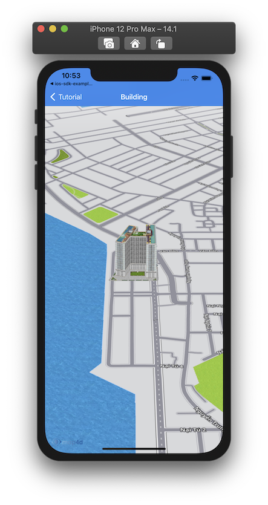
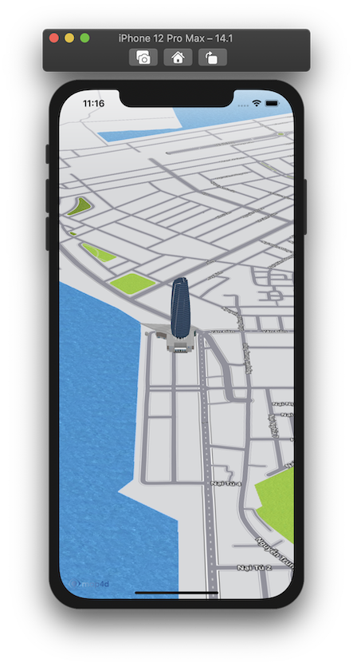

# Building

> Điểm khác biệt giữa nền tảng bản đồ **Map4D** với các nền tảng bản đồ khác đó là chế độ bản đồ 3D. Chế độ này sẽ có các đối
tượng 3D mô phỏng lại các tòa nhà, cây cối, các cây cầu cũng như các công trình kiến trúc khác, ... Ngoài những đối tượng **Building 3D** 
có sẵn của bản đồ, bạn còn có thể tự tạo và thêm đối tượng 3D của bạn lên bản đồ thông qua đối tượng **MFBuilding**

**Chú ý**: Những đối tượng **Building** này chỉ được vẽ trong chế độ 3D của bản đồ, nó không được vẽ trong chế độ 2D.

### 1. Thêm một Building

Chúng ta thử tạo **Building** như sau:

<!-- tabs:start -->

#### ** Swift **

```swift 
let building = MFBuilding()
building.position = CLLocationCoordinate2D(latitude: 16.08795975082965, longitude: 108.22837829589844)
building.name = "User Building"
building.model = "https://hcm03.vstorage.vngcloud.vn/v1/AUTH_b32b6bc102c44269ab7b55e7820e7116/sdk/models/5db6b4798b4711141457d8a9.obj"
building.texture = "https://hcm03.vstorage.vngcloud.vn/v1/AUTH_b32b6bc102c44269ab7b55e7820e7116/sdk/textures/5db6b4798b4711141457d8ab.jpg"
building.map = mapView
```

#### ** Objective C **

```objc 
MFBuilding *building = [[MFBuilding alloc] init];
[building setPosition: CLLocationCoordinate2DMake(16.08795975082965, 108.22837829589844)];
[building setName: @"User Building"];
[building setModel: @"https://hcm03.vstorage.vngcloud.vn/v1/AUTH_b32b6bc102c44269ab7b55e7820e7116/sdk/models/5db6b4798b4711141457d8a9.obj"];
[building setTexture: @"https://hcm03.vstorage.vngcloud.vn/v1/AUTH_b32b6bc102c44269ab7b55e7820e7116/sdk/textures/5db6b4798b4711141457d8ab.jpg"];
[building setMap: mapView];
```

<!-- tabs:end -->

-   


### 2. Xóa Building khỏi bản đồ

Để xóa **Building** khỏi bản đồ, chúng ta **set** thuộc tính **map** bằng **nil**

<!-- tabs:start -->
#### ** Swift **

```swift
building.map = nil
```

#### ** Objective C **

```objc 
[building setMap: Nil];
```
<!-- tabs:end -->

Nếu bạn muốn quản lý một danh sách các **Building**, bạn nên tạo một **mảng** để chứa các **Building** đó. 

Sử dụng mảng này bạn có thể  **set** lần lượt thuộc tính **map** bằng **mapView** để hiển thị **Building** hoặc **nil** khi bạn cần xóa các **Building**.

### 3. Tùy chỉnh Building

Bạn có thể dễ dàng tuỳ chỉnh **Building** thông qua các thuộc tính mà **MFBuilding** cung cấp như:

  
| Name                       |Description                                                                                                                                             |
|----------------------------|--------------------------------------------------------------------------------------------------------------------------------------------------------|
| **name**                   | Tùy chỉnh tên **Building**                                                                                                                             |
| **position**               | Tùy chỉnh vị trí vẽ **Building**                                                                                                                       |
| **model**                  | Tùy chỉnh đường dẫn http chứa model của **Building**                                                                                                   |
| **texture**                | Tùy chỉnh đường dẫn http chứ texture của **Building**                                                                                                  |
| **coordinates**            | Tùy chỉnh model của **Building** dưới dạng các coordinate (chỉ cần sử dụng một trong 2 thuộc tính **model** hoặc **coordinates** để tạo **Building**)  |
| **selected**               | **set** là **true** nếu muốn hiển thị **Building** dưới dạng được chọn (có viền đỏ bao quanh)                                                          |

<!-- tabs:start -->

#### ** Swift **

```swift 
building.name = "Da Nang Tower"
building.model = "https://sw-hcm-1.vinadata.vn/v1/AUTH_4486f66f671c41bab0d3dea1904626d4/sdk/models/5ca32c3865863cc894adeb06"
building.texture = "https://sw-hcm-1.vinadata.vn/v1/AUTH_4486f66f671c41bab0d3dea1904626d4/sdk/textures/5ca32c3865863cc894adeb07.jpg"
```

#### ** Objective C **

```objc 
[building setName: @"Da Nang Tower"];
[building setModel: @"https://sw-hcm-1.vinadata.vn/v1/AUTH_4486f66f671c41bab0d3dea1904626d4/sdk/models/5ca32c3865863cc894adeb06"];
[building setTexture: @"https://sw-hcm-1.vinadata.vn/v1/AUTH_4486f66f671c41bab0d3dea1904626d4/sdk/textures/5ca32c3865863cc894adeb07.jpg"];
```

<!-- tabs:end -->

-   

## Reference

`MFBuilding` class

### Constructor

<!-- tabs:start -->
#### ** Swift **

```swift 
let Building = MFBuilding()
```

#### ** Objective C **

```objc 
MFBuilding *Building = [[MFBuilding alloc] init];
```

<!-- tabs:end -->

### Properties

| Name                       | Type                   | Description                                                                                                             |
|----------------------------|:-----------------------|-------------------------------------------------------------------------------------------------------------------------|
| **name**                   | NSString               | Chỉ định tên của  **Building**.                                                                                         |
| **position**               | CLLocationCoordinate2D | Chỉ định một **CLLocationCoordinate2D** để xác định vị trí ban đầu của **Building**.                                    |
| **model**                  | NSString               | Chỉ định một đường dẫn **URL** để lấy dữ liệu **model** cho **Building**.                                               |
| **texture**                | NSString               | Chỉ định một đường dẫn **URL** để lấy dữ liệu **texture** cho **Building**. Thuộc tính này chỉ được dùng khi thuộc tính **model** được **set** giá trị. Nó sẽ **map** **texture** này vào **model** mà bạn đã **set** cho **Building**. Nếu bạn không **set** giá trị **texture** khi đã **set** giá trị **model** thì bản đồ sẽ vẽ một **building** màu trắng.                                                                                                                                                                          |
| **coordinates**            | MFPath                 | Chỉ định một mảng vị trí **CLLocationCoordinate2D** để tạo một **Building** hình khối với mặt đáy của hình khối là mảng vị trí này. Nó kết hợp với thuộc tính **height** để tạo chiều cao cho hình khối đó (**building** này được gọi là **Extrude Building**). Trường hợp dùng **coordinates** thì sẽ không dùng đến thuộc tính **texture**. Nếu **set** giá trị cho **coordinates** và cả **model** đồng thời thì sẽ ưu tiên lấy giá trị của **model** để tạo **Building**.                                                                     |
| **height**                 | double                 | Chỉ định chiều cao của **Building** theo đơn vị là mét. Thuộc tính này chỉ có tác dụng khi **Building** của bạn được tạo từ một mảng **CLLocationCoordinate2D** thông qua thuộc tính **coordinates** (hay còn gọi là **Extrude Building**). Nó không có tác dụng với **Building** được vẽ bằng **Model** và **Texture**. Giá trị mặc định là 1.                                                                                                                                                                               |
| **scale**                  | double                 | Chỉ định tỉ lệ của **Building** được vẽ ra ở trên bản đồ so với tỉ lệ thật của nó. Ví dụ khi giá trị scale là 0.5 thì **Building** sẽ nhỏ hơn một nửa so với kích thước thật của nó. Giá trị mặc định là 1.                                                                                                                            |
| **bearing**                | CGFloat                | Chỉ định góc quay của **Building** khi được vẽ ra trên bản đồ theo đơn vị là Độ. Bình thường giá trị mặc định của nó là 0. Khi bạn muốn quay **Building** theo một hướng nào đó thì bạn chỉ cần set lại giá trị **bearing** trong khoảng từ 0 đến 360 độ.                                                                     |
| **elevation**              | double                 | Chỉ định độ cao của **Building** so với mực nước biển, đơn vị là mét. Giá trị mặc định là 0                              |
| **selected**               | bool                   | Chỉ định Building có được **hightlight** hay không. Khi nó được set là true thì **Building** sẽ được vẽ một đường viền màu đỏ xung quanh để giúp người dùng dễ nhận biết. Còn khi nó được **set** giá trị là **false** thì nó sẽ được vẽ như một **Building** bình thường. Giá trị mặc định là **false**.                               |
| **types**                  | NSMutableArray*        | Chỉ định kiểu của **Building**.                                                                                          |
| **minZoom**                | double                 | Chỉ định mức zoom tối thiểu cho **Building**.                                                                            |
| **maxZoom**                | double                 | Chỉ định mức zoom đa thiểu cho **Building**.                                                                             |
| **startDate**              | NSDate                 | Chỉ định thời gian tạo **Building**.                                                                                     |
| **endDate**                | NSDate                 | Chỉ định thời gian kết thúc của **Building**.                                                                            |
| **userInteractionEnabled** | boolean                | Cho phép người dùng có thể tương tác được với **Building** hay không. Giá trị mặc định là **true**. Khi không cho phép người dùng tương tác với **Building** thì tất cả các sự kiện liên quan tới **Building** từ phía người dùng sẽ không có tác dụng.                                                                          | 
| **isHidden**               | Bool                   | Xác định **Building** có thể ẩn hay hiện trên bản đồ. Giá trị mặc định là **true**.                                      |
| **zIndex**                 | float                  | Chỉ định thứ tự hiển thị giữa các Building với nhau hoặc giữa **Building** với các đối tượng khác trên bản đồ. Giá trị mặc định là **0**                                                                                                                                                                            |
| **userData**               | NSObject               | Cho phép người dùng lưu trữ thông tin trên **Building**.                                                                 |
| **map**                    | [MFMapView](/reference/map?id=MFMapView)              | Chỉ định hiển thị **Building** trên **Map** hoặc xoá **Building** khỏi **Map**     |
| **Id**                     | UInt32                 | **Id** của **Building** **{get}**.                                                                                       |

**Ghi chú:** Hiện tại Map4D hỗ trợ cái kiểu sau: **Buildingnt**, **cafe**, **bus_station**, **electronics**, **shop**, **bakery**, **fuel**, **restaurant**, **police**, **payment_centre**, **museum**, **university**, **school**, **airport**, **bank**, **clothes**, **motel**, **insurance**, **furniture**, **atm**, **hospital**, **bar**, **books**, **theatre**, **car**, **goverment**, **townhall**, **apartment**, **park**, **stadium**, **nightclub**. Kiểu mặc định sẽ là **Buildingnt**.


### Delegate

  > **Chú ý**: Để sử dụng các sự kiện của **Building** phải **set** thuộc tính **userInteractionEnabled** = **true**
  
  **TouchBuilding**

  Phát sinh khi người dùng **touch** vào **Building**
  </br>Cung cấp thông tin của **Building** cho người dùng

  <!-- tabs:start -->

  #### ** Swift **

  ```swift 
    func mapView(_ mapView: MFMapView!, didTap building: MFBuilding!) {}
  ```

  #### ** Objective C **

  ```objc 
  - (void)mapView: (MFMapView*)  mapView didTapBuilding: (MFBuilding*) building {}
  ```

  <!-- tabs:end -->
  