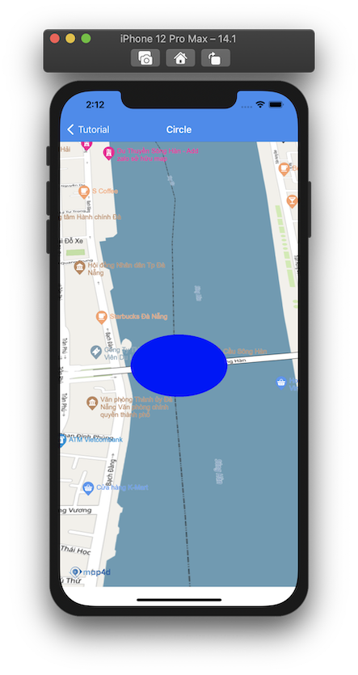
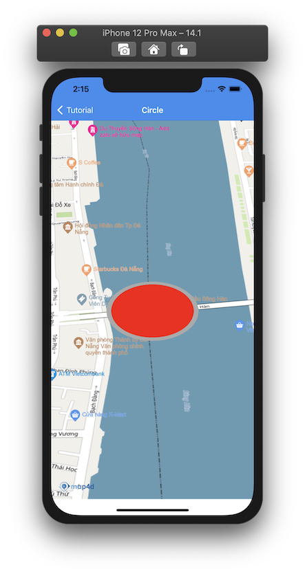

# Circle

Nếu bạn muốn vẽ một hình tròn lên bản đồ, thì Map4D SDK cung cấp cho bạn lớp **MFCircle** để thực hiện điều đó. 
Bạn có thể dễ dàng vẽ các vòng tròn trên bề mặt bản đồ.

Để tạo một đường tròn, bạn phải chỉ định hai thuộc tính sau:


| Name                       |Description                                                                                                              |
|----------------------------|-------------------------------------------------------------------------------------------------------------------------|
| **position**               | Tâm của vị trí xác định trên bản đồ.                                                                                    |
| **radius**                 | Bán kính đường của tròn tính từ tâm.                                                                                    |

### 1. Thêm một Circle

Đoạn mã sau sẽ vẽ một vòng tròn lên bản đồ:

<!-- tabs:start -->
#### ** Swift **

```swift 
let circle = MFCircle()
circle.radius = 100.0
circle.position = CLLocationCoordinate2D(latitude: 16.072086430034517, longitude: 108.2262037173781)
circle.fillColor = .blue
circle.map = mapView
```

#### ** Objective C **

```objc 
MFCircle *circle = [[MFCircle alloc] init];
[circle setRadius: 100.0];
[circle setPosition: CLLocationCoordinate2DMake(16.072086430034517, 108.2262037173781)];
[circle setFillColor: [UIColor blueColor]];
[circle setMap: mapView];
```

<!-- tabs:end -->

-   

Bạn có thể tùy chỉnh hình dáng của **Circle** trước khi thêm nó vào bản đồ hoặc sau khi nó đã được thêm vào bản đồ.

### 2. Xóa Circle khỏi bản đồ

Để xóa **Circle** khỏi bản đồ, chúng ta **set** thuộc tính **map** bằng **nil**

<!-- tabs:start -->
#### ** Swift **

```swift
circle.map = nil
```

#### ** Objective C **

```objc 
[circle setMap: Nil];
```
<!-- tabs:end -->

### 3. Tùy chỉnh cho Circle

Bạn có thể dễ dàng tuỳ chỉnh hình dáng của **Circle** thông qua các thuộc tính mà **MFCircle** cung cấp như

- **position** : một điểm tọa độ **CLLocationCoordinate2D** để xác định tâm của **Circle**. 
- **radius** : tuỳ chỉnh bán kính của **Circle** theo đơn vị **mét**.
- **fillColor** : tuỳ chỉnh màu sắc của **Circle**.
- **fillOpacity** : tuỳ chỉnh độ trong suốt màu của **Circle**, khoảng giá trị của nó nằm trong khoảng từ 0.0 đến 1.0.
- **strokeColor** : tuỳ chỉnh màu sắc của **đường viền Circle**
- **strokeWidth** : tuỳ chỉnh độ lớn của **đường viền Circle** theo đơn vị **point**.

<!-- tabs:start -->
#### ** Swift **

```swift 
circle.radius = 100.0
circle.position = CLLocationCoordinate2D(latitude: 16.072086430034517, longitude: 108.2262037173781)
circle.strokeColor = .lightGray
circle.strokeWidth = 10.0
circle.fillColor = .red
```

#### ** Objective C **

```objc 
[circle setRadius: 100.0];
[circle setPosition: CLLocationCoordinate2DMake(16.072086430034517, 108.2262037173781)];
[circle setFillColor: [UIColor blueColor]];
[circle setStrokeColor: [UIColor lightGrayColor]];
[circle setStrokeWidth: 10.0];
```

<!-- tabs:end -->

-   

## Reference

`MFCircle` class

### Constructor

<!-- tabs:start -->

#### ** Swift **

```swift 
let circle = MFCircle()
```

#### ** Objective C **

```objc 
MFCircle *circle = [[MFCircle alloc] init];
```

<!-- tabs:end -->

### Properties

| Name                       | Type                   | Description                                                                                                             |
|----------------------------|:-----------------------|-------------------------------------------------------------------------------------------------------------------------|
| **position**               | CLLocationCoordinate2D | Chỉ định một **CLLocationCoordinate2D** để xác định vị trí ban đầu của **Circle**.                                      |
| **fillColor**              | UIColor                | Chỉ định màu sắc của **Circle**.                                                                                        |
| **strokeColor**            | UIColor                | Chỉ định màu sắc của **đường viền Circle**.                                                                             |
| **radius**                 | double                 | Chỉ định bán kính của **Circle** theo đơn vị mét.                                                                       |
| **strokeWidth**            | double                 | Chỉ định độ lớn của đường viền **Circle** theo đơn vị point.                                                            |
| **userInteractionEnabled** | BOOL                   | Cho phép người dùng có thể tương tác được với **Circle** hay không. Giá trị mặc định là **true**. Khi không cho phép người dùng tương tác với **Circle** thì tất cả các sự kiện liên quan tới **Circle** từ phía người dùng sẽ không có tác dụng.                                                                             |
| **isHidden**               | BOOL                   | Xác định **Circle** có thể ẩn hay hiện trên bản đồ. Giá trị mặc định là **true**.                                       |
| **zIndex**                 | float                  | Chỉ định thứ tự hiển thị giữa các Circle với nhau hoặc giữa **Circle** với các đối tượng khác trên bản đồ. Mặc định là **0** |
| **userData**               | NSObject               | Cho phép người dùng lưu trữ thông tin trên **Circle**.                                                                  |
| **map**                    | [MFMapView](/reference/map?id=MFMapView) | Chỉ định hiển thị **Circle** trên **Map** hoặc xoá **Circle** khỏi **Map**                            |
| **Id**                     | UInt32                 | **Id** của **Circle** **{get}**.                                                                                        |


### Delegate

  > **Chú ý**: Để sử dụng sự kiện của **Circle** phải **set** thuộc tính **userInteractionEnabled** = **true**
  
  **TouchCircle**

  Phát sinh khi người dùng **touch** vào **Circle**
  </br>Cung cấp thông tin của **Circle** cho người dùng

  <!-- tabs:start -->

  #### ** Swift **

  ```swift
  func mapView(_ mapView: MFMapView!, didTap circle: MFCircle!) {}
  ```

  #### ** Objective C **

  ```objc 
  - (void)mapView:(MFMapView *)mapView didTapCircle:(MFCircle *)circle{}
  ```

  <!-- tabs:end -->
  