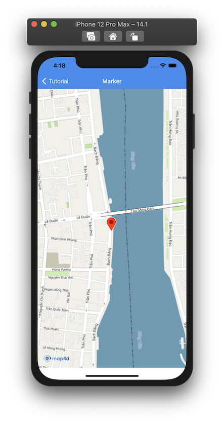
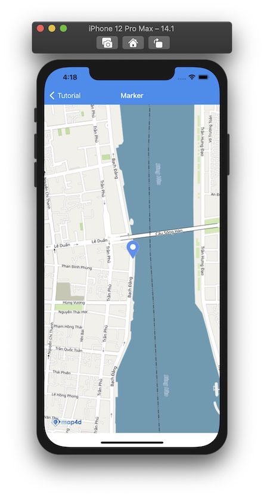
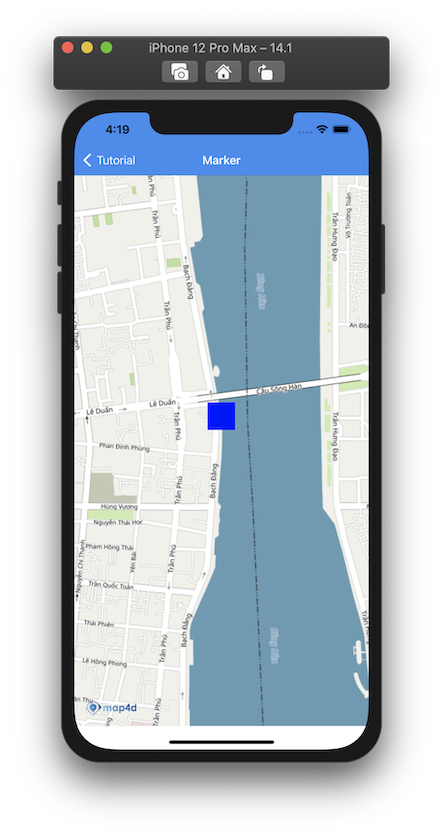
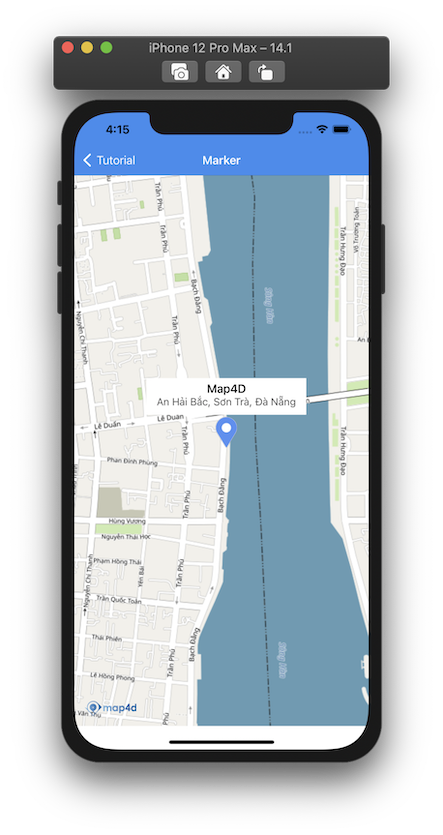

# Marker

> **Marker** dùng để xác định một vị trí đơn lẻ trên bản đồ. 

> Cho phép người dùng đánh dấu lên các vị trí trên bản đồ bằng các biểu tượng chung được cung cấp bởi **Map4d SDK** 
hoặc bạn có thể tuỳ chỉnh bằng một hình ảnh khác hoặc tuỳ chỉnh các thuộc tính của **Marker**

### 1. Thêm một marker

Chúng ta thử tạo MFMarker như sau:

<!-- tabs:start -->
#### ** Swift **

```swift 
let marker = MFMarker()
marker.position = CLLocationCoordinate2D(latitude: 16.072086430034517, longitude: 108.2262037173781)
marker.icon = UIImage(named: "iconLocation")
marker.title = "Map4D"
marker.snippet = "An Hải Bắc, Sơn Trà, Đà Nẵng"
marker.map = mapView
```

#### ** Objective C **

```objc 
MFMarker *marker = [[MFMarker alloc] init];
[marker setPosition: CLLocationCoordinate2DMake(16.072086430034517, 108.2262037173781)];
[marker setIcon: [UIImage imageNamed:@"iconLocation"]];
[marker setTitle: @"Map4D"];
[marker setSnippet: @"An Hải Bắc, Sơn Trà, Đà Nẵng"];
[marker setMap:mapView];
```

<!-- tabs:end -->

 

### 2. Xóa Marker khỏi bản đồ

Để xóa **Marker** khỏi bản đồ, chúng ta **set** thuộc tính **map** bằng **nil**

<!-- tabs:start -->
#### ** Swift **

```swift
marker.map = nil
```

#### ** Objective C **

```objc 
[marker setMap: Nil];
```
<!-- tabs:end -->

Nếu bạn muốn quản lý một danh sách các **Marker**, bạn nên tạo một **mảng** để chứa các **Marker** đó. 

Sử dụng mảng này bạn có thể  **set** lần lượt thuộc tính **map** bằng **mapView** để hiển thị **Marker** hoặc **nil** khi bạn cần xóa các **Marker**.

### 3. Tùy chỉnh Marker

Bạn có thể dễ dàng tuỳ chỉnh hình dáng của **Marker** thông qua các thuộc tính mà **MFMarker** cung cấp như

| Name                       |Description                                                                                                                                       |
|----------------------------|--------------------------------------------------------------------------------------------------------------------------------------------------|
| **position**               | Để xác định vị trí ban đầu của **Marker**.                                                                                                       |
| **groundAnchor**           | Để xác định điểm neo cho **Marker**                                                                                                              |
| **icon**                   | Tùy chỉnh icon cho **Marker**.Có thể truyền vào là một **UIImage** hoặc **UIView**                                                               |
| **elevation**              | Chỉ định độ cao của **Marker** so với mực nước biển, đơn vị là mét                                                                               |
| **rotation**               | Chỉ định góc quay của **Marker** theo đơn vị là Độ                                                                                               |
| **title**                  | Chỉ định tiêu đề của **Marker**. Tiêu đề sẽ được hiển thị ở dòng đầu tiên của bảng thông tin **Marker**.                                         |
| **snippet**                | Mô tả thông tin ngắn gọn cho **Marker**. Snippet sẽ được hiển thị ở bẳng thông tin của **Marker** và
phía dưới dòng tiêu đề.                                                                                                                                                         |
| **infoWindowAnchor**       |                          Chỉ định một **CGPoint** để xác định điểm neo bảng thông tin của **Marker**. Bảng thông tin này
sẽ hiện lên khi click vào **Marker**                                                                                                                                            |

### 4. Tùy chỉnh hình ảnh cho Marker

Nếu bạn muốn tùy chỉnh **Marker** bạn có thể chỉ dùng một **UIImage** hoặc một **UIView** để thay thế cho hình ảnh mặc định của **Marker**.

#### Tùy chỉnh hình ảnh cho Marker với UIImage

<!-- tabs:start -->
#### ** Swift **

```swift
marker.icon = UIImage(named: "iconLocationBlue")
```

#### ** Objective C **

```objc 
[marker setIcon: [UIImage imageNamed:@"iconLocationBlue"]];
```
<!-- tabs:end -->

 

#### Tùy chỉnh hình ảnh cho Marker với UIView

Bạn có thể thay đổi hình ảnh của **Marker** bằng cách tạo một **UIView** và **set** thuộc tính **iconView** bằng **UIView** đã tạo.

<!-- tabs:start -->
#### ** Swift **

```swift
let view = UIView(frame: CGRect(x: 0.0, y: 0.0, width: 40.0, height: 40.0))
view.backgroundColor = .blue
marker.iconView = view
```
#### ** Objective C **

```objc
UIView *view = [[UIView alloc] initWithFrame:CGRectMake(0, 0, 40.0, 40.0)];
[view setBackgroundColor: [UIColor blueColor]];
[marker setIconView: view];
```
<!-- tabs:end -->

 

#### Marker có bảng thông tin

Bạn có thể tạo **Marker** chứa bảng thông tin bằng cách chỉ định giá trị cho thuộc tính **title** và **snippet** của **Marker**

<!-- tabs:start -->
#### ** Swift **

```swift
marker.title = "Map4D"
marker.snippet = "An Hải Bắc, Sơn Trà, Đà Nẵng"
```

#### ** Objective C **

```objc
[marker setTitle: @"Map4D"];
[marker setSnippet: @"An Hải Bắc, Sơn Trà, Đà Nẵng"];
```
<!-- tabs:end -->

Bảng thông tin sẽ được hiển thị **khi người dùng click lên Marker** như hình bên dưới:

 

### 5. Kéo Marker di chuyển trên bản đồ

Để cho phép người dùng có thể kéo một **Marker** tới một vị trí khác trên bản đồ, bạn cần **set** thuộc tính **draggable** bằng **true**

<!-- tabs:start -->
#### ** Swift **

```swift
marker.draggable = true
```

#### ** Objective C **

```objc
[marker setDraggable: YES];
```

<!-- tabs:end -->

Ngoài ra bạn có thể gọi phương thức **setDraggable()** của đối tượng **Marker** và truyền vào tham số **true** để bật
tính năng **draggable** của **Marker** hoặc truyền vào tham số **false** để tắt tính năng **draggable**.

## Reference

`MFMarker` class

### Constructor


<!-- tabs:start -->
#### ** Swift **

```swift 
let marker = MFMarker()
```

#### ** Objective C **

```objc 
MFMarker *marker = [[MFMarker alloc] init];
```

<!-- tabs:end -->

### Properties

| Name                       | Type                   | Description                                                                                                             |
|----------------------------|:-----------------------|-------------------------------------------------------------------------------------------------------------------------|
| **position**               | CLLocationCoordinate2D | Chỉ định một **CLLocationCoordinate2D** để xác định vị trí ban đầu của **Marker**.                                      |
| **groundAnchor**           | CGPoint                | Chỉ định một **GCPoint** để xác định điểm neo cho **Marker**. Giá trị mặc định là **{x: 0.0, y: 0.0}**                  |
| **elevation**              | double                 | Chỉ định độ cao của **Marker** so với mực nước biển, đơn vị là mét. Giá trị mặc định là **0**                           |
| **rotation**               | double                 | Chỉ định góc quay của **Marker** theo đơn vị là Độ. Giá trị mặc định là **0**                                           |
| **draggable**              | BOOL                   | Cho phép người dùng có thể kéo **Marker** trên bản đồ hay không. Giá trị mặc định là **false**                          |
| **infoWindowAnchor**       | CGPoint                | Chỉ định một **CGPoint** để xác định điểm neo bảng thông tin của **Marker**. Bảng thông tin này sẽ hiện lên khi **touch** vào **Marker**. Giá trị mặc định là **{x: 0.5, y: 0.0}**                                                                                                                                                    |
| **title**                  | NSString               | Chỉ định tiêu đề của **Marker**. Tiêu đề sẽ được hiển thị ở dòng đầu tiên của bảng thông tin **Marker**.                |
| **snippet**                | NSString               | Mô tả thông tin ngắn gọn cho **Marker**. Snippet sẽ được hiển thị ở bẳng thông tin của **Marker** và phía dưới dòng tiêu đề. |
| **iconView**               | UIView                 | Cho phép thêm biểu diễn **Marker** bằng **UIView** mà người dùng tuỳ chỉnh để thay thế icon mặc định của **Marker**.    |
| **icon**                   | UIImage                | Tùy chỉnh **icon** cho **Marker**. Có thể truyền vào là một **UIImage**                                                 |
| **userInteractionEnabled** | BOOL                   | Cho phép người dùng có thể tương tác được với **Marker** hay không. Giá trị mặc định là **true**. Khi không cho phép người dùng tương tác với **Marker** thì tất cả các sự kiện liên quan tới **Marker** từ phía người dùng sẽ không có tác dụng.                                                                             |
| **isHidden**               | BOOL                   | Xác định **Marker** có thể ẩn hay hiện trên bản đồ. Giá trị mặc định là **true**.                                       |
| **zIndex**                 | float                  | Chỉ định thứ tự hiển thị giữa các Marker với nhau hoặc giữa **Marker** với các đối tượng khác trên bản đồ. Giá trị mặc định là **0** |
| **flat**                   | BOOL                   | Xác định **Marker** bằng phẳng so với mặt đất. Các thay tác xoay, nghiêng, zoom bản đồ sẽ không làm thay đổi hướng của marker        |
| **userData**               | NSObject               | Cho phép người dùng lưu trữ thông tin trên **Marker**.                                                                  |
| **map**                    | [MFMapView](/reference/map?id=MFMapView)              | Chỉ định hiển thị **Marker** trên **Map** hoặc xoá **Marker** khỏi **Map**               |
| **Id**                     | UInt32                 | **Id** của **Marker** **{get}**.                                                                                        |


### Delegate

  > **Chú ý**: Để sử dụng các sự kiện của **Marker** phải **set** thuộc tính **userInteractionEnabled** = **true**
  
  **1. TouchMarker**

  Phát sinh khi người dùng **touch** vào **Marker**
  </br>Cung cấp thông tin của **Marker** cho người dùng

  <!-- tabs:start -->

  #### ** Swift **

  ```swift
  func mapView(_ mapView: MFMapView?, didTap marker: MFMarker?) -> BOOL {
    return true
  }
  ```

  #### ** Objective C **

  ```objc 
  - (BOOL)mapView:(MFMapView *)mapView didTapMarker:(MFMarker *)marker {
    return YES;
  }
  ```

  <!-- tabs:end -->

  **true**: cho phép tuỳ chọn lại sự kiện **touch** vào **Marker**
  </br> **false**: sử dụng **event** mặc định là **touch** vào **Marker** hiển thị lên thông tin **Marker**
  
  **2. Draggable Marker**

  Được kích hoạt khi người dùng **set** thuộc tính **draggable** = **true**. Phát sinh khi người dùng giữ **Marker**.
  </br>Cho phép người dùng di chuyển **Marker** trực tiếp trên **map**

  <!-- tabs:start -->

  #### ** Swift **

  ```swift
    func mapView(_ mapView: MFMapView?, didBeginDragging marker: MFMarker?) {}
    func mapView(_ mapView: MFMapView?, didEndDragging marker: MFMarker?) {}
    func mapView(_ mapView: MFMapView?, didDrag marker: MFMarker?) {}
  ```

  #### ** Objective C **

  ```objc 
  - (void)mapView:(MFMapView *)mapView didDragMarker:(MFMarker *)marker {}
  - (void)mapView:(MFMapView *)mapView didEndDraggingMarker:(MFMarker *)marker {}
  - (void)mapView:(MFMapView *)mapView didBeginDraggingMarker:(MFMarker *)marker {}
  ```

  <!-- tabs:end -->
  
  **3. touch infoWindow Marker**
  
  Phát sinh khi người dùng **touch** vào bảng thông tin **Marker**. Hiển thị bảng thông tin **Marker**.

  <!-- tabs:start -->

  #### ** Swift **

  ```swift
    func mapView(_ mapView: MFMapView?, didTapInfoWindowOf marker: MFMarker?) {}
  ```

  #### ** Objective C **

  ```objc 
  - (void)mapView:(MFMapView *)mapView didTapInfoWindowOfMarker:(MFMarker *)marker {} 
  ```

  <!-- tabs:end -->