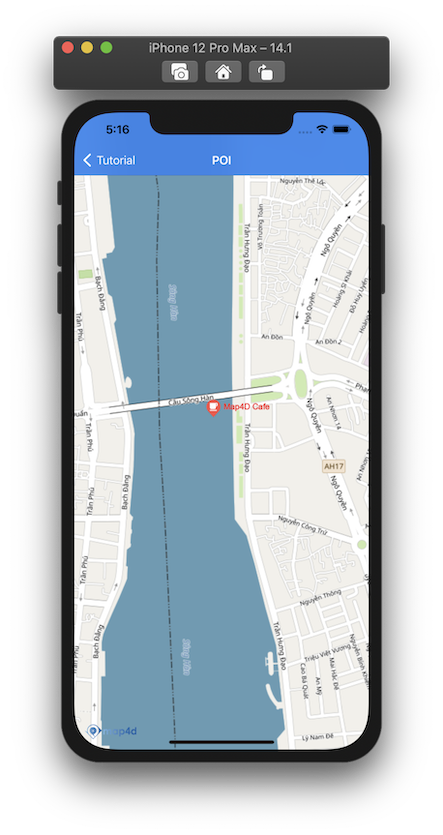
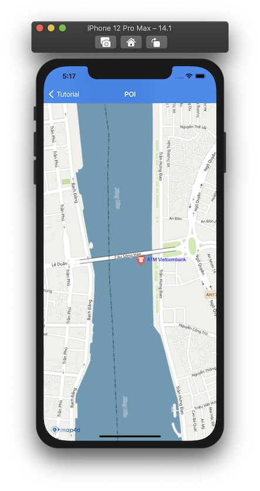

# POI

> Hiện tại trên bản đồ đã có những điểm đánh dấu địa điểm có sẵn (như địa danh công cộng, quán cà phê, nhà hàng, bến xe, ...)
và chúng chỉ hiển thị khi bản đồ ở chế độ 2D. Khi bạn cần một đối tượng để đánh dấu một địa điểm trên bản đồ tương tự như
những điểm có sẵn đó thì bạn có thể dùng lớp **MFPOI**. Các đối tượng **POI** bạn thêm vào bản đồ có thể hiện thị
ở **cả 2 chế độ 2D và 3D**.

### 1. Thêm một POI

Chúng ta thử tạo **POI** như sau:

<!-- tabs:start -->

#### ** Swift **

```swift 
let poi = MFPOI()
poi.position = CLLocationCoordinate2D(latitude: 16.071575666602996, longitude: 108.22781709595301)
poi.title = "Map4D Cafe"
poi.zIndex = 1
poi.type = "cafe"
poi.color = red
poi.map = mapView
```

#### ** Objective C **

```objc 
MFPOI *poi = [[MFPOI alloc] init];
[poi setPosition:CLLocationCoordinate2DMake(16.071575666602996, 108.22781709595301)];
[poi setTitle: @"Map4D Cafe"];
[poi setZIndex: 1];
[poi setType: @"cafe"];
[poi setColor: [UIColor redColor]];
[poi setMap: mapView];
```

<!-- tabs:end -->

 


### 2. Xóa POI khỏi bản đồ

Để xóa **POI** khỏi bản đồ, chúng ta **set** thuộc tính **map** bằng **nil**

<!-- tabs:start -->
#### ** Swift **

```swift
poi.map = nil
```

#### ** Objective C **

```objc 
[poi setMap: Nil];
```
<!-- tabs:end -->

Nếu bạn muốn quản lý một danh sách các **POI**, bạn nên tạo một **mảng** để chứa các **POI** đó. 

Sử dụng mảng này bạn có thể  **set** lần lượt thuộc tính **map** bằng **mapView** để hiển thị **POI** hoặc **nil** khi bạn cần xóa các **POI**.

### 3. Tùy chỉnh POI

Bạn có thể dễ dàng tuỳ chỉnh **POI** thông qua các thuộc tính mà **MFPOI** cung cấp như:

  
| Name                       |Description                                                                                                                                       |
|----------------------------|--------------------------------------------------------------------------------------------------------------------------------------------------|
| **position**               | Tuỳ chỉnh vị trí của **POI** được vẽ trên bản đồ                                                                                                 |
| **title**                  | Tuỳ chỉnh tiểu đề của **POI**, được hiển thị bên cạnh **POI** icon                                                                               |
| **color**                  | Tuỳ chỉnh màu cho icon (nếu sử dụng `type`) và tiêu đề của POI                                                                                   |
| ~**titleColor**~           | ~Tuỳ chỉnh màu của tiêu đề~                                                                                                                      |
| **type**                   | Tuỳ chỉnh kểu của **POI**, dùng để quy định icon (bank, hospital, cafe, ...)                                                                     |
| **iconView**               | Tuỳ chỉnh icon của **POI** bằng UIView                                                                                                           |
| **icon**                   | Tuỳ chỉnh icon của **POI** bằng hình ảnh                                                                                                         |
| **groundAnchor**           | Xác định điểm neo cho **POI** icon                                                                                                               |

> - **Chú ý**: Người dùng có thể set icon cho **POI** bằng các cách sau (theo thứ tự ưu tiên):
    + ***Tuỳ biến lại POI bằng cách dùng hàm setIconView***
    + ***Sử dụng 1 hình ảnh làm icon dùng hàm setIcon***
    + ***Set type cho POI***

<!-- tabs:start -->

#### ** Swift **

```swift 
poi.title = "ATM Vietcombank"
poi.type = "atm"
poi.color = .blue
```

#### ** Objective C **

```objc 
[poi setTitle: @"ATM Vietcombank"];
[poi setType: @"atm"];
[poi setColor: [UIColor blueColor]];
```

<!-- tabs:end -->

 

## Reference

### POI Class

#### 1 Constructor


<!-- tabs:start -->
##### ** Swift **

```swift 
let poi = MFPOI()
```

##### ** Objective C **

```objc 
MFPOI *poi = [[MFPOI alloc] init];
```

<!-- tabs:end -->

##### Properties

| Name                       | Type                   | Description                                                                                                             |
|----------------------------|:-----------------------|-------------------------------------------------------------------------------------------------------------------------|
| **position**               | CLLocationCoordinate2D | Chỉ định một **CLLocationCoordinate2D** để xác định vị trí ban đầu của **POI**.                                         |
| **title**                  | NSString               | Chỉ định tiêu đề của **POI**. Tiêu đề sẽ hiển thị thông tin của **POI** mà bạn muốn hiển thị cho người dùng.            |
| **color**                  | UIColor                | Chỉ định màu cho icon (nếu sử dụng `type`) và tiêu đề của POI                                                           |
| ~**titleColor**~           | ~UIColor~              | ~Chỉ định màu tiêu đề của **POI**.~                                                                                     |
| **subtitle**               | NSString               | Chỉ định thông tin mô tả của **POI**.                                                                                   |
| **type**                   | NSString               | Chỉ định kiểu của **POI**, tùy thuộc vào kiểu mà icon của **POI** sẽ có hình ảnh tương ứng.                             |
| **iconView**               | UIView                 | Cho phép thêm biểu diễn **POI** bằng **UIView** mà người dùng tuỳ chỉnh để thay thế icon mặc định của **POI**.          |
| **icon**                   | UIImage                | Tùy chỉnh **icon** cho **POI**. Có thể truyền vào là một **UIImage**                                                    |
| **groundAnchor**           | CGPoint                | Xác định điểm neo cho **POI** icon                                                                                      |
| **userInteractionEnabled** | BOOL                   | Cho phép người dùng có thể tương tác được với **POI** hay không. Giá trị mặc định là **true**. Khi không cho phép người dùng tương tác với **POI** thì tất cả các sự kiện liên quan tới **POI** từ phía người dùng sẽ không có tác dụng. | 
| **isHidden**               | BOOL                   | Xác định **POI** có thể ẩn hay hiện trên bản đồ. Giá trị mặc định là **true**.                                          |
| **zIndex**                 | float                  | Chỉ định thứ tự hiển thị giữa các POI với nhau hoặc giữa **POI** với các đối tượng khác trên bản đồ. Giá trị mặc định là **0** |
| **userData**               | NSObject               | Cho phép người dùng lưu trữ thông tin trên **POI**.                                                                     |
| **map**                    | [MFMapView](/reference/map?id=MFMapView)             | Chỉ định hiển thị **POI** trên **Map** hoặc xoá **POI** khỏi **Map**                      |
| **Id**                     | UInt32                 | **Id** của **POI** **{get}**.                                                                                           |

**Ghi chú:** Hiện tại Map4D hỗ trợ cái kiểu sau: **point**, **cafe**, **bus_station**, **electronics**, **shop**, **bakery**, **fuel**, **restaurant**, **police**, **payment_centre**, **museum**, **university**, **school**, **airport**, **bank**, **clothes**, **motel**, **insurance**, **furniture**, **atm**, **hospital**, **bar**, **books**, **theatre**, **car**, **goverment**, **townhall**, **apartment**, **park**, **stadium**, **nightclub**. Kiểu mặc định sẽ là **point**.


##### Delegate

  > **Chú ý**: Để sử dụng các sự kiện của **POI** phải **set** thuộc tính **userInteractionEnabled** = **true**
  
  **TouchPOI**

  Phát sinh khi người dùng **touch** vào **POI**
  </br>Cung cấp thông tin của **POI** cho người dùng

  <!-- tabs:start -->

  #### ** Swift **

  ```swift 
  func mapView(_ mapView: MFMapView!, didTap poi: MFPOI!) {}
    ```

  #### ** Objective C **

  ```objc 
  - (void)mapView: (MFMapView*)  mapView didTapPOI: (MFPOI*) poi{}
  ```

  <!-- tabs:end -->