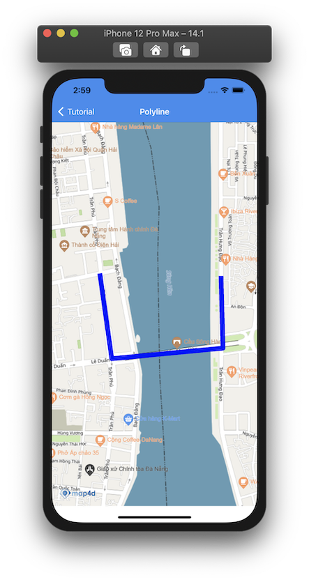
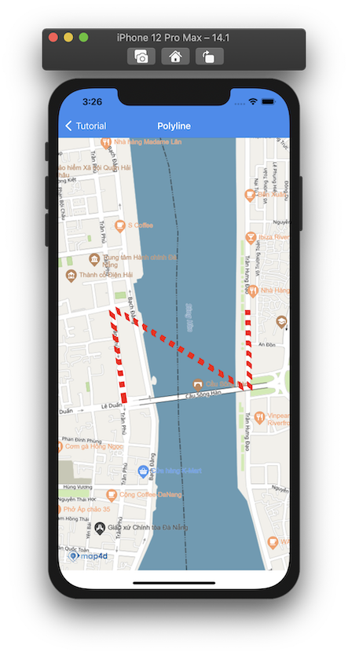

# Polyline

> Để vẽ các đường thẳng trên bản đồ thì ta sử dụng đối tượng **MFPolyline**. Một đối tượng **MFPolyline** bao gồm một mảng các điểm tọa độ
và tạo ra các đoạn thẳng nối các vị trí đó theo một trình tự có thứ tự.

### 1. Thêm một Polyline

Đoạn mã sau sẽ vẽ **Polyline** lên bản đồ:

<!-- tabs:start -->
#### ** Swift **

```swift 
let polyline = MFPolyline()
let path = MFMutablePath()
path.add(CLLocationCoordinate2D(latitude: 16.075370898415514, longitude: 108.22887796703878))
path.add(CLLocationCoordinate2D(latitude: 16.072266586439582, longitude: 108.22896530020222))
path.add(CLLocationCoordinate2D(latitude: 16.07181296817015, longitude: 108.22398711335603))
path.add(CLLocationCoordinate2D(latitude: 16.07548312266711, longitude: 108.22345067080795))
polyline.path = path
polyline.width = 10.0
polyline.color = .blue
polyline.map = mapView
```

#### ** Objective C **

```objc 
MFPolyline *polyline = [[MFPolyline alloc] init];
MFMutablePath *path = [[MFMutablePath alloc] init];
[path addCoordinate: CLLocationCoordinate2DMake(16.075370898415514, 108.22887796703878)];
[path addCoordinate: CLLocationCoordinate2DMake(16.072266586439582, 108.22896530020222)];
[path addCoordinate: CLLocationCoordinate2DMake(16.07181296817015, 108.22398711335603)];
[path addCoordinate: CLLocationCoordinate2DMake(16.07548312266711, 108.22345067080795)];
[polyline setPath: path];
[polyline setWidth: 10.0];
[polyline setColor: [UIColor blueColor]];
[polyline setMap: mapView];
```

<!-- tabs:end -->

-   

Bạn có thể tùy chỉnh hình dáng của **Polyline** trước khi thêm nó vào bản đồ hoặc sau khi nó đã được thêm vào bản đồ.

### 2. Xóa Polyline khỏi bản đồ

Để xóa **Polyline** khỏi bản đồ, chúng ta **set** thuộc tính **map** bằng **nil**

<!-- tabs:start -->
#### ** Swift **

```swift
polyline.map = nil
```

#### ** Objective C **

```objc 
[polyline setMap: Nil];
```
<!-- tabs:end -->

### 3. Tùy chỉnh cho Polyline

Bạn có thể dễ dàng tuỳ chỉnh hình dáng của **Polyline** thông qua các thuộc tính mà **MFPolyline** cung cấp như
 
| Name                       |Description                                                                                                              |
|----------------------------|-------------------------------------------------------------------------------------------------------------------------|
| **path**                   | Truyền vào một mảng các tọa độ **CLLocationCoordinate2D** để tạo **Polyline**.                                          |
| **width**                  | Tuỳ chỉnh độ rộng của **Polyline**.                                                                                     |
| **color**                  | Tuỳ chỉnh màu sắc của **Polyline**.                                                                                     |
| ~**style**~                | ~Tuỳ chỉnh **Polyline** là loại nét liền **solid** hay nét đứt **dotted**.~                                             |
| **strokePattern**          | Tuỳ kiểu vẽ cho polyline (có 4 kiểu là: SolidPattern, DashPattern, DotPattern và IconPattern).                          |

<!-- tabs:start -->
#### ** Swift **

```swift    
let path = MFMutablePath()
path.add(CLLocationCoordinate2D(latitude: 16.075370898415514, longitude: 108.22887796703878))
path.add(CLLocationCoordinate2D(latitude: 16.072266586439582, longitude: 108.22896530020222))
path.add(CLLocationCoordinate2D(latitude: 16.07548312266711, longitude: 108.22345067080795))
path.add(CLLocationCoordinate2D(latitude: 16.07181296817015, longitude: 108.22398711335603))
polyline.path = path
polyline.width = 10.0
polyline.color = .red
polyline.strokePattern = MFStrokePattern.dash(length: 5 gap: 5)
```

#### ** Objective C **

```objc 
MFMutablePath *path = [[MFMutablePath alloc] init];
[path addCoordinate: CLLocationCoordinate2DMake(16.075370898415514, 108.22887796703878)];
[path addCoordinate: CLLocationCoordinate2DMake(16.072266586439582, 108.22896530020222)];
[path addCoordinate: CLLocationCoordinate2DMake(16.07548312266711, 108.22345067080795)];
[path addCoordinate: CLLocationCoordinate2DMake(16.07181296817015, 108.22398711335603)];
[polyline setPath: path];
[polyline setWidth: 10.0];
[polyline setColor: [UIColor redColor]];
[polyline setStrokePattern: [MFStrokePattern dashWithLength:5 gap:5]];
```

<!-- tabs:end -->
 
-   

## Reference

`MFPolyline` class

### Constructor

<!-- tabs:start -->

#### ** Swift **

```swift 
let polyline = MFPolyline()
```

#### ** Objective C **

```objc 
MFPolyline *polyline = [[MFPolyline alloc] init];
```
<!-- tabs:end -->

### Properties

| Name                       | Type                   | Description                                                                                                             |
|----------------------------|:-----------------------|-------------------------------------------------------------------------------------------------------------------------|
| **path**                   | MFPath                 | Truyền vào một mảng các tọa độ **CLLocationCoordinate2D** để tạo Polyline.**Polyline**.                                 |
| **width**                  | UIColor                | Chỉ định độ rộng của **Polyline** theo đơn vị point.                                                                    |
| ~**style**~                | ~MFPolylineStyle~      | ~Chỉ định **Polyline** là loại nét liền **solid** hay nét đứt **dotted**. Giá trị mặc định là **solid** **Polyline**.~  |
| **strokePattern**          | MFStrokePattern        | Chỉ định kiểu vẽ cho polyline                                                                                           |
| **color**                  | double                 | Chỉ định màu sắc của **Polyline**.                                                                                      |
| **userInteractionEnabled** | BOOL                   | Cho phép người dùng có thể tương tác được với **Polyline** hay không. Giá trị mặc định là **true**. Khi không cho phép người dùng tương tác với **Polyline** thì tất cả các sự kiện liên quan tới **Polyline** từ phía người dùng sẽ không có tác dụng.                                                                         |
| **isHidden**               | BOOL                   | Xác định **Polyline** có thể ẩn hay hiện trên bản đồ. Giá trị mặc định là **true**.                                     |
| **zIndex**                 | float                  | Chỉ định thứ tự hiển thị giữa các Polyline với nhau hoặc giữa **Polyline** với các đối tượng khác trên bản đồ. Giá trị mặc định là **0** |
| **userData**               | NSObject               | Cho phép người dùng lưu trữ thông tin trên **Polyline**.                                                                |
| **map**                    | [MFMapView](/reference/map?id=MFMapView)              | Chỉ định hiển thị **Polyline** trên **Map** hoặc xoá **Polyline** khỏi **Map**           |
| **Id**                     | UInt32                 | **Id** của **Polyline** **{get}**.                                                                                      |


### Delegate

  > **Chú ý**: Để sử dụng sự kiện của **Polyline** phải **set** thuộc tính **userInteractionEnabled** = **true**
  
  **TouchPolyline**

  Phát sinh khi người dùng **touch** vào **Polyline**
  </br>Cung cấp thông tin của **Polyline** cho người dùng

  <!-- tabs:start -->

  #### ** Swift **

  ```swift
  func mapView(_ mapView: MFMapView!, didTap polyline: MFPolyline!) {}
  ```

  #### ** Objective C **

  ```objc 
  - (void)mapView:(MFMapView *)mapView didTapPolyline:(MFPolyline *)polyline{}
  ```

  <!-- tabs:end -->