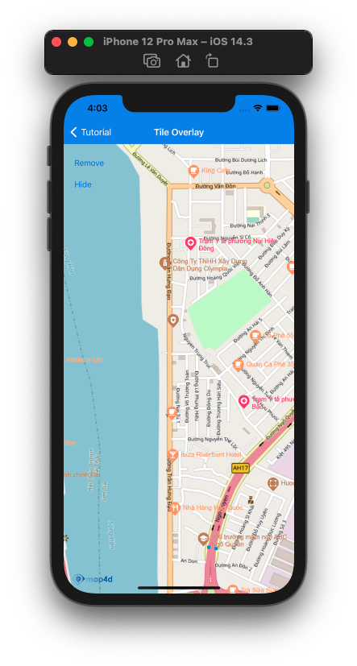

# Tile Overlay

Tile Overlay là một loại overlay cho phép người dùng hiển thị các tile map khác nhau từ nhiều nguồn khác nhau lên trên tile map có sẵn của Map4D



## Add Tile overlay

Để thêm 1 tile overlay vào map cần tạo mới 1 đối tượng của lớp [MFURLTileLayer](reference/tile-overlay?id=mfurltilelayer-class) sau đó set `map` cho đối tượng đó.  
Cần phải implement [MFTileURLConstructor](reference/tile-overlay?id=mftileurlconstructor-protocol)

### Tạo mới Tile overlay

Đoạn code bên dưới hướng dẫn cách sử dụng implement [MFTileURLConstructor](reference/tile-overlay?id=mftileurlconstructor-protocol) và sử dụng [MFURLTileLayer](reference/tile-overlay?id=mfurltilelayer-class) để hiển thị lớp tile từ `openstreetmap`

<!-- tabs:start -->
#### ** Swift **
Implement **MFTileURLConstructor**
```swift
class TileURLConstructor : NSObject, MFTileURLConstructor {
    func getTileUrlWith(x: UInt, y: UInt, zoom: UInt) -> URL? {
    let url = "https://tile.openstreetmap.de/\(zoom)/\(x)/\(y).png"
    return URL(string: url)
    }
}
```

Tạo đối tượng **MFURLTileLayer** và set `map`
```swift
let urlConstructor = TileURLConstructor()
let tileOverlay = MFURLTileLayer(urlConstructor: urlConstructor)
tileOverlay.map = mapView
```

#### ** Objective-C **

Implement **MFTileURLConstructor**

```objc
@interface TileURLConstructor : NSObject<MFTileURLConstructor>

- (NSURL * _Nullable)getTileUrlWithX:(NSUInteger)x y:(NSUInteger)y zoom:(NSUInteger)zoom;

@end

@implementation TileURLConstructor

- (NSURL * _Nullable)getTileUrlWithX:(NSUInteger)x y:(NSUInteger)y zoom:(NSUInteger)zoom {
  NSString *url = [NSString stringWithFormat:@"https://tile.openstreetmap.de/%lu/%lu/%lu.png", zoom, x, y];
  return [NSURL URLWithString:url];
}

@end
```

Tạo đối tượng **MFURLTileLayer** và set `map`
```objc
TileURLConstructor * urlConstructor = [[TileURLConstructor alloc] init];
MFURLTileLayer * tileOverlay = [MFURLTileLayer tileLayerWithURLConstructor:urlConstructor];
[tileOverlay setMap:mapView];
```
<!-- tabs:end -->

### Remove title overlay

Để xoá tile overlay khỏi map, ta set đối tượng `map` của tile overlay về rỗng
<!-- tabs:start -->
#### ** Swift **
```swift
tileOverlay.map = nil
```
#### ** Objective-C **
```objc
tileOverlay.map = nil;
```
<!-- tabs:end -->

### Ẩn/Hiện Tile Overlay
Set giá trị cho thuộc tính `isHidden` để ẩn/hiện tile overlay.  
Chú ý: Mặc dù tile overlay không hiển thị nhưng quá trình tải các tile vẫn diễn ra

<!-- tabs:start -->
#### ** Swift **
```swift
tileOverlay.isHidden = true
```
#### ** Objective-C **
```objc
tileOverlay.isHidden = YES;
```
<!-- tabs:end -->

## References

### MFURLTileLayer class

`MFURLTileLayer` class

**Constructor** 

Lớp `MFURLTileLayer` cung cấp một phương thức static để tạo đối tượng *MFURLTileLayer* một cách tiện lợi
```objc
+ (instancetype _Nonnull)tileLayerWithURLConstructor:(id<MFTileURLConstructor> _Nonnull)constructor;
```

- Parameters:
  - urlConstructor: [MFTileURLConstructor](reference/tile-overlay?id=mftileurlconstructor-protocol) *required*

Sử dụng
<!-- tabs:start -->
##### ** Swift **
```swift
let tileOverlay = MFURLTileLayer(urlConstructor: urlConstructor)
```
##### ** Objective-C **
```objc
MFURLTileLayer * tileOverlay = [MFURLTileLayer tileLayerWithURLConstructor:urlConstructor];
```
<!-- tabs:end -->

**Methods**

| Name               | Parameters  | Return Value | Description                                                              |
|--------------------|-------------|--------------|--------------------------------------------------------------------------|
| **clearTileCache** | `none`      | `none`       | Xoá cache của đối tượng tile overlay và load lại hình ảnh tile từ server |

**Properties**

| Name         | Type      | Description                                                                            |
|--------------|-----------|----------------------------------------------------------------------------------------|
| **map**      | [MFMapView](/reference/map?id=mfmapview-class) | Map view sẽ hiển thị tile overlay                 |
| **isHidden** | bool                                           | Ẩn/hiện tile overlay trên map                     |
| **opacity**  | float                                          | Độ trong suốt của tile layer (mặc đinh là: 1.0)   |
| **zIndex**   | float                                          | Giá trị zIndex của tile overlay cao hơn sẽ hiển thị trên tile overlay có giá trị zIndex nhỏ hơn |

### MFTileURLConstructor protocol

`MFTileURLConstructor` protocol

MFTileURLConstructor là một protocol, định nghĩa sẵn phương thức dùng để xác định URL trỏ đến hình ảnh tile tương ứng với mỗi toạ độ và mức zoom

<!-- tabs:start -->
##### ** Swift **
```swift
func getTileUrlWith(x: UInt, y: UInt, zoom: UInt) -> URL?
```
##### ** Objective-C **
```objc
- (NSURL * _Nullable)getTileUrlWithX:(NSUInteger)x y:(NSUInteger)y zoom:(NSUInteger)zoom;
```
<!-- tabs:end -->

Cần phải implement protocol này trước khi tạo đối tượng `MFURLTileLayer`
