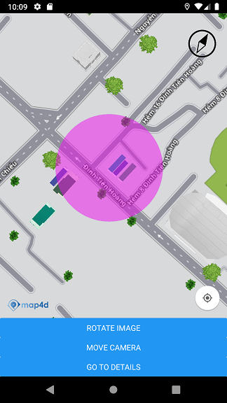

# Circle

Nếu bạn muốn vẽ một hình tròn lên bản đồ, thì Map4D React Native SDK cung cấp cho bạn lớp **MFCircle** để thực hiện điều đó. 
Bạn có thể dễ dàng vẽ các hình tròn lên bản đồ.

> Để tạo một Circle, bạn phải chỉ định ít nhất hai thuộc tính **center** và **radius**:

### Các thuộc tính của **Circle**:

| Name                   | Type          |Description                                                                                                              |
|------------------------|---------------|-------------------------------------------------------------------------------------------------------------------------|
| **center**             | {latitude: number,longitude: number} | Tọa độ tâm của hình tròn. |
| **radius**             | number        | Bán kính của hình tròn theo đơn vị mét. |
| **strokeWidth**        | number        | Độ rộng của đường viền **Circle** theo đơn vị point.                                                                  |
| **strokeColor**        | string        | Màu sắc **đường viền Circle**. Ví dụ: "#0000FF08"                                                                          |
| **fillColor**          | string        | Màu sắc của **Circle**. Ví dụ: "#F00FF07F"                                                                                      |
| **zIndex**             | number        | Chỉ định thứ tự hiển thị giữa các **Circle** với nhau hoặc giữa **Circle** với các đối tượng khác trên bản đồ. Giá trị mặc định là **0**.  |
| **visible**            | bool          | Xác định **Circle** có thể ẩn hay hiện trên bản đồ. Giá trị mặc định là **true**.                                       |
| **userData**           | object        | Dữ liệu bất kỳ mà người dùng muốn lưu cùng với **Circle**.                                       |
| **onPress**            | func          | Callbacks để nhận sự kiện khi người dùng press circle trên map.                                                                          |

### Thêm một Circle



```javascript
render() {
  return (
    <MFMapView ref={ref => this.map = ref} >
      <MFCircle
        onPress={(event) => {console.log('on press circle:', event.nativeEvent)}}
        center={{latitude: 10.7881732, longitude: 106.7000933}}
        radius={50}
        visible={true}
        fillColor="#F00FF07F"
        strokeColor="#0000FF08" strokeWidth={2}
        userData={{name: "Circle 10", id: 10}}
        zIndex ={3.0} />
    </MFMapView>
  );
}
```

### Methods

| Name                   | Parameters                           | Description                                                                            |
|------------------------|:------------------------------------:|----------------------------------------------------------------------------------------|
| **setCenter**          | {latitude: number,longitude: number} | Set tạo độ tâm cho circle                                                              |
| **setRadius**          | number                               | Set bán kính cho circle theo đơn vị là mét                                             |
| **setFillColor**       | string                               | Set màu cho circle kiểu string. Ví dụ: "#F00FF07F"                                     |
| **setStrokeColor**     | string                               | Set màu viền cho circle theo kiểu string. Ví dụ: "#F00FF07F"                           |
| **setStrokeWidth**     | number                               | Set độ rộng đường viền của circle                                                      |
| **setUserData**        | object                               | Set dữ liệu bất kỳ cho circle                                                          |
| **setZIndex**          | number                               | Set giá trị zIndex cho circle                                                          |
| **setVisible**         | bool                                 | Ẩn/hiện circle trên map                                                                |
