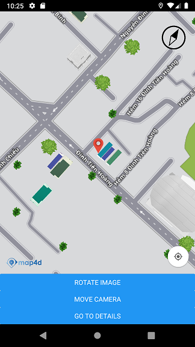
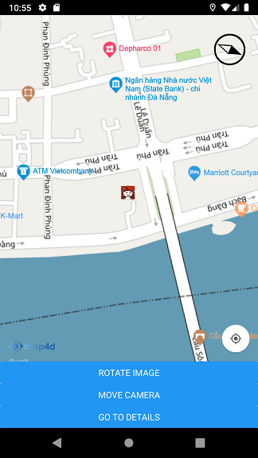
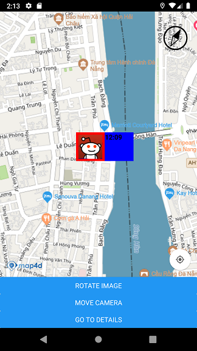

# Marker

**Marker** dùng để xác định một vị trí đơn lẻ trên bản đồ. 

> Cho phép người dùng đánh dấu lên các vị trí trên bản đồ bằng các biểu tượng chung được cung cấp bởi **Map4dMap React Native** 
hoặc bạn có thể tuỳ chỉnh bằng một hình ảnh khác hoặc tuỳ chỉnh các thuộc tính của **Marker**

### Các thuộc tính của **Marker**:

| Name                   | Type          |Description                                                                                                              |
|------------------------|---------------|-------------------------------------------------------------------------------------------------------------------------|
| **coordinate**         | [CoordinateData](#CoordinateData) | Vị trí của Marker trên bản đồ. |
| **draggable**          | bool          | Marker có thể kéo để di chuyển vị trí trên bản đồ hay không. Giá trị mặc định là **false** |
| **anchor**             | [AnchorData](#AnchorData) | Anchor của marker.                                                                  |
| **elevation**          | number        | Độ cao của Marker so với mực nước biển, đơn vị là mét                                                               |
| **rotation**           | number        | Góc quay của Marker trên bản đồ theo đơn vị là Độ                                                              |
| **infoWindowAnchor**   | number        | Anchor info window của Marker                                                                         |
| **title**              | string        | Tiêu đề của Marker, sẽ được hiển thị trong info window                                                                          |
| **snippet**            | string        | Snippet của Marker, sẽ được hiển thị trong info window                                                             |
| **icon**               | [IconData](#IconData) | tùy chỉnh icon của Marker                                                                          |
| **zIndex**             | number        | Chỉ định thứ tự hiển thị giữa các **Marker** với nhau hoặc giữa **Marker** với các đối tượng khác trên bản đồ. Giá trị mặc định là **0**.  |
| **visible**            | bool          | Xác định **Marker** có thể ẩn hay hiện trên bản đồ. Giá trị mặc định là **true**.                                       |
| **userData**           | object        | Dữ liệu bất kỳ mà người dùng muốn lưu cùng với **Marker**.                                       |
| **onPress**            | func          | Callbacks để nhận sự kiện khi người dùng press Marker trên map.                                                                          |
| **onPressInfoWindow**  | func          | Callbacks để nhận sự kiện khi người dùng press lên info window của Marker.                                                                          |
| **onDragStart**        | func          | Callbacks để nhận sự kiện khi người dùng bắt đầu drag Marker trên map.                                                                          |
| **onDrag**             | func          | Callbacks để nhận sự kiện khi người dùng đang kéo Marker trên map.                                                                          |
| **onDragEnd**          | func          | Callbacks để nhận sự kiện khi người dùng kết thúc việc kéo Marker trên map.                                                                          |

### 1. Thêm một Marker



```javascript
render() {
  return (
    <MFMapView ref={ref => this.map = ref} >
      <MFMarker
        coordinate={{latitude: 10.7881732, longitude: 106.7000933}}
        draggable={true}
        anchor={{x: 0.5, y: 1.0}}
        userData={{name: "Marker 1", arr:[1, 5, 9], obj:{x:10, y:11}}}
        onPress={(event) => {console.log('on press marker:', event.nativeEvent)}}
        zIndex={20}
      />
    </MFMapView>
  );
}
```

### 2. Render Marker với icon tùy chỉnh

Để tùy chỉnh icon cho Marker, bạn có thể dùng thuộc tính icon để thực hiện điều đó



```javascript
render() {
  return (
    <MFMapView ref={ref => this.map = ref} >
      <MFMarker
        icon={{uri: 'https://b.thumbs.redditmedia.com/F82n9T2HtoYxNmxbe1CL0RKxBdeUEw-HVyd-F-Lb91o.png', width: 32, height: 32}}
        coordinate={{latitude: 16.071364, longitude: 108.224487}}
        zIndex={3.0}
        visible={true}
      />
    </MFMapView>
  );
}
```

### 3. Render Marker với custom view

Ngoài việc tùy chỉnh icon cho Marker, bạn còn có thể dùng custom view để thay đổi hình ảnh của Marker như hình dưới:



> Các children components có thể được thêm vào trong Marker và nội dung được hiển thị sẽ thay thế cho icon marker.

```javascript
render() {
  return (
    <MFMapView ref={ref => this.map = ref} >
      <MFMarker
        coordinate={{latitude: 16.071364, longitude: 108.224487}}
        zIndex={3.0}
        visible={true} >
          <View style={{
            width: 120,
            height: 60,
            backgroundColor: 'blue',
            flexDirection: 'row'
          }}>
            <Image source={{uri: 'https://b.thumbs.redditmedia.com/F82n9T2HtoYxNmxbe1CL0RKxBdeUEw-HVyd-F-Lb91o.png'}}
              style={{ borderColor: "red", borderWidth: 5, height: 60, width: 60 }} />

            <Text style={{ fontWeight: 'bold', color: 'black' }}>
              {"12:09"}
            </Text>
        </View>
      </MFMarker>
    </MFMapView>
  );
}
```

### Methods

| Name                   | Parameters                           | Description                                                                            |
|------------------------|:------------------------------------:|----------------------------------------------------------------------------------------|
| **setCoordinate**      | [CoordinateData](#CoordinateData)    | Set vị trí cho marker.                                                              |
| **setRotation**        | number                               | Set góc quay cho marker theo đơn vị là Độ                                             |
| **setTitle**           | string                               | Set tiêu đề cho marker                                     |
| **setSnippet**         | string                               | Set snippet cho marker                                |
| **setDraggable**       | bool                                 | Set marker có thể drag trên bản đồ hay không                                                      |
| **setZIndex**          | number                               | Set giá trị zIndex cho marker                                                          |
| **setVisible**         | bool                                 | Ẩn/hiện marker trên map                                                                |
| **setInfoWindowAnchor**| [AnchorData](#AnchorData)            | Set anchor cho info window của marker                                                             |
| **setElevation**       | number                               | Set độ cao của marker so với mực nước biển, đơn vị là mét                             |
| **setUserData**        | object                               | Set dữ liệu bất kỳ cho marker                                                          |

### Object Types

#### CoordinateData

Thông tin tọa độ theo kinh độ, vĩ độ

```js
let coordinate = {latitude: 10.7881732, longitude: 106.7000933}
```

#### AnchorData

Thông tin tọa độ anchor

```js
let anchor = {x: 0.5, y: 1.0}
```

#### IconData

Thông tin custom icon cho Marker

```js
let icon = {uri: 'https://b.thumbs.redditmedia.com/F82n9T2HtoYxNmxbe1CL0RKxBdeUEw-HVyd-F-Lb91o.png', width: 32, height: 32}
```
