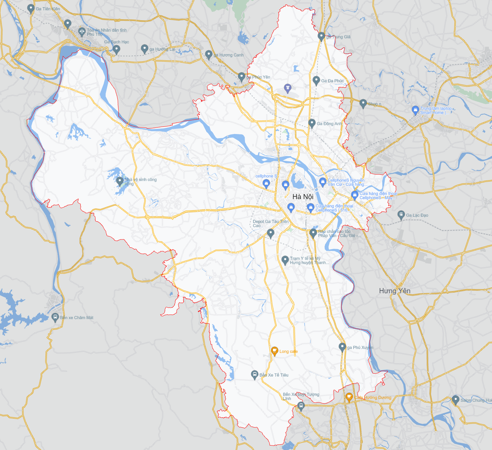

# Area Focuser

Cho phép di chuyển bản đồ đến một vùng cụ thể và hiển thị nổi bật khu vực đó

## Focus tỉnh/thành

```js
map.areaFocuser.focusProvince({
  name: string,
  highlight: boolean
}) : Promise<void>
```

Trong đó:
  - name: tên tỉnh/thành muốn hiển thị
  - highlight: set true nếu muốn hiển thị nổi bật tỉnh/thành

Ví dụ:

```js
map.areaFocuser.focusProvince({name: "Hà Nội", highlight: true})
```



### Bỏ focus

Truyền null nếu muốn bỏ focus

```js
map.areaFocuser.focusProvince(null)
```
