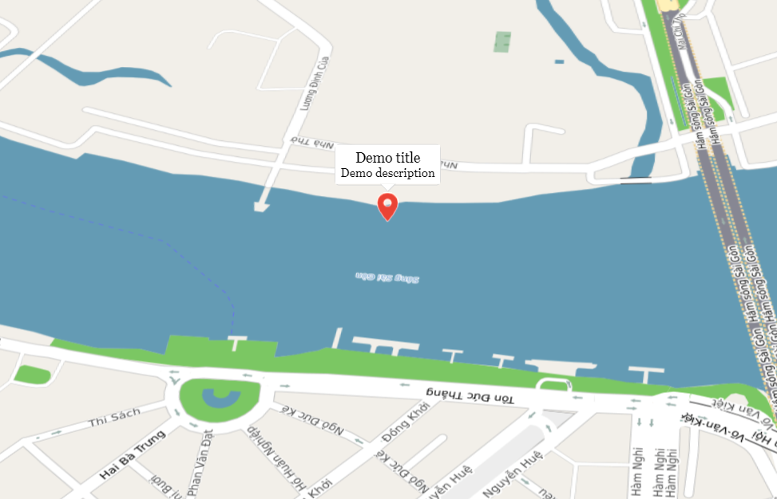

# Marker

Marker dùng để xác định một vị trí trên bản đồ. Cho phép người dùng thêm một điểm ghim trên bản đồ ở một vị trí xác định.

### 1. Thêm một marker

Hàm khởi tạo của lớp **map4d.Marker** cần truyền vào một đối tượng **map4d.MarkerOptions** để định nghĩa các thuộc tính ban đầu của
Marker. 

Đối tượng **MarkerOptions** được định nghĩa như sau:

```javascript
interface MarkerOptions {
    position: ILatLng
    visible?: boolean
    anchor?: IPoint
    labelAnchor?: IPoint
    icon?: Icon | string
    elevation?: number
    rotation?: number
    title?: string
    snippet?: string
    windowAnchor?: IPoint
    zIndex?: number
    label?: string | MarkerLabel
    draggable?: boolean
    iconView?: string | Node
    clickable?: boolean
    animation?: IAnimation
  }
```

Các thuộc tính của **Marker Options** :
- **position** (bắt buộc) : chỉ định một **ILatLng** để xác định vị trí ban đầu của Marker. 
- **visible** (tùy chọn) : xác định Marker có thể ẩn hay hiện trên bản đồ. Giá trị mặc định là **true**.
- **anchor** (tùy chọn) : chỉ định một **IPoint** để xác định điểm neo cho Marker. Giá trị mặc định là **{x: 0.5, y: 1.0}**
- **labelAnchor** (tùy chọn) : chỉ định một **IPoint** để xác định điểm neo của Label so với Marker. Giá trị mặc định là **{x: 0.5, y: 0.5}**
- **icon** (tùy chọn) : tùy chỉnh icon cho Marker. Có thể truyền vào là một **Icon** hoặc là một **Url**
- **elevation** (tùy chọn) : chỉ định độ cao của Marker so với mực nước biển, đơn vị là mét. Giá trị mặc định là **0**
- **rotation** (tùy chọn) : chỉ định góc quay của Marker theo đơn vị là Độ. Giá trị mặc định là **0**
- **title** (tùy chọn) : chỉ định tiêu đề của Marker. Tiêu đề sẽ được hiển thị ở dòng đầu tiên của bảng thông tin Marker.
- **snippet** (tùy chọn) : mô tả thông tin ngắn gọn cho Marker. Snippet sẽ được hiển thị ở bẳng thông tin của Marker và
phía dưới dòng tiêu đề.
- **windowAnchor** (tùy chọn) : chỉ định một **IPoint** để xác định điểm neo bảng thông tin của Marker. Bảng thông tin này
sẽ hiện lên khi click vào Marker. Giá trị mặc định là **{x: 0.5, y: 0.0}**
- **zIndex** (tùy chọn) : chỉ định thứ tự chồng nhau giữa các Marker với nhau hoặc giữa Marker với các đối tượng khác trên
bản đồ. Giá trị mặc định là **0**
- **label** (tùy chọn) : chỉ định label của Marker. Label sẽ được hiển thị ở tâm của Marker.
- **draggable** (tùy chọn) : cho phép người dùng có thể kéo Marker trên bản đồ hay không. Giá trị mặc định là **false**
- **iconView** (tùy chọn) : cho phép thêm node HTML vào và thay thế icon mặc định của Marker.
- **clickable** (tùy chọn) : cho phép người dùng có thể tương tác được với Marker hay không. Giá trị mặc định
là true. Khi không cho phép người dùng tương tác với Marker thì tất cả các sự kiện liên quan tới Marker từ phía người dùng
sẽ không có tác dụng.
- **animation** (tùy chọn) : hoạt ảnh của marker khi được thêm vào bản đồ

Ví dụ sau đây thêm một Marker đơn giản vào bản đồ tại Bình Thạnh, Thành phố Hồ Chí Minh:

<iframe src="//jsfiddle.net/duydung2007/zxg1evLt/embedded/" style="min-width: 914px;" height="360px"></iframe>

### 2. Xóa Marker khỏi bản đồ

Để xóa một Marker ra khỏi bản đồ, hãy gọi phương thức **setMap()** và truyền vào đối số __null__

```javascript
marker.setMap(null)
```

Lưu ý rằng cách trên không xóa Marker. Nó chỉ xóa Marker ra khỏi bản đồ. Nếu bạn muốn xóa Marker, bạn nên xóa nó khỏi bản đồ,
sau đó bạn gán **marker** bằng __null__.

Nếu bạn muốn quản lý một danh sách các Marker, bạn nên tạo một mảng để chứa các Marker đó. Sử dụng mảng này bạn có thể gọi phương
thức **setMap()** lần lượt từng Marker trong mảng khi bạn cần xóa các Marker.

### 3. Tùy chỉnh hình ảnh cho Marker

Nếu bạn muốn hiện thị chữ cái hoặc số trên Marker, bạn có thể sử dụng Marker có label. Nếu bạn muốn tùy chỉnh nhiều hơn,
bạn có thể chỉ định một icon hoặc một hình ảnh khác để thay thế cho hình ảnh mặc định của Marker.

Các phần bên dưới mô tả Marker với iconView, Marker có bảng thông tin, Marker có label.

#### Marker có IconView

Nếu bạn muốn thay đổi hình ảnh mặc định của Marker thành một node HTML thì bạn có thể gán thuộc tính **iconView** trong
**MarkerOptions** thành một node HTML như ví dụ dưới đây.

<iframe src="//jsfiddle.net/duydung2007/z68nu7o4/embedded/" style="min-width: 914px;" height="400px"></iframe>

#### Marker có bảng thông tin

Bạn có thể tạo marker chứa bảng thông tin bằng cách chỉ định giá trị cho **title** và **snippet** trong **MarkerOptions**
khi tạo một marker.

<iframe src="//jsfiddle.net/duydung2007/zdstvq8o/embedded/" style="min-width: 914px;" height="370px"></iframe>

Bảng thông tin sẽ được hiển thị **khi người dùng click lên marker** như hình bên dưới:



Ngoài ra bạn còn có thể thay đổi nội dung bảng thông tin bằng layout mặc định của bản đồ bằng phương thức **setInfoContents()**
với đối số truyền vào là một string hoặc một HTML:

```javascript
marker.setInfoContents("có thể là string hoặc html")
```

hoặc thay đổi nội dung bảng thông tin bao gồm cả layout và nội dung bằng phương thức **setInfoWindow()** với đối số truyền
vào cũng là một string hoặc một HTML:
```javascript
marker.setInfoWindow("có thể là string hoặc html")
```

#### Marker có label

Là một marker có chữ hoặc số được vẽ ở trong Marker. Bạn có thể chỉ định label là một string hoặc một đối tượng **MarkerLabel**
(bao gồm một string và các thuộc tính khác).

Khi tạo một marker bạn có thể chỉ định thuộc tính **label** trong đối tượng MarkerOptions. Ngoài ra bạn có thể gọi phương thức
**setLabel()** của đối tượng **Marker** để thiết lập label trên đối tượng đó.

<iframe src="//jsfiddle.net/duydung2007/zgn9te67/embedded/" style="min-width: 914px;" height="380px"></iframe>

Như đoạn mã tạo maker với label ở trên, ta có label là một đối tượng **map4d.MarkerLabel** với các thuộc tính text là
**Text**, màu chữ là màu đen và kích thước là 12.

### 4. Tạo một Marker có thể kéo được trên bản đồ

Để cho phép người dùng có thể kéo một Marker tới một vị trí khác trên bản đồ, chỉ định thuộc tính **draggable** thành **true** ở trong
**MarkerOptions**

<iframe src="//jsfiddle.net/duydung2007/0rdzmpnk/embedded/" style="min-width: 914px;" height="360px"></iframe>

Ngoài ra bạn có thể gọi phương thức **setDraggable()** của đối tượng **Marker** và truyền vào tham số **true** để bật
tính năng draggable của marker hoặc truyền vào tham số **false** để tắt tính năng draggable.

### 5. Marker Animations

Bạn có thể tạo hiệu ứng chuyển động cho marker bằng cách set giá trị thuộc tính `animation` (thuộc loại: `map4d.Animation`). Các giá trị được hỗ trợ:
- DROP: cho biết rằng điểm đánh dấu sẽ rơi từ trên cùng của bản đồ xuống vị trí cuối cùng của nó khi được đặt lần đầu tiên trên bản đồ.
- BOUNCE: marker sẽ nảy tại chỗ (dừng lại khi set `animation` bằng null)

Ví dụ:

Tạo marker với giá trị animation từ options

```javascript
const marker = new map4d.Marker({
  position: { lat: 10.773201, lng: 106.700147 },
  animation: map4d.Animation.DROP,
})
```

Thay đổi giá trị animation bằng phương thức setAnimation

```javascript
marker.setAnimation(map4d.Animation.BOUNCE)
```

### 6. Các sự kiện trên Marker

Để lắng nghe các sự kiện xảy ra trên marker, bạn hãy dùng phương thức **addListener()** của lớp **Map** với tham số **EventOptions**
là đối tượng **{marker: true}**.

Các sự kiện có thể lắng nghe trên marker là: **click, dblClick, longClick, rightClick, hover, mouseOut, drag, dragStart, dragEnd**

Mô tả các sự kiện này tương tự như mô tả của **Map Event**. Các bạn có thể tham khảo [tại đây](guides/map-events.md)

#### i. Ví dụ: để lắng nghe sự kiện **click** cho marker ta thực hiện như sau:

```javascript
let clickEvent = map.addListener("click", (args) => {
  console.log("Marker clicked: ")
  console.log(args)
}, {marker: true})
```

Tham số **args** trả về khi có sự kiện xảy ra sẽ bao gồm các thông tin chính như sau:
- marker: là đối tượng marker mà người dùng **click**.
- location: là tọa độ click trên bản đồ theo latitude và longitude.
- pixel: là tọa độ pixel mà người dùng click trên màn hình.

####  ii. Ví dụ: để lắng nghe sự kiện **mouseOut** cho marker ta thực hiện như sau:

```javascript
let clickEvent = map.addListener("mouseOut", (args) => {
  console.log("Mouse Out Marker:", args.marker)
}, {marker: true})
```

## Reference

### Marker Class

`map4d.Marker` class

**Constructor** 

Tạo Marker với các options được chỉ định

```js
Marker(options)
```

- Parameters:
  - options: [MarkerOptions](/reference/marker?id=marker-options) *required*

**Methods**

| Name                         | Parameters                              | Return Value | Description                                                                            |
|------------------------------|:---------------------------------------:|:------------:|----------------------------------------------------------------------------------------|
| **setMap**                   | [Map](/reference/map?id=map-class)      | `none`       | Thêm marker vào map, nếu set map là **null** thì marker sẽ bị xóa khỏi map             |
| **getMap**                   | `none`                                  | Map          | Lấy đối tượng map mà marker được thêm vào                                              |
| **setVisible**               | visibility: boolean                     | `none`       | Ẩn/hiện marker trên map                                                                |
| **isVisible**                | `none`                                  | boolean      | Get trạng thái ẩn/hiện của marker                                                      |
| **setZIndex**                | zIndex: number                          | `none`       | Set giá trị zIndex cho Marker                                                          |
| **getZIndex**                | `none`                                  | number       | Get giá trị zIndex hiện tại của Marker                                                 |
| **setPosition**              | [ILatLng](/reference/coordinates?id=ilatlng)| `none`    | Set vị trí cho marker                                                                 |
| **getPosition**              | `none`                                  | ILatLng      | Get vị trí của marker                                                                  |
| **setAnchor**                | [IPoint](/reference/coordinates?id=ipoint)| `none`      | Set điểm neo cho Marker                                                               |
| **getAnchor**                | `none`                                  | IPoint       | Get điểm neo đã set cho Marker                                                         |
| **setLabelAnchor**           | [IPoint](/reference/coordinates?id=ipoint)| `none`      | Set điểm neo cho chữ vẽ trong marker                                                  |
| **getLabelAnchor**           | `none`                                  | IPoint       | Get điểm neo của chữ trong marker đã set                                               |
| **setIcon**                  | [Icon](/reference/marker?id=icon)`or`string|`none`| Set một hình ảnh cho marker để thay cho hình ảnh mặc định                                   |
| **getIcon**                  | `none`                                  |Icon`or`string| Get hình ảnh đã set cho marker trước đó                                                |
| **setElevation**             | number                                  | `none`       | Set độ cao của marker theo đơn vị là mét                                               |
| **getElevation**             | `none`                                  | number       | Get độ cao của marker                                                                  |
| **setRotation**              | number                                  | `none`       | Set góc quay của marker trên bản đồ theo đơn vị độ                                     |
| **getRotation**              | `none`                                  | number       | Get góc quay của marker trên bản đồ                                                    |
| **hideInfoWindow**           | `none`                                  | `none`       | Ẩn bảng thông tin của marker                                                           |
| **showInfoWindow**           | `none`                                  | `none`       | Hiện bảng thông tin của marker                                                         |
| **getTitle**                 | `none`                                  | string       | Get tiêu đề của maker                                                                  |
| **setTitle**                 | string                                  | `none`       | Set tiêu của marker                                                                    |
| **getSnippet**               | `none`                                  | string       | Get mô tả của marker                                                                   |
| **setSnippet**               | string                                  | `none`       | Set mô tả của marker                                                                   |
| **setWindowAnchor**          | [IPoint](/reference/coordinates?id=ipoint)| `none`      | Set điểm neo cho bảng thông tin marker                                                |
| **setInfoWindow**            | string `or` Node                        | `none`       | Set kiểu dáng bảng thông tin thay cho bảng thông tin mặc định                          |
| **setInfoContents**          | string `or` Node                        | `none`       | Set nội dung cho bảng thông tin                                                        |
| **isInfoWindowShown**        | `none`                                  | boolean      | Kiểm tra xem bảng thông tin có được hiện trên bản đồ hay không                         |
| **setDraggable**             | boolean                                 | `none`       | Cho phép marker có được kéo trên bản đồ hay không                                      |
| **isDraggable**              | `none`                                  | boolean      | Kiểm tra xem marker có thể kéo trên bản đồ hay không                                   |
| **getUserData**              | `none`                                  | any          | Set dữ liệu riêng mà người dùng muốn cho marker                                        |
| **setUserData**              | any                                     | `none`       | Get dữ liệu riêng mà người dùng đã set cho marker                                      |
| **setLabel**                 | string`or`[MarkerLabel](/reference/marker?id=marker-label)| `none`| Set một label để vẽ trong marker                                            |
| **setIconView**              | string `or` Node                        | `none`       | Thay thế hình ảnh mặc định của marker bằng một HTML view                               |
| **getIconView**              | `none`                                  |string`or`Node| Get thông tin hình ảnh HTML của marker                                                 |
| **isClickable**              | `none`                                  | boolean      | Kiểm tra marker có thể tương tác bởi người dùng hay không                              |
| **setClickable**             | boolean                                 | `none`       | Cho phép marker có thể tương tác bởi người dùng hay không                              |
| **getAnimation**             | `none`                                  | [Animation](/reference/marker?id=animation) | Get giá trị hoạt ảnh của marker                         |
| **setAnimation**             | [Animation](/reference/marker?id=animation) or null or string | `none`          | Set hoạt ảnh cho marker, set `null` để dừng hoạt ảnh hiện tại |

### Marker Options

`map4d.MarkerOptions` interface

Đối tượng MarkerOptions dùng để xác định các thuộc tính dùng cho Marker.

**Properties**

| Name                       | Type                | Description                                                                                                                                                           |
|----------------------------|:-------------------:|-----------------------------------------------------------------------------------------------------------------------------------------------------------------------|
| **position** *required*    |[ILatLng](/reference/coordinates?id=ilatlng)| chỉ định một **ILatLng** để xác định vị trí ban đầu của Marker.                                                                                |
| **visible** *optional*     | boolean             | xác định Marker có thể ẩn hay hiện trên bản đồ. Giá trị mặc định là **true**.                                                                                         |
| **anchor** *optional*      |[IPoint](/reference/coordinates?id=ipoint)| chỉ định một **IPoint** để xác định điểm neo cho Marker. Giá trị mặc định là **{x: 0.5, y: 1.0}**                                                |
| **labelAnchor** *optional* |[IPoint](/reference/coordinates?id=ipoint)| chỉ định một **IPoint** để xác định điểm neo của Label so với Marker. Giá trị mặc định là **{x: 0.5, y: 0.5}**                                   |
| **icon** *optional*        |[Icon](/reference/marker?id=icon)`or`string| tùy chỉnh icon cho Marker. Có thể truyền vào là một **Icon** hoặc là một **Url**                                                                |
| **elevation** *optional*   | number              | chỉ định độ cao của Marker so với mực nước biển, đơn vị là mét. Giá trị mặc định là **0**                                                                             |
| **rotation** *optional*    | number              | chỉ định góc quay của Marker theo đơn vị là Độ. Giá trị mặc định là **0**                                                                                             |
| **title** *optional*       | string              | chỉ định tiêu đề của Marker. Tiêu đề sẽ được hiển thị ở dòng đầu tiên của bảng thông tin Marker.                                                                      |
| **snippet** *optional*     | string              | mô tả thông tin ngắn gọn cho Marker. Snippet sẽ được hiển thị ở bẳng thông tin của Marker và phía dưới dòng tiêu đề.                                                  |
| **windowAnchor** *optional*|[IPoint](/reference/coordinates?id=ipoint)| chỉ định một **IPoint** để xác định điểm neo bảng thông tin của Marker. Bảng thông tin này sẽ hiện lên khi click vào Marker. Giá trị mặc định là **{x: 0.5, y: 0.0}** |
| **zIndex** *optional*      | number              | chỉ định thứ tự chồng nhau giữa các Marker với nhau hoặc giữa Marker với các đối tượng khác trên bản đồ. Giá trị mặc định là **0**                                    |
| **label** *optional*       |string`or`[MarkerLabel](/reference/marker?id=marker-label)| chỉ định label của Marker. Label sẽ được hiển thị ở tâm của Marker.                                                              |
| **draggable** *optional*   | boolean             | cho phép người dùng có thể kéo Marker trên bản đồ hay không. Giá trị mặc định là **false**                                                                            |
| **iconView** *optional*    |string`or`Node       | cho phép thêm node HTML vào và thay thế icon mặc định của Marker.                                                                                                     |
| **clickable** *optional*   | boolean             | cho phép người dùng có thể tương tác được với Marker hay không. Giá trị mặc định là true. Khi không cho phép người dùng tương tác với Marker thì tất cả các sự kiện liên quan tới Marker từ phía người dùng sẽ không có tác dụng.|
| **animation** *optional*   | [Animation](/reference/marker?id=animation) `or` string | Hoạt ảnh của marker khi được thêm vào bản đồ.|


### Marker Label

`map4d.MarkerLabel` class

**Constructor** 

Tạo MarkerLabel với các options được chỉ định

```js
MarkerLabel(options)
```

- Parameters:
  - options: [MarkerLabelOptions](/reference/marker?id=marker-label-options) *required*

**Methods**

| Name               | Parameters | Return Value | Description                                                                                  |
|--------------------|:----------:|:------------:|----------------------------------------------------------------------------------------------|
| **getColor**       | `none`     | string       | Get màu của Maker Label theo hệ HEX                                                          |
| **getFontWeight**  | `none`     | string       | Get kiểu font của Marker Label. Có 2 loại fontWeight là normal (nét thường) và bold (nét đậm)|
| **getFontSize**    | `none`     | number       | Get kích thước của Marker Label                                                              |
| **getText**        | `none`     | string       | Get text của Marker Label                                                                    |
| **getLine**        | `none`     | number       | Get số dòng lớn nhất mà Marker Label có thể vẽ                                               |
| **getMaxWidth**    | `none`     | number       | Get độ rộng lớn nhất mà Marker Label có thể vẽ                                               |
| **hasHalo**        | `none`     | boolean      | Kiểm tra xem đối tượng Marker Label có viền bao quanh khi vẽ text hay không                  |
| **getHaloColor**   | `none`     | string       | Get màu bao quanh text khi vẽ lên bản đồ                                                     |
| **getAnchor**      | `none`     |[Point](/reference/coordinates?id=point)| Get điểm neo của Marker Label                                      |
| **getMargin**      | `none`     |[MarginOptions](/reference/marker?id=margin-options)| Get thông tin về căn lề của Marker Label               |

### Marker Label Options

`map4d.MarkerLableOptions` interface

Đối tượng MarkerLabelOptions dùng để xác định các thuộc tính dùng cho **MarkerLabel**.

**Properties**

| Name                      | Type               | Description                                                                                                                                              |
|---------------------------|:------------------:|----------------------------------------------------------------------------------------------------------------------------------------------------------|
| **text** *required*       | string             | chỉ định một đoạn text cho Marker Label                                                                                                                  |
| **color** *optional*      | string             | chỉ định màu cho Marker Label theo mã HEX (ví dụ **"#FF08A9"**). Giá trị mặc định là **"#000000"**                                                       |
| **fontWeight** *optional* | string             | chỉ định kiểu font cho Marker Label (kiểu **normal** hoặc **bold**). Giá trị mặc định là **normal**                                                      |
| **fontSize** *optional*   | number             | chỉ định kích thước font cho Marker Label. Giá trị mặc định là **13**.                                                                                   |
| **maxWidth** *optional*   | number             | chỉ định độ rộng lớn nhất mà Marker Label có thể vẽ trên bản đồ. Giá trị mặc định là **200**                                                             |
| **line** *optional*       | number             | chỉ định số dòng lớn nhất mà Marker Label có thể vẽ, nếu text dài hơn so với số đòng thì nó sẽ thêm dấu ... ở dòng cuối cùng. Giá trị mặc dịnh là **1**. |
| **halo** *optional*       | boolean            | chỉ định Marker Label vẽ lên bản đồ có viền bao quanh chữ hay không. Giá trị mặc định là **true**                                                        |
| **haloColor** *optional*  | string             | chỉ định màu của viền bao quanh chữ khi Marker Label có halo theo mã HEX. Giá trị mặc định là **"#FFFFFF"**                                              |
| **anchor** *optional*     |[IPoint](/reference/coordinates?id=ipoint)| chỉ định một **IPoint** để xác định điểm neo của Marker Label. Giá trị mặc định là **{x: 0.5, y: 0.5}**                             |
| **margin** *optional*     |[MarginOptions](/reference/marker?id=margin-options)| chỉ định một đối tượng **MarginOptions** để xác định thuộc tính căn lề trên, dưới, trái, phải                             |

### Margin Options

`map4d.MarginOptions` interface

```javascript
interface MarginOptions {
    top?: number,
    bottom?: number,
    left?: number,
    right?: number
}
```

Đối tượng MarginOptions dùng để xác định các thuộc tính căn lề

**Properties**

| Name        | Type          | Description                                                           |
|-------------|:-------------:|-----------------------------------------------------------------------|
| top         | number        | chỉ định khoảng cách căn lề ở phía trên                               |
| bottom      | number        | chỉ định khoảng cách căn lề ở phía dưới                               |
| left        | number        | chỉ định khoảng cách căn lề ở phía bên trái                           |
| right       | number        | chỉ định khoảng cách căn lề ở phía bên phải                           |

### Icon

Là một đối tượng lưu trữ hình ảnh.

`map4d.Icon` class

**Constructor** 

Tạo Icon với các tham số được chỉ định như sau

```js
Icon(width: number, height: number, url: string)
```

- Parameters:
  - width: number *required* Chiều rộng của Icon
  - height: number *required* Chiều cao của Icon
  - url: string *required* đường dẫn URL của hình ảnh dùng để khởi tạo Icon

**Methods**

| Name            | Parameters | Return Value | Description                                                                                  |
|-----------------|:----------:|:------------:|----------------------------------------------------------------------------------------------|
| **clone**       | `none`     | Icon         | Tạo một bản sao của đối tượng Icon hiện tại                                                  |
| **getWidth**    | `none`     | number       | Get chiều rộng của Icon                                                                      |
| **getHeight**   | `none`     | number       | Get chiều cao của Icon                                                                       |
| **getUrl**      | `none`     | string       | Get đường dẫn chứa hình ảnh của Icon                                                         |

### Animation

`map4d.Animation` type

| Constants                  | Description                                                                                  |
|----------------------------|----------------------------------------------------------------------------------------------|
| **map4d.Animation.BOUNCE** | Marker nảy liên tục cho đến khi setAnimation bằng null |
| **map4d.Animation.DROP**   | Marker rơi từ phía trên bản đồ xuống vị trí của nó khi marker được thêm vào bản đồ |

