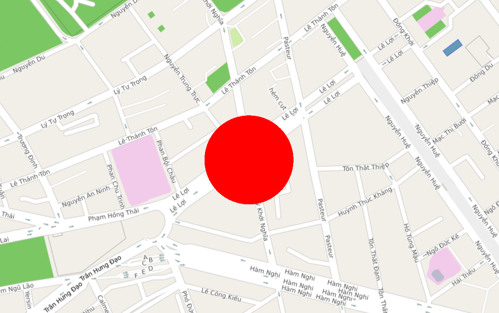
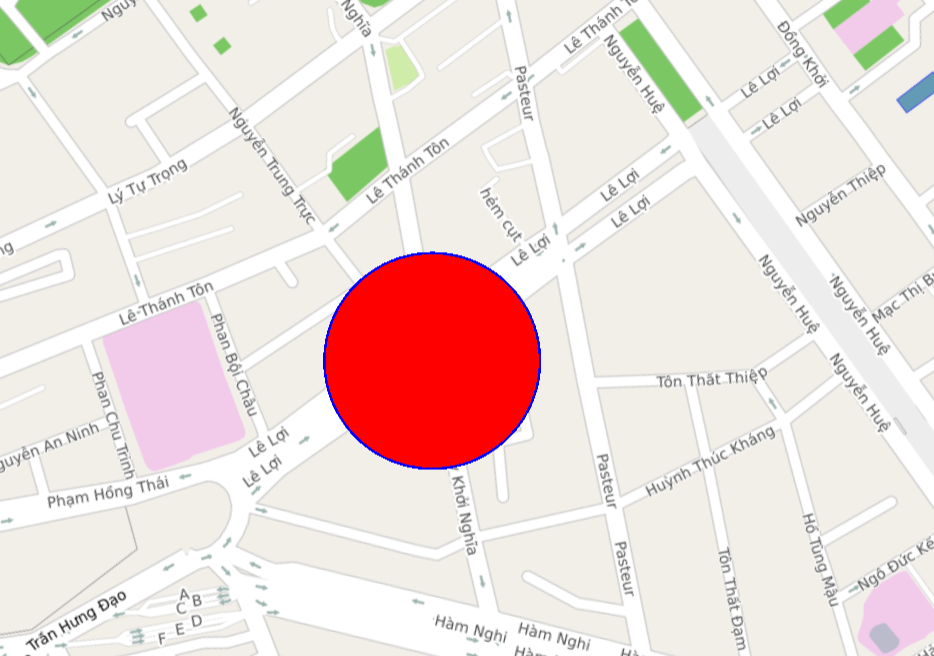

# Circle
Lớp Circle cho phép người dùng vẽ một Circle lên map.

## 1. Circle & CircleOptions

```javascript
  interface CircleOptions {
    center: ILatLng // Tâm của Circle
    radius?: number // Bán kính Circle tính theo mét
    fillColor?: string // Màu sắc Circle theo hex
    fillOpacity?: number // Độ trong suốt Circle
    strokeColor?: string // màu của border của Circle
    strokeWidth?: number // độ rộng border của Circle theo Point, default = 0 là không vẽ
    visible?: boolean // Ẩn hoặc hiện Circle
    draggable?: boolean // Cho phép kéo Polyline di chuyển trên bản đồ bằng chuột trái, default = false
    zIndex?: number  // Thứ tự vẽ của Polyline, default = 0
    bringFrontBuilding?: boolean  // Vẽ phía trước hoặc phía sau Building, default = false
    userInteractionEnabled?: boolean // cho phép người dùng tương tác với Circle, mặc định là cho phép (true)
  }

  class Circle {
    constructor(options: CircleOptions) // Khởi tạo Circle bằng CircleOptions
    getMap(): Map // Lấy thông tin map
    setMap(map: Map): void // Cài đặt map cần vẽ Circle
    setCenter(center: ILatLng): void // Cài đặt tâm Circle
    setRadius(radius: number): void // Cài đặt bán kính Circle
    setFillColor(fillColor: string) // Cài đặt màu sắc Circle
    setFillOpacity(fillOpacity: number) // Cài đặt độ trong suốt Circle
    setStrokeColor(strokeColor: string): // cài đăt màu sắc border của Circle
    setVisible(visible: boolean) // Cài đặt ẩn hiện Circle
    getCenter(): LatLng // Lấy thông tin tâm Circle
    getRadius(): number // Lấy thông tin bán kính Circle
    getFillColor(): string // Lấy thông tin màu sắc Circle
    getFillOpacity(): number // Lấy thông tin độ trong suốt Circle
    getStrokeColor(): string // lấy giá trị màu của border
    getStrokeWidth(): number  // lấy giá trị độ rộng của border
    isVisible(): boolean // Kiểm tra ẩn hiện Circle
    getZIndex(): boolean // lấy giá trị của zIndex
    setZIndex(zIndex: number): void  // cài đặt giá trị zIndex
    isBringFrontBuilding(): boolean  // lấy giá trị bringFrontBuilding
    setBringFrontBuilding(bringFrontBuilding: boolean): void // cài đặt giá trị của bringFrontBuilding
    isDraggable(): boolean // lấy giá trị của draggable
    setDraggable(value: boolean): void // cài đặt giá trị của draggable
            
    getUserData(): any // Lấy user data được gán cho polygon
    setUserData(data: any) // Thêm user data cho polygon
    
    isUserInteractionEnabled(): boolean  // lấy giá trị của userInteractionEnabled
    setUserInteractionEnabled(enable: boolean) // cài đặt giá trị cho userInteractionEnabled
  }
```


## 2. Tạo circle

```javascript
  //tạo đối tượng circle từ CircleOptions
  let circle = new map4d.Circle({
        center: {lat: 10.773201, lng: 106.700147},
        fillColor: "#ff0000",
        radius: 100,
  })
  
  //thêm circle vào map    
  circle.setMap(this.map)
```

Như ví dụ trên vẽ một hình tròn có bán kinh 100m lên bản đồ.



Ta có thể vẽ viền của đường tròn thông qua thuộc tính **strokeWidth** và **strokeColor**.
**strokeWidth** sẽ quyết định kích thước của viền
**strokeColor** sẽ quyết định màu của viền nếu không xác định hệ thống sẽ dùng màu mặc đinh (#00ff00)

```javascript
  //tạo đối tượng circle từ CircleOptions
  let circle = new map4d.Circle({
        center: {lat: 10.773201, lng: 106.700147},
        fillColor: "#ff0000",
        radius: 100,
        strokeWidth: 2.0,
        strokeColor: "#0000ff"
  })
  
  //thêm circle vào map    
  circle.setMap(this.map)
```

 

## 3. Xóa circle 

Để xóa circle khỏi map ta gán map về null.

```javascript
//Xóa circle khỏi map
circle.setMap(null)
```

## 4. Các sự kiện trên circle

Sự kiện click phát sinh khi người dùng click vào circle

```javascript
let clickEvent = this.map.addListener("click", (args) => {
      console.log("Circle clicked: ")
      console.log(args)
    }, {circle: true})

    //sau khi dùng xong
    clickEvent.remove();
```

Sự kiện hover phát sinh khi người dùng rê chuột vào circle

```javascript
  let hoverEvent = this.map.addListener("hover", (arg) => {
      console.log(Circle hover: ")
      console.log(arg)
    }, {circle: true})

    //sau khi dùng xong
    hoverEvent.remove();
```

Ngoài ra map4d SDK còn hỗ trợ các loại sự kiện khác như: long click, right click...

## 5. Thứ tự vẽ các layer

- bringFrontBuilding mặc định là false. Nếu muốn vẽ đè lên thì set bằng true
	
```javascript
	circle.setBringFrontBuilding(true)
```

- Layer nào có bringFrontBuilding bằng true sẽ đc vẽ sau, nếu cả 2 bringFrontBuilding 
bằng true thì sẽ dựa vào index để vẽ, zIndex càng lớn càng vẽ sau.


**Ví dụ:**

```javascript
	let circleA = new map4d.Circle({center: {lat: 10.773201, lng: 106.700147}, radius: 50, bringFrontBuilding: true, zIndex: 15, draggable: true,
      fillColor: "#0000ff", strokeWidth: 5})

    //thêm circle vào map
    circleA.setMap(this.map)
	
	let circleB = new map4d.Circle({center: {lat: 10.773201, lng: 106.700147}, radius: 100, bringFrontBuilding: true, zIndex: 10, draggable: true,
      fillColor: "#ff0000", strokeWidth: 5})

    //thêm circle vào map
    circleB.setMap(this.map)
```
Như ví dụ ở trên thì circleA sẽ đè lên circleB vì nó có zIndex lớn hơn zIndex của circleB và nó cùng có thuộc tính bringFrontBuilding là true.

- zIndex bằng nhau thì add vô sau sẽ vẽ sau.

**Ví dụ:**

```javascript
	let circleA = new map4d.Circle({center: {lat: 10.773201, lng: 106.700147}, radius: 100, bringFrontBuilding: true, zIndex: 10, draggable: true,
      fillColor: "#0000ff", strokeWidth: 5})

    //thêm circle vào map
    circleA.setMap(this.map)
	
	let circleB = new map4d.Circle({center: {lat: 10.773201, lng: 106.700147}, radius: 50, bringFrontBuilding: true, zIndex: 10, draggable: true,
      fillColor: "#ff0000", strokeWidth: 5})

    //thêm circle vào map
    circleB.setMap(this.map)
```
Như ví dụ ở trên thì circleB sẽ đè lên circleA vì nó có zIndex bằng nhau và nó cùng có thuộc tính bringFrontBuilding là true nên được add vô sau sẽ được vẽ sau.

License
-------

Copyright (C) 2016 IOT Link Ltd. All Rights Reserved.
