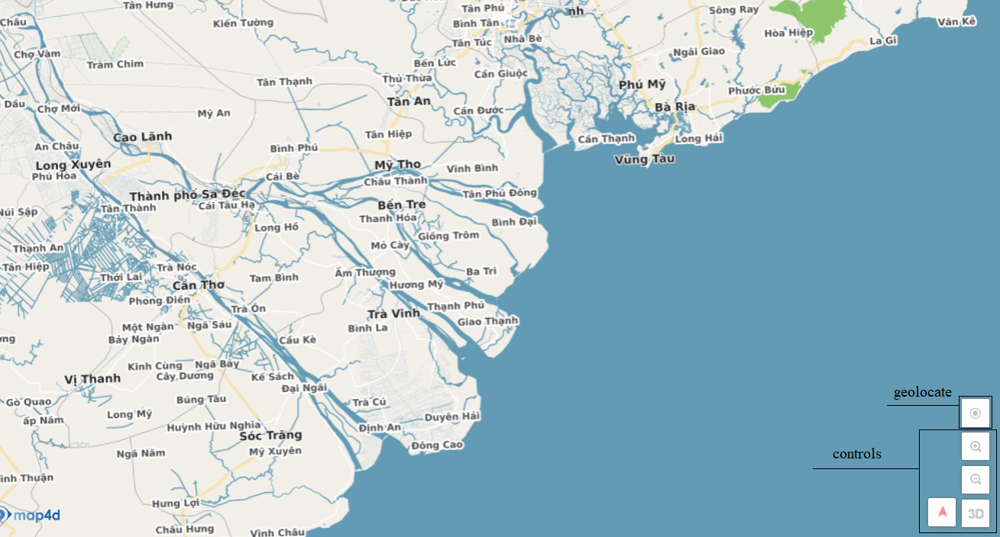

# Cài đặt Map4D-SDK

## 1. Cài đặt

  - Tải mã nguồn mới nhất của SDK từ [link](https://github.com/iotlinkadmin/map4d-web-sdk/tree/master/sdk)

  - Nhúng mã nguồn SDK vào trang web của bạn bằng tag script

```html
<script src="[PATH]/map4dsdk@[version].js"></script>
```

**Chú ý: tên script mã nguồn phải chứa "map4dsdk@", nếu không SDK sẽ không hoạt động.**

## 2. Tạo map

  - Khai báo 1 div để chứa map

```html
<body>
<div id="yourmapid"> <!--Map Container Here--> </div>

<script src="[PATH]/map4dsdk@[version].js"></script>
</body>
```
  - Khởi tạo map với id

```html
<body>
<div id="id"></div>

<script src="[PATH]/map4dsdk@[version].js"></script>

<script>
  let map = new map4d.Map(document.getElementById("yourmapid"),
      {
        center: [106.720739, 10.793113],
        zoom: 17,
        geolocate: true,
        controls :true,
        tilt: 0,
        controlOptions: map4d.ControlOptions.BOTTOM_RIGHT,
        accessKey: `${access_key}`
      }
    )
</script>
</body>
```

- Thiết lập style cho map

```css
  <style>
	body {
	  margin: 0px;
	  height: 100%;
	}

	#yourmapid {
	  position: absolute;
	  width: 100%;
	  height: 100%;
	  background-color: #f2efe9;
	}
  </style>
  ```

## 3. Access key
Để sử dụng map4d JavaScript API, bạn cần phải có access key (bạn có thể sử dụng một access key cho các api trên web, iOS, Android).
Để nhận được access key vui vòng truy cập đường link sau ([đăng ký key](http://map4d.vn))

## 4. Tùy chọn khi tạo map

```javascript
{
  center: ILatLng,
  accessKey: string
  zoom?: number,
  tilt?: number,
  bearing?: number,
  minZoom?: number,
  maxZoom?: number,
  maxNativeZoom?: number,
  geolocate?: boolean,
  controls?: boolean,
  controlOptions?: ControlOptions,
  switchMode?: SwitchMode
}

enum ControlOptions {
  TOP_LEFT,
  TOP_RIGHT,
  BOTTOM_LEFT,
  BOTTOM_RIGHT
}
```

- center: vị trí khởi tạo trung tâm của map
- zoom, tilt, bearing: mức zoom, độ nghiêng và góc xoay khởi tạo cho map
- minZoom, maxZoom: giới hạn zoom của map có nghĩa mức zoom của map chỉ được nằm trong khoảng [minZoom, maxZoom]. Nếu không set thì giá trị mặc định sẽ là [0, 22]
- maxNativeZoom: là giới hạn mức Zoom cao nhất của Tile mà map request từ server. Nếu không set thì giá trị mặc định là 19
- geolocate: bật/tắt chức năng lấy vị trí hiện tại của người dùng, mặc định là tắt
- accessKey: key để sử dụng map ([đăng ký key](http://map4d.vn))
- controls: ẩn hiện bảng điều khiển, mặc định là ẩn
- controlOptions: vị trí của bảng điều khiển giá trị mặc định là BOTTOM_RIGHT
- switchMode: là chế độ chuyển mode của Map khi người dùng thực hiện các thao tác tác động đến Map như zoom, fly, move. Mục đích của switchMode là cho phép Map có tự động chuyển từ 2D sang 3D và ngược lại khi người dùng thực hiện các thao tác trên hay không. Để tìm hiểu kĩ hơn bạn có thể đọc phần tài liệu về SwitchMode ở mục **9**



## 5. Giới hạn mức zoom tối đa và tối thiểu
Có thể set thông qua MapOptions khi khởi tạo map hoặc là phương thức setMinZoom/ setMapZoom.
Giá trị mặc định của minZoom và maxZoom nằm trong khoảng [0, 22]

```javascript
  map.setMinZoom(7)
  map.setMaxZoom(18)
```
Như ví dụ trên thì sau khi cài đặt map như trên thì các mức zoom của map chỉ có thể nằm trong khoảng [7, 18]. Chúng ta không thể zoom map tới vị trị nằm ngoài khoảng [7, 18] kể cả sử dụng các hàm thay đổi vị trí của camera. 

## 6. Lấy các thông số của map.

```javascript
  getCamera(): CameraPosition
```
- getCamera: Cho phép lấy các thông số của map như độ nghiêng, độ xoay, điểm trung tâm, mức zoom hiện tại

```javascript
  getCameraWithBounds(bounds: ILatLngBounds, padding?: PaddingOptions)
```
- getCameraWithBounds: Cho phép lấy thông số camera của map tương ứng với giá trị ILatLngBounds và padding mà người dùng truyền vào.

```javascript
  getTileUrl(): string
```
- getTileUrl: trả về thông tin url của tile hiện tại

```javascript
  getBounds(paddingOptions?: PaddingOptions): LatLngBounds
```
- getBounds: trả về thông tin LatLngBounds của map với các thông số camera và màn hình hiện tại.

```javascript
  getMinZoom(): number
```
- getMinZoom: trả về thông tin mức zoom tối thiểu của map.

```javascript
  getMaxZoom(): number
```
- getMaxZoom: trả về thông tin mức zoom tối đa của map.

```javascript
  getMaxNativeZoom(): number
```
- getMaxNativeZoom: trả về mức zoom tối đa của tile có thể request đến server

```javascript
  getWeather(): Weather
```
- getWeather: trả về thông tin hiệu ứng thời gian của map

```javascript
  is3dMode(): boolean
```
- is3dMode: Kiểm tra map đang ở chế độ 2D hay 3D. 


```javascript
  getPreferMinZoom(): number
```
- getPreferMinZoom: trả về thông tin mức zoom tối thiểu theo trạng thái map(2D or 3D) và phụ thuộc vào **SwitchMode**
  - **Ví dụ**:

    - *Map đang ở chế độ Manual*:   
    Nếu map đang ở 2D: trả về mức zoom tối thiếu khi đang ở chế độ 2D 
    <br/>Nếu map đang ở 3D: trả về mức zoom tối thiểu khi đang ở chế độ 3D (Vì chế độ này không cho phép chuyển từ 3D xuống 2D) => [ minZoom >= 17 ]

    - *Map đang ở chế độ Auto*:
    <br/>Nếu map đang ở chế độ 2D: trả về mức zoom tối thiếu khi đang ở chế độ 2D
    <br/>Nếu map đang ở chế độ 3D: trả về mức zoom tối thiếu khi đang ở chế độ 2D (Vì chế độ này cho phép chuyển từ 3D xuống 2D)

    - *Map đang ở chế độ Auto3DTo2D*:
    <br/>Nếu map đang ở chế độ 2D: trả về mức zoom tối thiếu khi đang ở chế độ 2D
    <br/>Nếu map đang ở chế độ 3D: trả về mức zoom tối thiều khi đang ở chế độ 2D (Vì chế độ này cho phép chuyển từ 3D xuống 2D)

    - *Map đang ở chế độ Auto2DTo3D*:
    <br/>Nếu map đang ở chế độ 2D: trả về mức zoom tối thiếu khi đang ở chế độ 2D
    <br/>Nếu map đang ở chế độ 3D: trả về mức zoom tối thiều khi đang ở chế độ 3D (Vì chế độ này không cho phép chuyển từ 3D xuống 2D) => [ minZoom >= 17 ]

  > Chú ý: Ở mức zoom >= 17 mới có chế độ 3D và tìm hiểu chi tiết về các chế độ ở phía trên
  > Mức zoom tối thiểu khi đang ở chế độ 2D bằng với giá trị khi ta gọi hàm getZoom()
  > Đọc mục 8 để có thêm cái nhìn về các mode chuyển đổi

## 7. Set các thông số cho Map

```javascript
  enable3dMode(enabled: boolean): void
```
- enable3dMode: Set chế độ 2D cho map nếu giá trị enable = false, ngược lại set chế độ 3D cho map nếu giá trị enable = true

```javascript
  setTileUrl(mapUrl: string, is3dMode: boolean): void
```
- setTileUrl: Set thông tin url của tile hiện tại

```javascript
  setTileUrl(mapUrl: string, is3dMode: boolean): void
```
- setTileUrl: Set thông tin url của tile hiện tại

```javascript
  setMaxNativeZoom(maxNativeZoom: number): void
```
- setMaxNativeZoom: set mức zoom tối đa của tile có thể request đến server cho dù mức Zoom hiện tại lớn hơn. Ví dụ: khi setMaxNativeZoom(18) thì cho dù mức zoom hiện tại của Map là 19 hay lớn hơn 19 thì tất cả các tile ở các mức zoom này đều request tile ở mức Zoom 18.

## 8. Di chuyển camera 
Cho phép di chuyển map đến một vị trí bất kỳ

```javascript
    panBy(offset: IPoint, animationOptions?: AnimationOptions): void
    panTo(destination: ILatLng, animationOptions?: AnimationOptions): void
	moveCamera(camera: ICameraPosition, animationOptions?: AnimationOptions): void
	moveToMyLocation(animate: boolean): void
	fitBounds(bounds: ILatLngBounds, padding?: PaddingOptions, animationOptions?: AnimationOptions): void
```

AnimationOption:

```javascript
  interface AnimationOptions {
    duration?: number // thời gian chuyển động nếu có animation, đơn vị: miliseconds
    easing?: (arg0: number) => number // phương trình chuyển động nếu người dùng truyền vào
    animate?: boolean // có animation hay không nếu animate = false thì mặc định duration = 0
  }
```

IPoint:

```javascript
IPoint  = Point | {lat: number, lng: number} | [number, number]
```

ICameraPosition:

```javascript
ICameraPosition = CameraPosition | {target: ILatLng, tilt: number, bearing: number, zoom: number}
```

```javascript
  interface PaddingOptions {
    top?: number
    bottom?: number
    left?: number
    right?: number
  }
```

- **panBy**: di chuyển map 1 khoảng x, y tính theo đơn vị point
  - offset: Point | {x: number, y: number} | [number, number]
  - animationOptions: tùy chọn, mặc định là null. Cho phép tùy biến chuyển động.
- **panTo**: di chuyển map đến 1 vị trí (LatLng) bất kỳ
  - destination: LatLng | {lat: number, lng: number} | [number, number]
  - animationOptions: tùy chọn, mặc định là null. Cho phép tùy biến chuyển động.
- **moveCamera**: di chuyển map đến 1 vị trí (LatLng) bất kỳ
  - destination: LatLng | {lat: number, lng: number} | [number, number]
  - zoom: giá trị zoom sau khi di chuyển tới vị trí đích
  - animationOptions: tùy chọn, mặc định là null. Cho phép tùy biến chuyển động.  
- **moveToMyLocation** di chuyển map tới vị trí hiện tại của người dùng (nếu geolocate được bật) 
- **fitBounds** di chuyển map tới vị trí vừa đủ để chứa bounds.
  - bounds: LatLngBounds giá trị để di chuyển tới vị trí bao phủ toàn bộ bounds này
  - padding: tùy chọn, mặc định là 0, cho phép tùy chỉnh padding với bounds
  - animationOptions: tùy chọn, mặc định là null. Cho phép tùy biến chuyển động.

## 9. Các Chế độ chuyển đổi mode 2D và 3D
Cho phép thay đổi chế độ chuyển 2D & 3D của map. Có 4 chế độ:

```javascript
enum SwitchMode {
    Auto2DTo3D,
    Auto3DTo2D,
    Auto,
    Manual
}   
```

```javascript
  map.setSwitchMode(mode: SwitchMode): void
```
- Chế độ mặc định là **Auto**
- Auto3DTo2D:
  - Tự động chuyển từ chế độ 3D sang 2D, khi điều khiển map từ mức zoom >= 17 về mức zoom  < 17
  - Map vẫn giữ chế độ 2D khi điều map từ mức zoom < 17 sang mức zoom >= 17.
  - Muốn chuyển sang chế độ 3D phải dùng hàm enable3dMode(true)
- Auto2DTo3D:
  - Tự động chuyển chuyển từ chế độ 2D qua 3D khi điều khiển zoom từ mức zoom < 17 lên mức zoom >= 17.
  - Khi map đang ở mức zoom >= 17, nếu map đang ở chế độ 3D thì khi không cho phép điều khiển zoom xuống mức zoom < 17. Muốn chuyển qua chế độ 2D, phải dùng hàm enable3dMode(false)
  - Khi map đang ở mức zoom >= 17, nếu map đang chế độ 2D, thì map vẫn có thể zoom về mức zoom < 17.
- Auto:
  - Tự động chuyển chuyển từ chế độ 2D qua 3D khi điều khiển zoom từ mức zoom < 17 lên mức zoom >= 17.
  - Tự động chuyển từ chế độ 3D sang 2D khi điều khiển zoom từ mức zoom >= 17 về mức zoom < 17.
- Manual:
  - Khi map đang ở mức zoom >= 17, nếu map đang ở chế độ 3D thì khi không cho phép điều khiển zoom xuống mức zoom < 17. 
  - Map cũng không tự động chuyển về chế độ 3D khi zoom từ mức zoom 17 lên 18.
  - Sử dụng hàm enable3dMode(boolean) khi muốn chuyển qua lại chế độ 2D và 3D.

 ## 10. Ghi chú
 Các kiểu dữ liệu **Point, LatLng, CameraPosition, SwitchMode, ControlOptions** là các kiểu dữ liệu của Map4D-SDK, muốn sử dụng được phải thông qua **module map4d**
 Ví dụ:
 ```javascript
 let location = new map4d.LatLng(10, 108);
 let point = new map4d.Point(1, 2)
 let camera = new map4d.CameraPosition([10, 108], tilt, bearing, zoom)
 map.setSwitchMode(map4d.SwitchMode.Auto)
 ```

License
-------

Copyright (C) 2016 IOT Link Ltd. All Rights Reserved.
