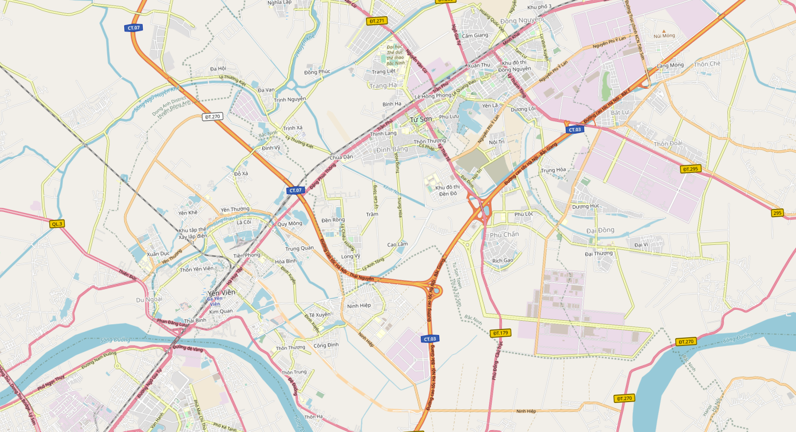

# Tile Overlay
Lớp Tile Overlay cho phép người dùng thêm một layer vẽ các Tile cùng với các Tile có sẵn của Map SDK

## 1. TileOverlay & TileOverlayOptions

```javascript
interface TileOverlayOptions {
    getUrl: Function // Hàm trả về đường dẫn của Tile
    minZoom?: number // Mức zoom tối thiểu của TileOverlay
    maxZoom?: number // Mức zoom tối đa của TileOverlay
}
````
  
```javascript
class TileOverlay {
    constructor(options?: TileOverlayOptions) // Khởi tạo TileOverlay từ TileOverlayOptions
    getUrl(x: number, y: number, z: number, _3dMode: boolean): string // Lấy thông tin đường dẫn của Tile theo TileCoordinate  
}
```

## 2. Tạo TileOverlay
Trước tiên chúng ta cần tạo tileOverlayOption với hàm getUrl, giá trị của minZoom và maxZoom như phía dưới

```javascript
// Tạo tileOverlayOption
let tileOverlayOption: map4d.TileOverlayOptions = {
  getUrl: (x, y, z, _3dMode) => {
    if (!_3dMode) {
      return `https://tile.openstreetmap.de/${z}/${x}/${y}.png`
    }
    else {
      return null
    }
  },
  minZoom: 14,
  maxZoom: 17
}
```

Sau đó chúng ta sẽ tạo TileOverlay như sau:

```javascript
// Tạo TileOverlay
let tileOverlay = new map4d.TileOverlay(tileOverlayOption)
// Set tile overlay vào map cần vẽ
tileOverlay.setMap(this.map)
```

Sau khi được set vào map thành công thì ta sẽ được kết quả như hình bên dưới:




## 3. Xóa Tile Overlay

Để xóa Tile Overlay khỏi map ta gán map về null.

```javascript
tileOverlay.setMap(null)
```

License
-------

Copyright (C) 2016 IOT Link Ltd. All Rights Reserved.
