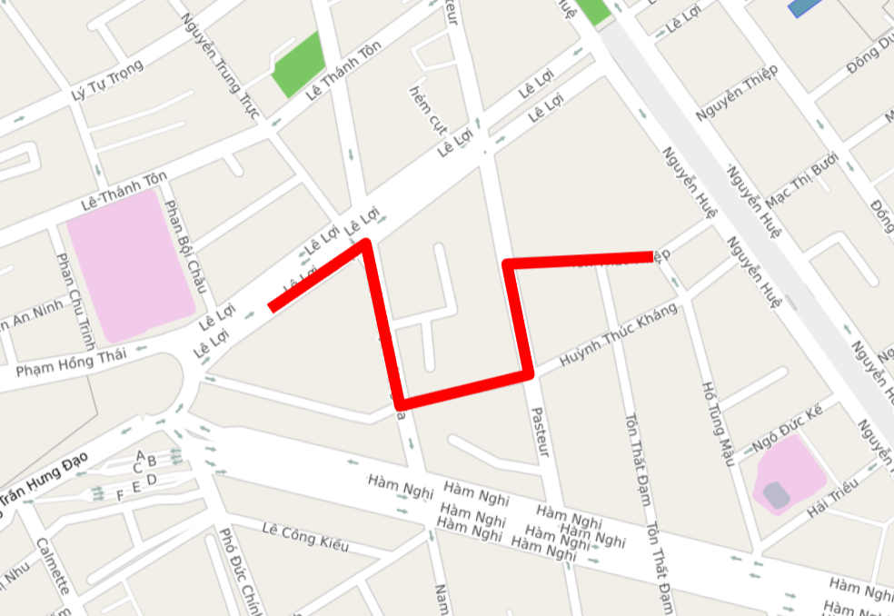
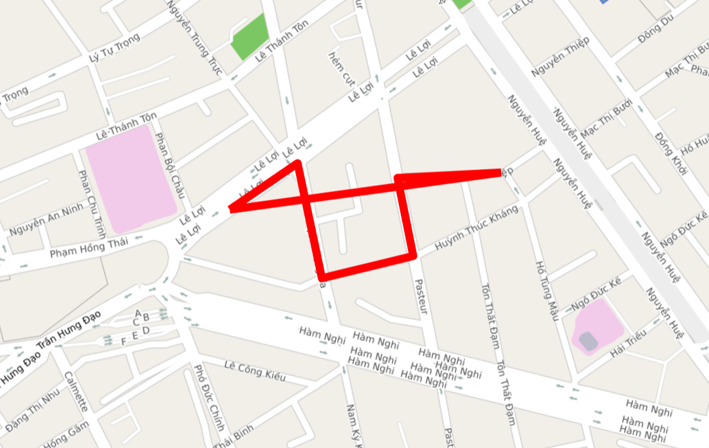
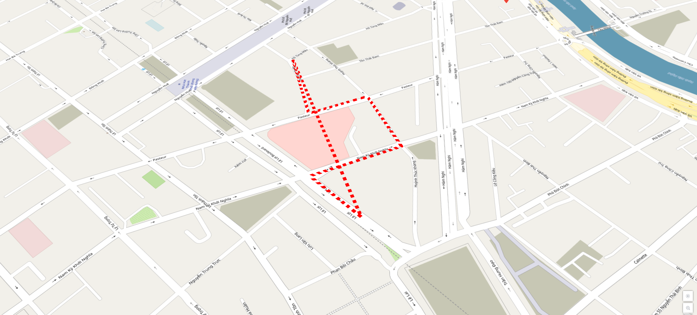

# Polyline
Lớp Polyline cho phép người dùng vẽ một polyline lên bản đồ.

## 1. Polyline & PolylineOptions

```javascript
  interface PolylineOptions {
    path: ILatLng[] // Một mảng danh sách các toạ độ cần vẽ polyline lên map
    strokeWidth?: number // Chiều rộng polyline tính bằng point
    strokeColor?: string // Màu sắc marker bằng mã hex
    strokeOpacity?: number // Độ trong suốt
    visible?: boolean // Ẩn hoặc hiện polyline
    closed?: boolean // Cho phép nối điểm đầu và điểm cuối lại với nhau.
    draggable?: boolean // Cho phép kéo Polyline di chuyển trên bản đồ bằng chuột trái, default = false
    zIndex?: number  // Thứ tự vẽ của Polyline, default = 0
    elevation?: number // độ cao so với mặt nước biển
    style?: string     //chỉ có 2 loại: nét liền (solid) hoặc nét đứt (dotted), default: solid
    userInteractionEnabled?: boolean // cho phép người dùng tương tác với Polyline, mặc định là cho phép (true)
  }

  class Polyline {
    constructor(options: PolylineOptions) // Khởi tạo polyline với PolylineOptions
    getPath(): LatLng[] // Lấy thông tin danh sách cách toạ độ cần vẽ polyline
    getMap(): Map // Lấy thông tin map.
    setMap(map: Map): void // Cài đặt map cần vẽ.
    setPath(path: ILatLng[]): void // Cài đặt danh sách các toạ độ cần vẽ.
    setStrokeWidth(strokeWidth: number): void // Cài đặt chiều rộng polyline.
    setClosed(closed: boolean): void // Cho phép nối điểm đầu và điểm cuối.
    setStrokeColor(strokeColor: string): void // Cài đặt màu sắc polyline.
    setStrokeOpacity(strokeOpacity: number): void // Cài đặt độ trong suốt cho polyline.
    setVisible(visible: boolean): void // Cài đặt ẩn hiện polyline.
    getStrokeWidth(): number // Lấy chiều rộng polyline
    getStrokeColor(): string // Lấy màu sắc polyline.
    getStrokeOpacity(): number // Lấy độ trong suốt polyline
    isVisible(): boolean // Kiểm tra ẩn hiện polyline
    isClosed(): boolean // Kiểm tra điểm đầu và điểm cuối có nối lại với nhau không ?
    getZIndex(): boolean // lấy giá trị của zIndex
    setZIndex(zIndex: number): void  // cài đặt giá trị zIndex
    getElevation(): number // lấy giá trị độ cao
    setElevation(elevation: number): number // đặt giá trị độ cao cho Polyline
    setStyle(style: string): void // cài đặt giá trị cho style
    getStyle(): string // lấy giá trị của style
    
    getUserData(): any // Lấy user data được gán cho polyline
    setUserData(data: any) // Thêm user data cho polyline
    isDraggable(): boolean // lấy giá trị của draggable
    setDraggable(value: boolean): void // cài đặt giá trị của draggable
    isUserInteractionEnabled(): boolean  // lấy giá trị của userInteractionEnabled
    setUserInteractionEnabled(enable: boolean) // cài đặt giá trị cho userInteractionEnabled
  }
```


## 2. Tạo polyline

```javascript
  //tạo đối tượng polyline từ PolylineOptions
  let polyline = new map4d.Polyline({
        path: [
          [106.699380, 10.772431],
          [106.700147, 10.773201],
          [106.700763, 10.771783],
          [106.701901, 10.772302],
          [106.701493, 10.773267],
          [106.702835, 10.773599]
        ],
        strokeColor: "#ff0000",
        strokeOpacity: 1.0,
        strokeWidth: 10})
  //thêm polyline vào map    
  polyline.setMap(map)
```

Như ví dụ trên vẽ polyline với màu là màu đỏ và độ rộng là 10 point.

 

Trong map sdk có một thuộc tính gọi là **closed** khi cài đặt là true thì sẽ vẽ polyline với điểm đầu và điểm cuối chụm lại với nhau.

```javascript
  //tạo đối tượng polyline từ PolylineOptions
  let polyline = new map4d.Polyline({
        path: [
          [106.699380, 10.772431],
          [106.700147, 10.773201],
          [106.700763, 10.771783],
          [106.701901, 10.772302],
          [106.701493, 10.773267],
          [106.702835, 10.773599]
        ],
        strokeColor: "#ff0000",
        strokeOpacity: 1.0,
        strokeWidth: 10,
        closed: true})
  //thêm polyline vào map    
  polyline.setMap(map)
```

 

Trong map sdk có một thuộc tính gọi là **style** khi cài đặt là solid thì vẽ nét liền và dotted thì vẽ nét đứt.

Default là solid (nét liền)

```javascript
  //tạo đối tượng polyline từ PolylineOptions
  let polyline = new map4d.Polyline({
        path: [
          [106.699380, 10.772431],
          [106.700147, 10.773201],
          [106.700763, 10.771783],
          [106.701901, 10.772302],
          [106.701493, 10.773267],
          [106.702835, 10.773599]
        ],
        strokeColor: "#ff0000",
        strokeOpacity: 1.0,
        strokeWidth: 10,
        style: "dotted",
        closed: true})
  //thêm polyline vào map    
  polyline.setMap(map)
```



## 3. Xóa polyline 

Để xóa polyline khỏi map ta gán map về null.

```javascript
//Xóa polyline khỏi map
polyline.setMap(null)
```

## 4. Các sự kiện trên polyline

Sự kiện click phát sinh khi người dùng click vào polyline

```javascript
    let clickEvent = this.map.addListener("click", (args) => {
      console.log("Polyline clicked: ")
      console.log(args)
    }, {polyline: true})

    //sau khi dùng xong
    clickEvent.remove();
```

Sự kiện hover phát sinh khi người dùng rê chuột vào polyline

```javascript
  let hoverEvent = this.map.addListener("hover", (arg) => {
      console.log("Polyline hover: ")
      console.log(arg)
    }, {polyline: true})

    //sau khi dùng xong
    hoverEvent.remove();
```

Ngoài ra map4d SDK còn hỗ trợ các loại sự kiện khác như: long click, right click...

## 5. Thứ tự vẽ các layer

- Layer nào có zIndex càng lớn càng vẽ sau. Ngoài ra khi set zIndex lớn hơn zIndex của building thì Polyline sẽ được vẽ trước building và ngược lại


**Ví dụ:**

```javascript
	let polylineA = new map4d.Polyline({
	  path: [
		[106.699380, 10.772431],
		[106.700147, 10.773201]
	  ], visible: true, strokeColor: "#ff0000", strokeWidth: 10, strokeOpacity: 1.0,
	  closed: true, draggable: true, zIndex: 10
	})
	polylineA.setMap(this.map)

	let polylineB = new map4d.Polyline({
	  path: [
		[106.699380, 10.772431],
		[106.700147, 10.773201]
	  ], visible: true, strokeColor: "#0000ff", strokeWidth: 10, strokeOpacity: 1.0,
	  closed: true, draggable: true, zIndex: 4
	})
	polylineB.setMap(this.map)
```
Như ví dụ ở trên thì polylineA sẽ đè lên polylineB vì nó có zIndex lớn hơn zIndex của polylineB.

- zIndex bằng nhau thì add vô sau sẽ vẽ sau.

**Ví dụ:**

```javascript
	let polylineA = new map4d.Polyline({
	  path: [
		[106.699380, 10.772431],
		[106.700147, 10.773201]
	  ], visible: true, strokeColor: "#ff0000", strokeWidth: 10, strokeOpacity: 1.0,
	  closed: true, draggable: true, zIndex: 1
	})
	polylineA.setMap(this.map)

	let polylineB = new map4d.Polyline({
	  path: [
		[106.699380, 10.772431],
		[106.700147, 10.773201]
	  ], visible: true, strokeColor: "#0000ff", strokeWidth: 10, strokeOpacity: 1.0,
	  closed: true, draggable: true, zIndex: 1
	})
	polylineB.setMap(this.map)
```
Như ví dụ ở trên thì polylineB sẽ đè lên polylineA vì nó có zIndex bằng nhau nên được add vô sau sẽ được vẽ sau.

 
License
-------

Copyright (C) 2016 IOT Link Ltd. All Rights Reserved.
