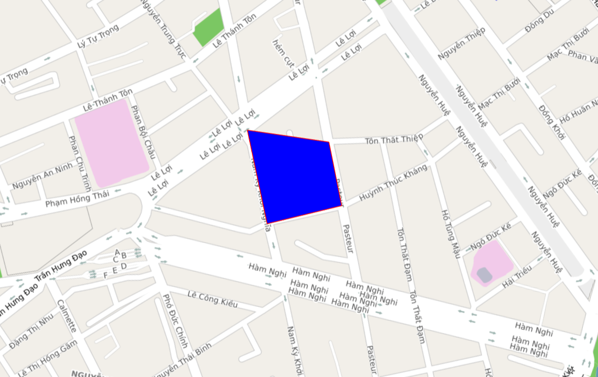
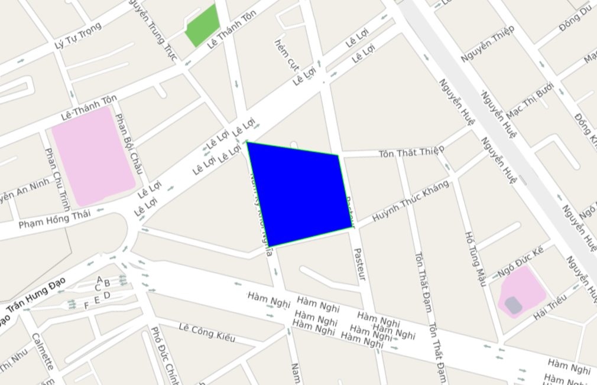
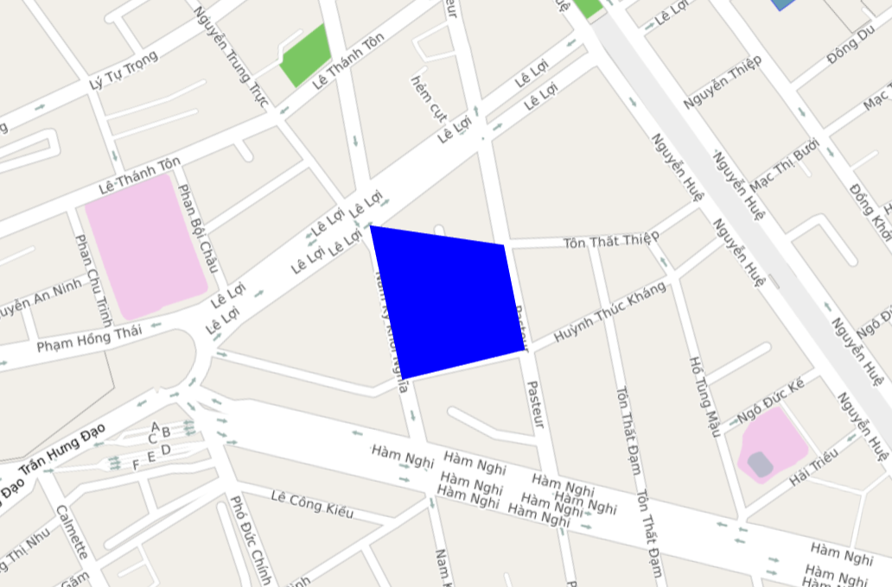
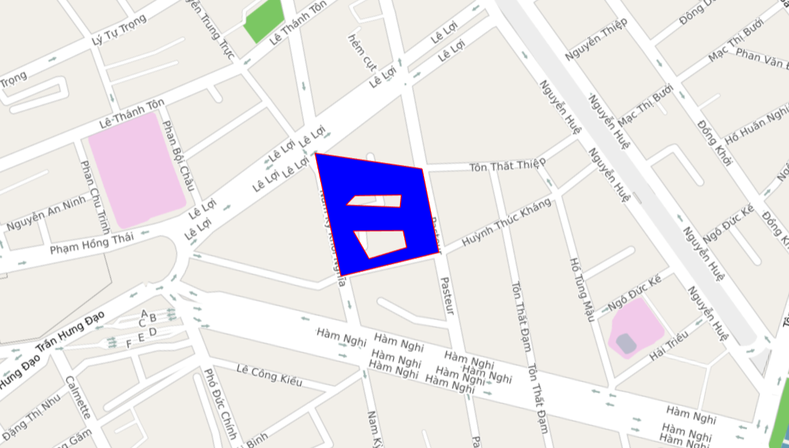

# Polygon
Lớp Polygon cho phép người dùng vẽ một Polygon lên bản đồ.

## 1. Polygon & PolygoneOptions

```javascript
  interface PolygonOptions {
    paths: ILatLng[][] // Danh sách các toạ độ cần vẽ
    fillColor?: string // Màu sắc polygon
    fillOpacity?: number // Độ trong suốt polygon
    strokeColor?: string // màu của border của polygon
    strokeWidth?: number // độ rộng border của Polyon, default = 1, hiện tại chỉ hỗ trợ vẽ 1px
    visible?: boolean // Ẩn hoặc hiện polygon
    draggable?: boolean // Cho phép kéo Polyline di chuyển trên bản đồ bằng chuột trái, default = false
    zIndex?: number  // Thứ tự vẽ của Polyline, default = 0
    elevation?: number // độ cao so với mặt nước biển
    userInteractionEnabled?: boolean // cho phép người dùng tương tác với Polygon, mặc định là cho phép (true)
  }

  class Polygon {
    constructor(options: PolygonOptions) // Khỏi tạo polygon bằng PolygonOptions
    getMap(): Map // Lấy thông tin map
    setMap(map: Map): void // Cài đặt map cần vẽ polygon
    setPaths(paths: ILatLng[][]): void // Cài đặt danh sách các toạ độ cần vẽ polygon
    setFillColor(fillColor: string): void // Cài đặt màu sắc polygon
    setFillOpacity(fillOpacity: number): void // Cài đặt độ trong suốt polygon
    setStrokeColor(strokeColor: string): void // cài đăt màu sắc border của polygon
    setStrokeWidth(strokeWidth: number): void // cài đặt độ rộng border của polygon, hiện tại chỉ hỗ trợ vẽ 1px, cài đặt bằng 0 để xóa border
    setVisible(visible: boolean): void // Cài đặt ẩn hiện polygon
    getPaths(): LatLng[][] // Lấy danh sách các toạ độ cần vẽ polygon
    getFillColor(): string // Lấy thông tin màu sắc
    getFillOpacity(): number // Lấy thông tin độ trong suốt
    getStrokeColor(): string // lấy giá trị màu của border
    getStrokeWidth(): number  // lấy giá trị độ rộng của border
    isVisible(): boolean // Kiểm tra polygon ẩn hiện
    getZIndex(): boolean // lấy giá trị của zIndex
    setZIndex(zIndex: number): void  // cài đặt giá trị zIndex
    getElevation(): number
    setElevation(elevation: number): void
    isDraggable(): boolean // lấy giá trị của draggable
    setDraggable(value: boolean): void // cài đặt giá trị của draggable

    getUserData(): any // Lấy user data được gán cho polygon
    setUserData(data: any) // Thêm user data cho polygon
    
    isUserInteractionEnabled(): boolean  // lấy giá trị của userInteractionEnabled
    setUserInteractionEnabled(enable: boolean) // cài đặt giá trị cho userInteractionEnabled
  }
```


## 2. Tạo polygon

```javascript
  let polygonOption: map4d.PolygonOptions = {
        paths:
          [[{lat: 10.773201, lng: 106.700147}, {lat: 10.771783, lng: 106.700763},
            {lat: 10.772302, lng: 106.701901}, {lat: 10.773267, lng: 106.701493},
            {lat: 10.773201, lng: 106.700147}]],
        fillColor: "#0000ff",
        fillOpacity: 1.0,
      }
  let polygon = new map4d.Polygon(polygonOption)
  polygon.setMap(this.map)    
```

Như ví dụ trên vẽ 1 polygon có màu xanh da trời lên bản đồ.



Các bạn để ý bên ngoài polygon có viền đỏ. Mặc định khi vẽ polygon sẽ có viền. Chúng ta có thể đổi màu viền thông qua việc đổi thuộc tính **strokeColor**

```javascript
  let polygonOption: map4d.PolygonOptions = {
        paths:
          [[{lat: 10.773201, lng: 106.700147}, {lat: 10.771783, lng: 106.700763},
            {lat: 10.772302, lng: 106.701901}, {lat: 10.773267, lng: 106.701493},
            {lat: 10.773201, lng: 106.700147}]],
        fillColor: "#0000ff",
        fillOpacity: 1.0,
        strokeColor: "#00ff00"
      }
  let polygon = new map4d.Polygon(polygonOption)
  polygon.setMap(this.map)    
```



Nếu không muốn vẽ viền có thể tắt thông qua thuộc tính **strokeWidth**. Khời tạo nó bằng 0 nghĩa là không vẽ viền

```javascript
  let polygonOption: map4d.PolygonOptions = {
        paths:
          [[{lat: 10.773201, lng: 106.700147}, {lat: 10.771783, lng: 106.700763},
            {lat: 10.772302, lng: 106.701901}, {lat: 10.773267, lng: 106.701493},
            {lat: 10.773201, lng: 106.700147}]],
        fillColor: "#0000ff",
        fillOpacity: 1.0,
        strokeWidth: 0.0
      }
  let polygon = new map4d.Polygon(polygonOption)
  polygon.setMap(this.map)    
```


  
Ta có thể vẽ polygon có lỗ lên bản đồ. Paths là một mảng chứa các mảng, với mảng đầu tiên là polygon cần vẽ lên bản đồ. Các mảng còn lại tương ứng với lỗ trên polygon.

```javascript
  let polygonOption: map4d.PolygonOptions = {
        paths: 
            [[{lat: 10.773201, lng: 106.700147}, {lat: 10.771783, lng: 106.700763},
              {lat: 10.772302, lng: 106.701901}, {lat: 10.773267, lng: 106.701493},
              {lat: 10.773201, lng: 106.700147}],
              // hole1
             [{lat: 10.772785, lng: 106.700738}, {lat: 10.772904, lng: 106.701304},
              {lat: 10.772752, lng: 106.701319}, {lat: 10.772650, lng: 106.700651},
              {lat: 10.772785, lng: 106.700738}],
              // hole2
             [{lat: 10.772356, lng: 106.700802}, {lat: 10.772479, lng: 106.701413},
              {lat: 10.772285, lng: 106.701497}, {lat: 10.772059, lng: 106.701064},
              {lat: 10.772356, lng: 106.700802}]],
      }
  let polygon = new map4d.Polygon(polygonOption)
  polygon.setMap(this.map)    
```

Như ví dụ trên ta vẽ 1 polygon với 2 cái lỗ.

 

***Chú ý:***
- Điểm đầu điểm cuối danh sách các điểm cần vẽ phải **GIỐNG NHAU**
- Kích thước của viền luôn luôn là 1 với bất cứ giá trị **strokeWidth** lớn hơn 0

## 3. Xóa polygon 

Để xóa polygon khỏi map ta gán map về null.

```javascript
//Xóa polygon khỏi map
polygon.setMap(null)
```

## 4. Các sự kiện trên polygon

Sự kiện click phát sinh khi người dùng click vào polygon

```javascript
let clickEvent = this.map.addListener("click", (args) => {
      console.log("Polygon clicked: ")
      console.log(args)
    }, {polygon: true})

    //sau khi dùng xong
    clickEvent.remove();
```

Sự kiện hover phát sinh khi người dùng rê chuột vào polygon

```javascript
  let hoverEvent = this.map.addListener("hover", (arg) => {
      console.log(Polygon hover: ")
      console.log(arg)
    }, {polygon: true})

    //sau khi dùng xong
    hoverEvent.remove();
```

Ngoài ra map4d SDK còn hỗ trợ các loại sự kiện khác như: long click, right click...

## 5. Thứ tự vẽ các layer

- Layer nào có zIndex càng lớn càng vẽ sau. Ngoài ra khi set zIndex lớn hơn zIndex của building thì Polygon sẽ được vẽ trước Building và ngược lại.


**Ví dụ:**

```javascript
	let polygonOptionA: map4d.PolygonOptions = {
      paths:
        [[{lat: 10.773201, lng: 106.700147}, {lat: 10.771783, lng: 106.700763},
          {lat: 10.772302, lng: 106.701901}, {lat: 10.773267, lng: 106.701493},
          {lat: 10.773201, lng: 106.700147}],
          // hole1
          [{lat: 10.772785, lng: 106.700738}, {lat: 10.772904, lng: 106.701304},
            {lat: 10.772752, lng: 106.701319}, {lat: 10.772650, lng: 106.700651},
            {lat: 10.772785, lng: 106.700738}],
          // hole2
          [{lat: 10.772356, lng: 106.700802}, {lat: 10.772479, lng: 106.701413},
            {lat: 10.772285, lng: 106.701497}, {lat: 10.772059, lng: 106.701064},
            {lat: 10.772356, lng: 106.700802}]], fillOpacity: 0.9, strokeWidth: 0, zIndex: 20, draggable: true, fillColor: "#ff0000"
    }
    //thêm polygon vào map
    let polygonA = new map4d.Polygon(polygonOptionA)
    polygonA.setMap(this.map)
	
	let polygonOptionB: map4d.PolygonOptions = {
      paths:
        [[{lat: 10.773201, lng: 106.700147}, {lat: 10.771783, lng: 106.700763},
          {lat: 10.772302, lng: 106.701901}, {lat: 10.773267, lng: 106.701493},
          {lat: 10.773201, lng: 106.700147}]], fillOpacity: 0.9, strokeWidth: 0, zIndex: 15, draggable: true
    }
    //thêm polygon vào map
    let polygonB = new map4d.Polygon(polygonOptionB)
    polygonB.setMap(this.map)
```
Như ví dụ ở trên thì polygonA sẽ đè lên polygonB vì nó có zIndex lớn hơn zIndex của polygonB.

- zIndex bằng nhau thì add vô sau sẽ vẽ sau.

**Ví dụ:**

```javascript
	let polygonOptionA: map4d.PolygonOptions = {
      paths:
        [[{lat: 10.773201, lng: 106.700147}, {lat: 10.771783, lng: 106.700763},
          {lat: 10.772302, lng: 106.701901}, {lat: 10.773267, lng: 106.701493},
          {lat: 10.773201, lng: 106.700147}],
          // hole1
          [{lat: 10.772785, lng: 106.700738}, {lat: 10.772904, lng: 106.701304},
            {lat: 10.772752, lng: 106.701319}, {lat: 10.772650, lng: 106.700651},
            {lat: 10.772785, lng: 106.700738}],
          // hole2
          [{lat: 10.772356, lng: 106.700802}, {lat: 10.772479, lng: 106.701413},
            {lat: 10.772285, lng: 106.701497}, {lat: 10.772059, lng: 106.701064},
            {lat: 10.772356, lng: 106.700802}]], fillOpacity: 0.9, strokeWidth: 0, zIndex: 20, draggable: true, fillColor: "#ff0000"
    }
    //thêm polygon vào map
    let polygonA = new map4d.Polygon(polygonOptionA)
    polygonA.setMap(this.map)
	
	let polygonOptionB: map4d.PolygonOptions = {
      paths:
        [[{lat: 10.773201, lng: 106.700147}, {lat: 10.771783, lng: 106.700763},
          {lat: 10.772302, lng: 106.701901}, {lat: 10.773267, lng: 106.701493},
          {lat: 10.773201, lng: 106.700147}]], fillOpacity: 0.9, strokeWidth: 0, zIndex: 20, draggable: true
    }
    //thêm polygon vào map
    let polygonB = new map4d.Polygon(polygonOptionB)
    polygonB.setMap(this.map)
```
Như ví dụ ở trên thì polygonB sẽ đè lên polygonA vì nó có zIndex bằng nhau nên được add vô sau sẽ được vẽ sau.

License
-------

Copyright (C) 2016 IOT Link Ltd. All Rights Reserved.
