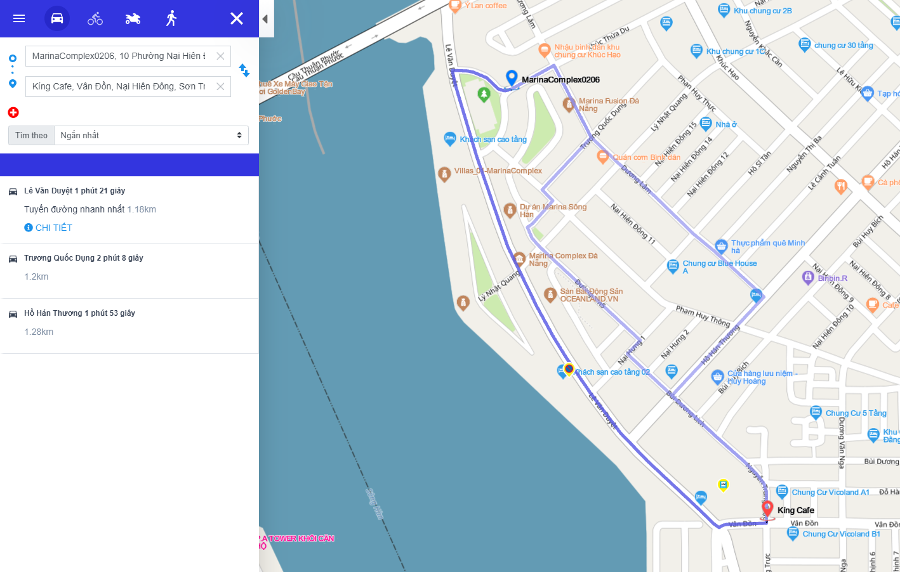
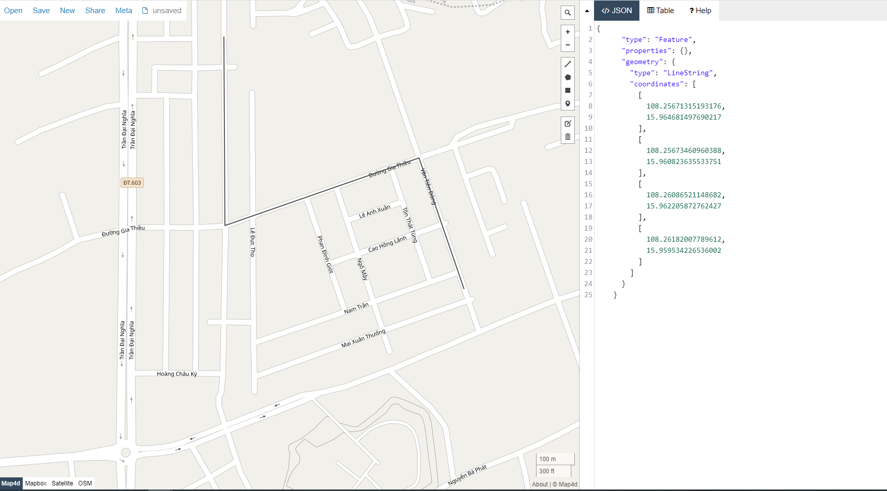

#  Route (Tìm đường đi nhanh nhất giữa các địa điểm)
## 1. Input (Đầu vào)
```
https://api.map4d.vn/sdk/route?key={key}&origin={origin}&destination={destination}&points={points}&mode={mode}&language={language}&weighting={weighting}
```
| Parameter  |Required| Description                                                                                                           |
|------------|--------|-----------------------------------------------------------------------------------------------------------------------|
| key        |Yes     | apiKey - một mã định danh để xác thực các yêu cầu liên quan đến projects dùng trong việc sử dụng và thanh toán. Truy cập: https://map.map4d.vn/user/access-key/add để tạo key |
| origin     |No      | vị trí lat, lng của địa điểm bắt đầu. VD:16.024634,108.209217                                                      |
| destination|No      | vị trí lat,lng của địa điểm kết thúc. VD:16.020179,108.211212                                                      |
| points     |No      | danh sách các lat,lng mà muốn đi qua. VD:16.039173,108.210912;16.044597,108.217263                                 |
| mode       |Yes     | phương tiện đi qua, hiện tại hỗ trợ 4 loại phương tiện: car (xe hơi), bike (xe đạp), foot (đi bộ), motorcycle (xe máy) |
| language   |No      | ngôn ngữ dùng chỉ đường, hiện tại hỗ trợ Tiếng Việt (vi) hoặc Tiếng Anh (en), mặc định sẽ là Tiếng Việt              |
| weighting  |No      | thuộc tính tìm theo đường đi ngắn nhất hay đường đi nhanh nhất hay đường đi cần bằng giữa ngắn nhất và nhanh nhất mặc định là ngắn nhất. Nếu weighting=0 là tìm đường đi ngắn nhất, nếu weighting=1 là tìm đường đi nhanh nhất, nếu weighting=2 là cân bằng giữa ngắn nhất và nhanh nhất.|

## 2. Output (Đầu ra)
```json
{
  "code": "string",
  "message": "string",
  "result": {
    "status": "string",
    "routes": [
      {
        "legs": [
          {
            "distance": {
              "text": "string",
              "value": 0
            },
            "duration": {
              "text": "string",
              "value": 0
            },
            "endAddress": "string",
            "startAddress": "string",
            "endLocation": {
              "lng": 0,
              "lat": 0
            },
            "startLocation": {
              "lng": 0,
              "lat": 0
            },
            "steps": [
              {
                "distance": {
                  "text": "string",
                  "value": 0
                },
                "duration": {
                  "text": "string",
                  "value": 0
                },
                "endLocation": {
                  "lng": 0,
                  "lat": 0
                },
                "startLocation": {
                  "lng": 0,
                  "lat": 0
                },
                "htmlInstructions": "string",
                "maneuver": "string",
                "polyline": "string",
                "travelMode": "string",
                "streetName": "string"
              }
            ]
          }
        ],
        "overviewPolyline": "string",
        "summary": "string",
        "distance": {
          "text": "string",
          "value": 0
        },
        "duration": {
          "text": "string",
          "value": 0
        },
        "snappedWaypoints": [
          {
            "lng": 0,
            "lat": 0
          }
        ]
      }
    ]
  }
}
```
| Parameter     |Notnull| Description                                                                                           |
|---------------|-------|-------------------------------------------------------------------------------------------------------|
| code          |Yes    | mã trả về, nếu 'ok' nghĩa là thành công, ngoài ra thì yêu cầu bị lỗi                               |
| message       |No     | nội dung của mã lỗi(nếu có)                                                                        |
| result        |No     | đường đi                                                                                           |
| status        |No     | trạng thái tìm đường đi, nếu ok thì có đường, ngược lại thì không tìm thấy đường                   |
| routes        |Yes    | danh sách các đường đi                                                                             |
| legs          |Yes    | danh sách đường đi từ điểm đầu đến điểm tiếp theo, từ tiếp theo đến tiếp theo nữa.. và đến cuối   |
| distance      |Yes    | khoảng cách về km mỗi địa điểm đi qua (text mô tả quản đường đi, còn value là giá trị đơn vị là mét)|
| duration      |Yes    | khoảng cách về thời gian mỗi địa điểm đi qua (text mô tả thời gian, còn value là thời gian khi đi trên đoạn đường đó đơn vị là giây)|
| endAddress    |Yes    | địa chỉ kết thục mỗi điểm                                                                          |
| startAddress  |Yes    | địa chỉ bắt đầu mỗi điểm                                                                           |
| startLocation |Yes    | điểm lat, lng bắt đầu                                                                              |
| steps         |Yes    | bước đi con trong mỗi đoạn trên url                                                                 |
| htmlInstructions|Yes  | mô tả dạng html                                                                                  |
| maneuver      |Yes    | hướng chuyển đổi                                                                                   |
| polyline      |Yes    | đường đi từng điểm dưới dạng mã hóa polyline làm tròn 5 ký tự                                      |
| travelMode    |Yes    | phương tiện đi                                                                                     |
| streetName    |Yes    | đường đi                                                                                           |
| overviewPolyline|Yes  | thông tin dạng mã hóa các điểm đi, dưới dạng tổng quát polyline                                  |
| summary       |Yes    | tóm lược đường đi                                                                                  |
| snappedWaypoints|Yes  | danh sách các điểm đi qua trên đường, từ địa điểm bắt đầu và điểm đi qua tới điểm kết thúc          |

[](https://map4d.vn)

**Ví dụ**
<iframe src="./examples/v1.0/route.html" height="600px"> </iframe>

## 3. Cách lấy các polyline đầy đủ
 - Truy cập vào đường link https://geojson.map4d.vn/#map=2/20.0/0.0 
 - Copy polyline từ api tìm đường (ở dạng JSON), paste vào phần JSON, ta được hình vẽ dạng polyline hoàn chỉnh

 **Ví dụ** 
 ```
 "geometry": {
        "type": "LineString",
        "coordinates": [
          [
            108.25671315193176,
            15.964681497690217
          ],
          [
            108.25673460960388,
            15.960823635533751
          ],
          [
            108.26086521148682,
            15.962205872762427
          ],
          [
            108.26182007789612,
            15.959534226536002
          ]
        ]
      }
 ```
 Khi nhúng đoạn json ở trên vào, ta có hình vẽ hoàn chỉnh của polyline như hình dưới đây: 

 [](https://map4d.vn)

## 4. Code sample

<iframe src="//jsfiddle.net/oy4c03sd/embedded/" style="min-width: 960px;" height="540px"></iframe>
