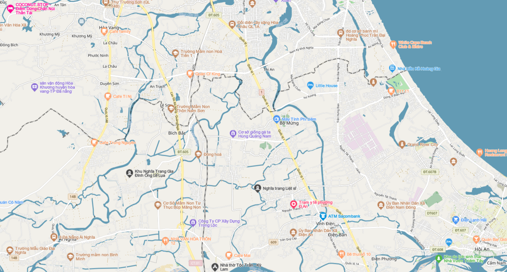

# Tile(Lấy thông tin của tile)
## 1. Bản đồ nền

[](https://map4d.vn)

## 2. URL
```
/all/{mode}/{z}/{x}/{y}.png
```
## 3. Phương Thức: GET
## 4. Các than số (parameter) sẵn có
| Tham số       |Bắt buộc | Mặc định | Ví dụ|
|---------------|---------|----------|------|
| mode          |Yes      | 2d       | 2d   |
| z             |Yes      | none     | 3    |
| x             |Yes      | none     | 29   |
| y             |Yes      | none     | 53   |

**Ví dụ**
```
https://rtile.map4d.vn/all/2d/7/102/58.png
```
**NOTE:**
 - Giá trị mode = "3d" chỉ tồn tại ở mức zoom từ 17+